> **Build, govern, and run your agent stack from one local control plane.**
> Define servers, skills, instructions, settings, hooks, plugins, profiles,
> and secrets once; compile them across agent CLIs; then trust, constrain,
> run, audit, and optimize the result.

**[Website](https://tarekkharsa.github.io/agentstack/)** ·
[Feature reference](docs/reference.md) ·
[Enforcement matrix](docs/ENFORCEMENT.md) ·
[Central library](https://tarekkharsa.github.io/agentstack/library.html) ·
[Dashboard](docs/dashboard.md) ·
[Releases](https://github.com/Tarekkharsa/agentstack/releases)

Define your stack once in `.agentstack/agentstack.toml`. AgentStack resolves
and pins capabilities, activates task-specific profiles, and either serves the
stack live through a trust-gated gateway or compiles it into the native config
of 13 agent CLIs — Claude Code, Claude Desktop, Codex, Cursor, Windsurf,
Gemini CLI, VS Code, GitHub Copilot CLI, OpenCode, Antigravity, Junie, Kiro,
and Pi. Secrets stay `${REFERENCES}` that resolve per machine, so the source of
truth is safe to commit and share.

## Install

```sh
curl -fsSL https://raw.githubusercontent.com/Tarekkharsa/agentstack/main/install.sh | sh
```

The installer verifies the release tarball against the `checksums.txt`
published with each release before installing.

Or from a checkout:

```sh
cargo build --release
./target/release/agentstack self link   # symlink onto your PATH
```

One static binary for the core workflows. Docker is required only for
`run --sandbox` / `--lockdown` and experimental `tools_execute`.

## Start in 60 seconds

`agentstack setup` is the guided path — it imports, previews, and applies
interactively. The same flow as individual commands:

```bash
agentstack init         # existing CLI configs → one manifest
                        # (nothing installed yet? init writes a starter
                        #  manifest with a commented example instead)
agentstack bootstrap    # check CLIs, skills, secrets; see what's missing
agentstack apply        # preview every CLI's changes, confirm to write
```



> ▶ [Watch it live on the site](https://tarekkharsa.github.io/agentstack/#start) — same flow, replayed in your browser.

Two things worth knowing before you go further:

- **Skills activate through profiles**, not `apply`: `apply` renders servers,
  instructions, and hooks; `agentstack use <profile> --write` materializes
  that profile's skills. (`apply` will remind you if the manifest has skills.)
- Prefer **no rendered files at all**? Skip `apply` entirely and jump to
  [the trust gate](#the-trust-gate--clone-anyones-repo-safely) — one gateway
  registration serves every repo live.

If `bootstrap` reports a missing secret, store it once — it goes in your OS
keychain, never in the manifest:

```bash
agentstack secret set GH_PAT
```

That's the whole everyday loop. Two habits worth keeping:

- `agentstack` with no arguments tells you the one next step for the directory
  you're in.
- `agentstack doctor` verifies everything is wired up and names the exact fix
  for anything that isn't.

### Experimental: governed TypeScript execution

Sandbox-enabled builds can expose `tools_execute`: one bounded TypeScript
program can call a small, exact set of MCP tools through the existing gateway.
The program runs as a non-root process in a read-only, resource-limited Docker
container with no workspace, ambient credentials, package installation, or
direct network route. Every allowed call is re-checked by the gateway and
attributed in `agentstack report`.

It is off by default and only the machine owner can enable it in
`~/.agentstack/agentstack.toml`:

```toml
[experimental]
tools_execute = true

# Optional machine-owned defaults; requests may only narrow them.
[experimental.tools_execute_limits]
timeout_ms = 30000
max_calls = 40
max_output_bytes = 131072
```

This is an experimental Docker-only surface, not a host-execution fallback.
See the [exact request contract](docs/reference.md#experimental-tools_execute)
and [enforcement matrix](docs/ENFORCEMENT.md#experimental-tools_execute).

## Why

Every skill, MCP server, and agent config you adopt is **unreviewed code plus
instructions**, wired into a process that holds your credentials, your shell,
and the network. Installing one is `npm install` with an agent attached —
except with no lockfile, no review gate, and no record of what it did. Three
gaps follow:

1. **Anything a repo declares can run.** Clone it, start an agent session,
   and its MCP servers want to spawn — commands you never read, with your
   keychain in reach. Here a clone is *inert* until you trust its exact
   bytes, and any edit re-gates it.
2. **Nothing narrows or records what agents do.** Consent today is
   all-or-nothing and unlogged; an injected prompt can turn a legitimate tool
   against you. Here your *machine policy* — which no repo can loosen —
   fences tools, secrets, and egress; every brokered call lands in an audit
   log; `--lockdown` removes the network route entirely. (Honest scope: what
   each mode enforces is spelled out in the
   [enforcement matrix](docs/ENFORCEMENT.md).)
3. **Every CLI spells the same setup differently** — six config syntaxes,
   drifting copies, real tokens pasted into files that were never meant to be
   shared. Here one reviewed manifest renders them all, secrets stay
   references, and a lockfile makes it reproducible.

If you use a single agent with one hand-managed server, you may not need this
yet. The moment capabilities come from repos you didn't write, you do.

## A manifest at a glance

```toml
version = 1

[servers.github]
type = "stdio"
command = "npx"
args = ["-y", "@modelcontextprotocol/server-github"]
env = { GITHUB_TOKEN = "${GH_PAT}" }        # resolved per machine, never stored

[servers.github.extra.codex]                 # native keys one CLI needs pass
startup_timeout_sec = 20                     # through verbatim, per adapter

[servers.kibana]
type = "http"
url = "https://kibana-mcp.example.com/mcp"
headers = { Authorization = "Bearer ${KIBANA_TOKEN}" }

[profiles.backend]
servers = ["kibana", "github"]
skills = ["sql-review"]                      # resolves from your central library

[targets]
default = ["claude-code", "codex"]
```

Relative paths in the manifest (a skill's `path`, a server's `cwd`) anchor at
the **manifest's directory** — `.agentstack/` in the preferred layout — so
`path = "./skills/x"` lives at `.agentstack/skills/x`, not the repo root.
(`cwd` is the exception: it anchors at the project root, matching what a
harness gives a rendered config.)

## Everyday commands

| Command | What it does |
| --- | --- |
| `agentstack init` | Reverse-engineer a manifest from the configs you already have |
| `agentstack bootstrap` | Preflight: installed CLIs, skills, secrets, pending diff |
| `agentstack apply` | Preview each CLI's config changes; confirm (or `--write`) to render |
| `agentstack doctor` | Verify wiring; every warning comes with the exact fix command |
| `agentstack diff` | What would change, read-only |
| `agentstack secret set NAME` | Store a secret in the OS keychain |
| `agentstack use <profile> --write` | Activate one profile's servers + skills |
| `agentstack run <cli> --profile <p>` | Launch a harness with a profile for its lifetime |
| `agentstack lock` | Pin profile refs in the lockfile without rendering anything |
| `agentstack dashboard` | The same lifecycle in a local web UI |

The [feature reference](docs/reference.md) has the complete command list.

## See what your tools cost on the wire

Every tool, server, and skill you load is re-billed as input tokens on *every*
turn — [one measurement](https://www.aihero.dev/how-to-kill-the-bloat-in-claude-codes-system-prompt)
clocked ~155 KB across 69 tools before a single word of your prompt. agentstack
gives you that visibility built in: point a harness at `agentstack proxy start`
and it relays every request verbatim (observe only — nothing injected, the
prompt cache stays warm) while ranking what each capability actually costs your
agent per turn.

```bash
export ANTHROPIC_BASE_URL=http://127.0.0.1:8787
agentstack proxy start        # in one shell
agentstack proxy report       # after some real usage
```

`report` ranks per-capability tokens/turn against how often each tool was
actually called — so a server that's expensive but never used is flagged
`drop / lazy`. Because those are the same servers and profiles agentstack
manages, that on-wire evidence closes the loop with the static `stats` /
`doctor` lenses. Telemetry is privacy-preserving: counts, capability names, and
token estimates only — never prompt bodies or secrets.

## A shared library of skills & servers

Install a capability once into your machine-wide **central library**
(`~/.agentstack/lib`), then reference it **by name** from any project's profile —
no copying files between repos.

```bash
agentstack search codex                    # find shipped skills + registry servers
agentstack add from run-codex              # add a shipped skill to this manifest

# Add your own — from a local dir, or straight from a git repo:
agentstack lib add sql-review --path ./skills/sql-review --write
agentstack lib add improve --git https://github.com/acme/skills \
    --subpath skills/improve --write       # subdir layouts (marketplaces/monorepos)

agentstack lib list                        # what's installed, with provenance
```

Every add is content-scanned (hidden-unicode / prompt-injection) before it
lands. agentstack ships a starter catalog — `run-codex`, `sync-library`,
`analyze-usage`, `mine-skills` (distill reusable skills from your past agent
sessions), `adversarial-review` and `orchestrate-workflow` (governed
multi-agent generate-review-fix loops), `route-by-cost`, `using-agentstack`,
and more.

Keep the library consistent across machines by versioning it as a git repo.
Secrets never travel — a fail-closed gate scans every server field (headers,
env, url, args) **and the outgoing commits** before anything is pushed, and a
definition it can't parse blocks the sync rather than slipping through:

```bash
agentstack lib sync --init --remote git@github.com:you/agent-lib.git
agentstack lib sync                        # commit local changes, pull, push
```

## Take one CLI's plugins everywhere

A plugin you installed in one CLI shouldn't lock its capabilities to that CLI.
`plugins adopt` lifts an installed native plugin (Claude Code or Codex) into
the manifest: its skills are **copied into the central library** with
provenance recorded, and its MCP servers — auth wiring included, as `${REF}`s —
travel with the recipe:

```bash
agentstack plugins adopt cloudflare --harness codex --write     # skills → library, recipe → manifest
agentstack plugins sync --write                                 # generate native packages + marketplaces
agentstack plugins install cloudflare --target claude-code --write
```

The harness you adopted *from* stays satisfied by its native install —
`status`/`doctor` report it as up to date at the adopted version and flag
drift when the native plugin moves ahead, instead of ever double-installing.

## Share it with a team

Commit `.agentstack/` (manifest + lock). A teammate — or your CI — then runs:

```bash
git clone <repo>
agentstack bootstrap
agentstack secret set GH_PAT   # local only; never committed
agentstack apply --write
```

In CI, the trust gate is two commands — or the one-line GitHub Action:

```bash
agentstack install --locked   # fail if sources drifted from the pinned lock
agentstack doctor --ci        # fail on errors, drift, policy, unsafe content
```

```yaml
steps:
  - uses: actions/checkout@v4
  - uses: Tarekkharsa/agentstack@v0.10.1  # pin a release tag, not @main
```

## The trust gate — clone anyone's repo, safely

Register the AgentStack gateway, then clone a repo: its declared MCP servers
remain inactive until you inspect their runtime surface and trust the current
manifest/lock consent digest. Calls brokered after that are firewalled and
audited.



> ▶ [Watch it live on the site](https://tarekkharsa.github.io/agentstack/#trust) — and run it yourself: [`docs/trust-gate-demo.sh`](docs/trust-gate-demo.sh).

Register the gateway once (`agentstack connect --all --write`) and every repo
you open brings its own MCP servers with **no files copied in**. But a repo you haven't reviewed
is **inert** — none of its servers are spawned or contacted, no secrets resolved:

```bash
git clone <some-repo> && cd <some-repo>
agentstack mcp --auto-project    # an agent asks what it can use here → nothing (untrusted)

agentstack trust .               # you SEE what it declares before authorizing:
#   ▶ demo: runs `python3 ./server.py`
#   ✓ trusted at sha256:…        (editing the manifest re-gates it)
```

Trust pins the **manifest, local overlay, and lockfile**, not arbitrary code they point at —
which also means running `agentstack lock` re-gates the project (new pins =
new consent); expect to re-run `trust .` after locking. And:
you're authorizing the command `python3 ./server.py`, and a later edit to
`server.py` won't re-gate the project (an edit to the manifest or lock will).
Central-library servers are pinned by definition digest in `agentstack.lock`
and verified by the gateway before serving — a drifted definition is refused
until you re-lock (which re-gates trust). Review referenced scripts as part
of `trust .` — same discipline as reading a `.envrc` before `direnv allow`.

After that its servers are live through the gateway — and every brokered call is
**firewalled** and **audited**. Two policy layers apply: the repo's `[policy]`
and your own machine-level `[policy.tools]` in `~/.agentstack/agentstack.toml`,
which is checked first and which no repo can loosen:

```text
agent → demo.echo         ✓ ok        # brokered through the gateway, logged
agent → demo.secret_read  ✗ denied    # blocked by [policy.tools]
every call → ~/.agentstack/audit/calls.jsonl   (tool · outcome · latency)
```

No generated config files in the repo, and no untrusted repo-declared server is
auto-started by the gateway. This does not sandbox arbitrary repo code; use
`run --sandbox --lockdown` when the agent process itself needs confinement.
The whole thing is a runnable 60-second demo:
[`docs/trust-gate-demo.sh`](docs/trust-gate-demo.sh).

## Where rendered files live — pick a mode

You always commit the *intent* (`agentstack.toml` + `.lock`). The rendered
artifacts (`.mcp.json`, `.claude/skills/`, and the compiled `CLAUDE.md` /
`AGENTS.md`) are a per-project choice:

- **Static** (default) — artifacts sit on disk, kept out of git by a managed
  `.gitignore` block, so a repo tracks only your `.agentstack/` intent. The
  block only ever covers files agentstack actually wrote — a hand-maintained
  `.mcp.json` or `CLAUDE.md` is never hidden from `git status`. Works however
  you launch your tools. (Pass `--no-gitignore` to commit them instead.)
- **Clean-at-rest** — nothing generated exists between sessions; profiles are
  injected by `agentstack run` / `session start` and reverted on exit.
  `git status` stays silent.
- **Zero files** — `agentstack connect` registers the gateway once per
  harness; every **trusted** repo then brings its own servers through
  `agentstack mcp --auto-project`, with a tool firewall and call audit log
  included. Untrusted repos are inert until you review and `agentstack trust .`

Details and trade-offs: [feature reference → three modes](docs/reference.md#where-rendered-files-live-three-modes).

## Going further

- **[Docs site](https://tarekkharsa.github.io/agentstack/)** — the visual
  getting-started walkthrough.
- **[Feature reference](docs/reference.md)** — the complete tested inventory:
  central library, vendor packs, MCP firewall, call audit log, `optimize`,
  plugin recipes, live runs, code mode, every command and flag.
- **[The no-terminal path](docs/dashboard.md)** — the dashboard's capability
  lifecycle, from discovery through undo.
- **Vendor packs** — `agentstack add from git:github.com/acme/pack@v1.2.0`
  installs a versioned MCP + skills + house-rules bundle, policy-gated and
  content-scanned before anything is written.
- **Personal layer** — `agentstack init --global` gives your machine-wide
  instructions a home; they merge beneath every project without ever landing
  in a repo's committed files.
- **App-managed servers** — `[servers.X] owner = "codex"` makes the owning
  app's config the source of truth: when the app rewrites its own entry (a
  self-update, say), `apply` refreshes the manifest and fans the fresh values
  out to every other CLI — instead of reverting the app.
- **Usage insight** — `agentstack analyze` reports what you actually call (from
  the runtime audit log) and flags library capabilities you installed but never
  use, so pruning is data-driven. `--transcripts` adds cross-harness reach from
  local Claude Code / Codex session logs — sessions, token totals, top tools;
  aggregates only, never prompt content. Read-only and local.
- **Sandboxed runs** — `agentstack run --sandbox --lockdown` launches the agent
  in a container with **no host route and no internet**: its only path out is
  the AgentStack egress-proxy sidecar, which enforces your machine
  `[policy.egress]` and records every decision to the run's flight recorder
  (`agentstack report`). Ignoring the proxy reaches nothing — the confinement
  is topological. The proxy filters by host (case- and trailing-dot-normalized),
  requires a TLS connection's SNI to match the host it dialed (no domain
  fronting), and refuses any name that resolves to a loopback, private,
  link-local, or cloud-metadata address (no SSRF into your own network). Build
  with `--features sandbox` (Docker support is off by default). The container
  runs your harness, so point `run --sandbox` at an image that carries it —
  build one from [`docker/sandbox.Dockerfile`](docker/sandbox.Dockerfile) and
  set `AGENTSTACK_SANDBOX_IMAGE`. The lockdown proxy sidecar needs no setup:
  each release publishes it to GHCR and the binary pulls the tag pinned to its
  own version (override with `AGENTSTACK_EGRESS_IMAGE`, e.g. a local
  [`docker/egress-proxy.Dockerfile`](docker/egress-proxy.Dockerfile) build).
  Runnable demo (needs Docker):
  [`agentstack-test/demo-lockdown.sh`](agentstack-test/demo-lockdown.sh).

  What each mode actually enforces — and where it stops — is spelled out per
  dimension in the [enforcement matrix](docs/ENFORCEMENT.md). AgentStack
  restricts destinations and records decisions; it cannot guarantee sensitive
  content never leaves through a host you *allowed*.



> ▶ [Watch it live on the site](https://tarekkharsa.github.io/agentstack/#sandbox) — and run it yourself (needs Docker): [`agentstack-test/demo-lockdown.sh`](agentstack-test/demo-lockdown.sh).

The closed loop in under a minute — install a versioned pack, spread it to
every CLI, firewall a tool, watch the refusal in the audit log, upgrade to the
vendor's next tag:



> ▶ Run it yourself: [`agentstack-test/demo-closed-loop.sh`](agentstack-test/demo-closed-loop.sh).

## Develop

```bash
cargo test              # unit + golden + integration
cargo clippy --all-targets
cargo fmt --check
```

Install your build with `agentstack self link` (symlinks the binary onto your
PATH; `self which` verifies what a bare `agentstack` runs). Don't wrap the
binary in a shell function or alias — those exist only in interactive shells,
so agent harnesses and scripts won't see them.

Adding a CLI is one YAML descriptor — copy `crates/adapters/descriptors/codex.yaml`, check it with
`agentstack adapters validate my-adapter.yaml`, then drop it into
`~/.agentstack/adapters/` (no rebuild). `agentstack adapters list` marks which
adapters are yours; a broken drop-in is skipped with a warning, never fatal.

## License

Dual-licensed under either [MIT](LICENSE-MIT) or [Apache-2.0](LICENSE-APACHE)
at your option.
