> **Cloning a repo shouldn't hand your agent to a stranger.**
> AgentStack is a local control plane for AI coding agents: one reviewed
> manifest defines what every agent CLI may run — then trust-gates,
> firewalls, and audits it. Nothing runs until it's trusted, and nothing
> trusted runs unobserved.

**[Website](https://tarekkharsa.github.io/agentstack/)** ·
[Docs](https://tarekkharsa.github.io/agentstack/docs.html) ·
[Examples](https://tarekkharsa.github.io/agentstack/examples.html) ·
[Releases](https://github.com/Tarekkharsa/agentstack/releases)

## Try it in 60 seconds

```sh
curl -fsSL https://raw.githubusercontent.com/Tarekkharsa/agentstack/main/install.sh | sh
agentstack init     # your existing CLI configs → one reviewed manifest
agentstack apply    # preview every CLI's changes, confirm to write
```

Real tokens are lifted out of your config files into `${REF}`s as part of the
import. That's step 1 of 6 — bare `agentstack` always names your next one.

## Why

Every skill, MCP server, and agent config you adopt is **unreviewed code plus
instructions**, wired into a process that holds your credentials, your shell,
and the network. Installing one is `npm install` with an agent attached —
except with no lockfile, no review gate, and no record of what it did.
AgentStack closes those gaps:

- **Anything a repo declares can run.** Here a clone is *inert* until you
  trust its exact bytes, and any edit re-gates it.
- **Nothing narrows or records what agents do.** Here your *machine policy* —
  which no repo can loosen — fences tools, secrets, and egress, and every
  brokered call lands in an audit log.
- **Every CLI spells the same setup differently.** Here one reviewed manifest
  renders them all, secrets stay references, and a lockfile makes it
  reproducible.
- **An agent can wreck your working tree by accident.** Here `agentstack
  guard` blocks destructive commands (`rm -rf`, `git reset --hard`, `.env`
  reads) before they run.

If you use a single agent with one hand-managed server, you may not need this
yet. The moment capabilities come from repos you didn't write, you do.


AgentStack resolves and pins capabilities from `.agentstack/agentstack.toml`,
activates task-specific profiles, and either serves the stack live through a
trust-gated gateway or compiles it into the native config of 13 agent CLIs —
Claude Code, Claude Desktop, Codex, Cursor, Windsurf, Gemini CLI, VS Code,
GitHub Copilot CLI, OpenCode, Antigravity, Junie, Kiro, and Pi.

## Install

The one-line installer above verifies the release tarball against the
`checksums.txt` published with each release. Or build from a checkout:

```sh
cargo build --release
./target/release/agentstack self link   # symlink onto your PATH
```

One static binary for everything below. Docker is required only for step 6
(`run --sandbox` / `--lockdown` and experimental `tools_execute`).

## Climb as far as you need

AgentStack is adopted in steps, not all at once. Each step pays off on its
own, in minutes, and nothing later is required to keep the earlier wins —
stop wherever your setup stops hurting.

| Step | You run | You get |
| --- | --- | --- |
| [1 — Unify](#step-1--one-manifest-every-cli-5-minutes) | `agentstack init` → `apply` | one reviewed manifest for every CLI; real tokens out of your config files |
| [2 — Verify](#step-2--two-habits-that-keep-it-healthy) | `agentstack` · `agentstack doctor` | drift caught early; every warning names its exact fix |
| [3 — Guard](#step-3--block-the-accidents-one-command) | `agentstack guard install` | `rm -rf`, `git reset --hard`, and `.env` reads blocked before they land |
| [4 — Trust](#step-4--keep-strangers-repos-inert-until-review) | `gateway connect` · `trust .` | cloned repos stay inert until you review them; brokered calls firewalled and audited |
| [5 — Scale](#step-5--scale-it-up-profiles-library-teams) | profiles · `lib` · extensions | one governed stack across projects, machines, and teammates |
| [6 — Confine](#step-6--maximum-assurance-sandbox--lockdown-docker) | `run --sandbox --lockdown` | kernel-enforced confinement — the agent's only route out is the audited proxy |

Steps 1–4 are the everyday loop; 5–6 are shipped and hardening — what each
mode enforces, and where it stops, is spelled out per dimension in the
[enforcement matrix](docs/ENFORCEMENT.md). The same ladder, with expected
output at every step, is the
[getting-started walkthrough](https://tarekkharsa.github.io/agentstack/start.html);
agents get the same map via the shipped
[`using-agentstack` skill](crates/cli/catalog/skills/using-agentstack/SKILL.md).

## Step 1 — One manifest, every CLI (5 minutes)

`agentstack setup` is the guided path — it imports, previews, applies, and
activates interactively. The same flow as individual commands: `init` →
`apply` → `use --write` (skills activate through `use`, not `apply`; `setup`
runs it for you). If `apply` or `doctor` reports a missing secret, store it
once — it goes in your OS keychain, never in the manifest:

```bash
agentstack secret set GH_PAT
```

Prefer a secrets manager? Drop a `.env.schema` in the project and the same
`${REF}`s resolve through varlock's providers (1Password, AWS/Azure/GCP,
Bitwarden, …) instead — OS keychain by default, provider-backed when you opt
in, and the manifest never changes either way.

What you just wrote looks like this — one file, reviewed like code:

```toml
version = 1

[servers.github]
type = "http"
url = "https://api.githubcopilot.com/mcp/"
headers = { Authorization = "Bearer ${GH_PAT}" } # resolved per machine

[servers.github.extra.codex]                 # native keys one CLI needs pass
startup_timeout_sec = 20                     # through verbatim, per adapter

[profiles.backend]
servers = ["github"]
skills = ["sql-review"]                      # resolves from your central library

[targets]
default = ["claude-code", "codex"]
```

One `agentstack apply` compiles it into the native config of every CLI in
`[targets]` — each adapter's quirks handled for you:


In a repo, writes default to **project** scope (artifacts land repo-local,
kept out of git by a managed `.gitignore` block that only ever covers files
agentstack wrote); the machine manifest (`~/.agentstack/`) defaults to your
global configs — `--scope` overrides either way. Prefer no rendered files at
all? Jump to [step 4](#step-4--keep-strangers-repos-inert-until-review).

Servers and skills are two of six capability kinds: `[instructions.*]`
compiles house rules into a managed region of each harness's `CLAUDE.md` /
`AGENTS.md`, `[settings.*]` renders native per-CLI settings, `[hooks.*]`
compiles lifecycle hooks, and `[extensions.*]` delivers native harness
add-ons under the strictest pinning agentstack has. Every kind, every flag,
and the manifest's path-anchoring rules: the
[feature reference](docs/reference.md).

## Step 2 — Two habits that keep it healthy

- `agentstack` with no arguments tells you the one next step for the
  directory you're in.
- `agentstack doctor` verifies everything is wired up and names the exact fix
  for anything that isn't.

Everything else you'll reach for day to day:

| Command | What it does |
| --- | --- |
| `agentstack init` | Reverse-engineer a manifest from the configs you already have |
| `agentstack apply` | Preview each CLI's config changes; confirm (or `--write`) to render |
| `agentstack doctor` | Verify wiring; every warning comes with the exact fix command |
| `agentstack diff` | What would change, read-only |
| `agentstack secret set NAME` | Store a secret in the OS keychain |
| `agentstack use --write` | Activate skills + servers (a named profile, or everything when none declared) |
| `agentstack run <cli> --profile <p>` | Launch a harness as a tracked run, with a profile for its lifetime |
| `agentstack report` | Every "what happened" view: live runs, a run's flight recorder, call activity |
| `agentstack guard install` | Wire the destructive-command guard into your CLIs' hooks |
| `agentstack lock` | Pin profile refs in the lockfile without rendering anything |
| `agentstack restore --last --write` | Undo any write from its recorded history |
| `agentstack adopt --write` | Keep a hand-edit: pull drifted native config back into the manifest |
| `agentstack dashboard` | The same lifecycle in a local web UI |

When `doctor` flags drift, the rule is directional: the hand-edit on disk is
right → `adopt` pulls it into the manifest; the manifest is right →
`apply --write` re-renders over it. And before acting on any capability,
`agentstack explain <name>` shows its provenance, secrets, and policy
footprint. Complete command list: the [feature reference](docs/reference.md).

## Step 3 — Block the accidents (one command)

`agentstack guard install` wires a **cooperative** pre-tool-use hook into 9
agent CLIs (Claude Code, Codex, Gemini, Cursor, Windsurf, Copilot CLI,
Antigravity, OpenCode, Pi; VS Code reads the Claude-format hooks). It stops
the commands an agent runs by mistake before they touch your machine:

```text
agent → rm -rf ~/other-project   ✗ blocked   # destructive, outside the workspace
agent → git reset --hard         ✗ blocked   # discards uncommitted work
agent → cat .env                 ✗ blocked   # [policy.filesystem] deny-glob
every denial → ~/.agentstack/audit/calls.jsonl
```

`guard status` shows which CLIs are wired; `guard test rm -rf /` shows a
denial without an agent. This catches *accidents*, not a determined attacker
— kernel-enforced confinement is
[step 6](#step-6--maximum-assurance-sandbox--lockdown-docker). Runnable
walkthrough: [`examples/guard-demo/`](examples/guard-demo/).



## Step 4 — Keep strangers' repos inert until review

Register the gateway once (`agentstack gateway connect --all --write`) and
every repo you open brings its own MCP servers with **no files copied in**.
But a repo you haven't reviewed is **inert** — none of its servers are
spawned or contacted, no secrets resolved:

```bash
git clone <some-repo> && cd <some-repo>
agentstack mcp --auto-project    # an agent asks what it can use here → nothing (untrusted)

agentstack trust .               # you SEE what it declares before authorizing:
#   ▶ demo: runs `python3 ./server.py`
#   ✓ trusted at sha256:…        (editing the manifest re-gates it)
```

Trust pins the **manifest, local overlay, and lockfile** — so `agentstack
lock` re-gates the project (new pins = new consent). You're authorizing the
declared commands, not arbitrary code they point at: review referenced
scripts as part of `trust .`, same discipline as reading a `.envrc` before
`direnv allow`. After that, every brokered call is **firewalled** and
**audited** under two policy layers — the repo's `[policy]` and your own
machine-level policy, checked first, which no repo can loosen:

```text
agent → demo.echo         ✓ ok        # brokered through the gateway, logged
agent → demo.secret_read  ✗ denied    # blocked by [policy.tools]
every call → ~/.agentstack/audit/calls.jsonl   (tool · outcome · latency)
```

Starter machine policies: [`examples/policies/`](examples/policies/). The
whole gate is a runnable 60-second demo —
[`docs/trust-gate-demo.sh`](docs/trust-gate-demo.sh) — or
[watch it live on the site](https://tarekkharsa.github.io/agentstack/#trust).

Two extensions of the same consent machinery, both fully specified in the
[feature reference](docs/reference.md):

- **`run <cli> --locked`** gates a whole launch, no Docker required: trust at
  the current digest, strict lock verification (a one-byte edit to a pinned
  local server executable refuses the run), and policy admission under your
  machine ceiling. What passed is **frozen** for the run — no mid-run lease
  swaps or surface widening; `--plan` prints every gate decision without
  launching. Honest scope: pre-launch gating plus a frozen surface, not
  kernel isolation. Asserted example:
  [`examples/projects/locked-run/`](examples/projects/locked-run/).
- **`[extensions.*]`** delivers native harness add-ons (pi's TypeScript
  extensions, OpenCode's JS plugins) — the highest-risk kind, so governance
  is all pre-delivery and labelled that way: content-pinned in the lock, zero
  bytes rendered while untrusted or drifted, copies re-verified by
  `run --locked`. What you get is provenance, not runtime enforcement:
  [enforcement matrix → native extensions](docs/ENFORCEMENT.md#native-extensions).

## Step 5 — Scale it up: profiles, library, teams

Install a capability once into your machine-wide **central library**
(`~/.agentstack/lib`), then reference it **by name** from any project's
profile — no copying files between repos:

```bash
agentstack search codex                    # your library + catalog + MCP registry
agentstack lib add sql-review --path ./skills/sql-review --write
agentstack lib add improve --git https://github.com/acme/skills \
    --subpath skills/improve --write       # marketplace/monorepo layouts
agentstack lib sync                        # version the library as a git repo
```

Every add is content-scanned (hidden-unicode / prompt-injection) before it
lands, and `lib sync`'s fail-closed gate keeps secrets from ever traveling.
A starter catalog ships in the binary (`run-codex`, `mine-skills`,
`adversarial-review`, `using-agentstack`, …).

**Teams and CI:** commit `.agentstack/` (manifest + lock); a teammate runs
`agentstack secret set` + `apply --write` + `doctor`. In CI the trust gate is
`agentstack install --locked` + `doctor --ci`, or the one-line GitHub Action:

```yaml
steps:
  - uses: actions/checkout@v4
  - uses: Tarekkharsa/agentstack@v0.11.0  # pin a release tag, not @main
```

A maintainer can `sign` the lockfile (detached ed25519) for `verify` on the
other end; `export` / `import` move a whole setup between machines as one
age-encrypted bundle.

**Where rendered files live** is a per-project choice — **static** (artifacts
on disk, gitignored), **clean-at-rest** (nothing exists between sessions;
profiles injected by `run` / `session start` and reverted on exit), or
**zero-files** (everything served live through the gateway, with
`agentstack_lease_open` profile fences, progressive skill loading, and
`tools_search` / `tools_bindings` to keep a dozen servers out of every
turn's context). Trade-offs and the full lease lifecycle:
[feature reference → three modes](docs/reference.md#where-rendered-files-live-three-modes).

**More power tools**, each one line here and fully documented in the
[reference](docs/reference.md): vendor packs
(`add from git:github.com/acme/pack@v1.2.0` — versioned, policy-gated
bundles); a personal layer (`init --global`) that merges beneath every
project; app-managed servers (`owner = "codex"` makes the owning app's config
canonical); usage insight (`report calls`, and `agentstack optimize` to turn
the audit log into concrete pruning recommendations); an observe-only wire
proxy (`agentstack proxy`) that measures what each tool actually costs in
tokens per turn; and [the no-terminal dashboard](docs/dashboard.md).

The closed loop in under a minute — install a versioned pack, spread it to
every CLI, firewall a tool, watch the refusal in the audit log, upgrade:


> ▶ Run it yourself: [`examples/sandbox/demo-closed-loop.sh`](examples/sandbox/demo-closed-loop.sh).

## Step 6 — Maximum assurance: sandbox & lockdown (Docker)

Everything so far decides what an agent *may* do. This step decides what it
*can* do. `agentstack run --sandbox --lockdown` launches the agent in a
container with **no host route and no internet**: its only path out is the
egress-proxy sidecar, which enforces your machine `[policy.egress]` — SNI
match, anti-SSRF address classes, host normalization — and records every
decision to the run's flight recorder (`agentstack report`). Ignoring the
proxy reaches nothing; the confinement is topological.


Build with `--features sandbox` and point it at an image carrying your
harness — setup, image variables, and the runnable demo live in the
[feature reference](docs/reference.md) and
[`examples/sandbox/demo-lockdown.sh`](examples/sandbox/demo-lockdown.sh).
Sandbox-enabled builds can also expose experimental **`tools_execute`** —
one bounded TypeScript program calling an exact set of MCP tools from a
read-only, no-network container, off by default and enabled only by the
machine owner: [contract](docs/reference.md#experimental-tools_execute) ·
[enforcement](docs/ENFORCEMENT.md#experimental-tools_execute).

AgentStack restricts destinations and records decisions; it cannot guarantee
sensitive content never leaves through a host you *allowed*. The per-mode
truth table is the [enforcement matrix](docs/ENFORCEMENT.md).

## Develop

```bash
cargo test              # unit + golden + integration
cargo clippy --all-targets
cargo fmt --check
```

Install your build with `agentstack self link`. Adding a CLI is one YAML
descriptor — copy `crates/adapters/descriptors/codex.yaml`, check it with
`agentstack adapters validate`, drop it into `~/.agentstack/adapters/` (no
rebuild). Ground rules and the security invariants:
[CONTRIBUTING.md](CONTRIBUTING.md). Release history:
[CHANGELOG.md](CHANGELOG.md).

## License

Dual-licensed under either [MIT](LICENSE-MIT) or [Apache-2.0](LICENSE-APACHE)
at your option.
