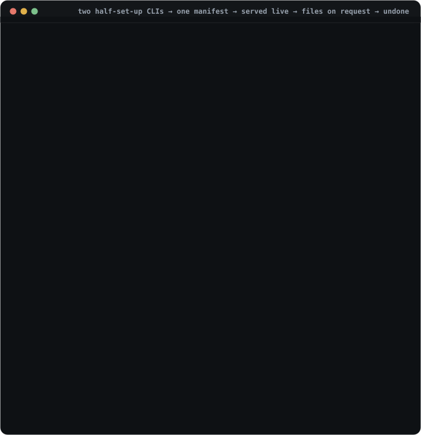

> **One agent setup. Every coding CLI.**
> AgentStack collects the MCP servers, skills, and instructions you already use
> into one `.agentstack/` directory in your project, then renders them back as
> native configuration for Claude Code, Codex, Cursor, Gemini CLI, OpenCode, and
> [eight more](https://tarekkharsa.github.io/agentstack/adapters.html). Named toolsets
> let you switch by project or task; doctor, diff, and restore keep every
> change understandable and recoverable.

**[Website](https://tarekkharsa.github.io/agentstack/)** ·
[Docs](https://tarekkharsa.github.io/agentstack/docs.html) ·
[Get started](https://tarekkharsa.github.io/agentstack/start.html) ·
[Releases](https://github.com/Tarekkharsa/agentstack/releases)

[](https://github.com/Tarekkharsa/agentstack/actions/workflows/ci.yml) [](https://github.com/Tarekkharsa/agentstack/actions/workflows/conformance.yml) [](https://github.com/Tarekkharsa/agentstack/releases) [](https://github.com/Tarekkharsa/agentstack/blob/main/LICENSE-MIT)

## Try it in 60 seconds

```sh
curl -fsSL https://raw.githubusercontent.com/Tarekkharsa/agentstack/main/install.sh | sh
agentstack init      # finds what your CLIs already have and writes it into .agentstack/
agentstack status    # is it ready — and if not, the one thing that fixes it
```

> `agentstack yes`, `undo`, `up`, `share`, and `receive` are v0.18.0 and later;
> the install line above serves the current stable release. `agentstack
> --version` says which you have, and `agentstack self update --write` upgrades
> once v0.18.0 is final.

That is the whole first run. Here is what it left in your project — plain files
you can open, read, and commit:

```text
your-project/
├── .agentstack/
│   ├── agentstack.toml   # everything your tools may run: servers, skills, instructions
│   └── .env              # token values lifted out of your configs (only when init found any)
└── .gitignore            # one managed line, so that .env is never committed
```

`.agentstack/agentstack.toml` records your whole setup. It is called
the **[manifest](https://tarekkharsa.github.io/agentstack/concepts.html)**, and
every CLI-specific file AgentStack writes — `.mcp.json`, `.claude/skills/`, the
compiled `AGENTS.md` — is rendered from it and can be regenerated, or taken back
off, at any time. Mostly the system writes it for you: `init` and `add` fill it
in, and so does
[dropping a skill folder in](https://tarekkharsa.github.io/agentstack/howto/add-a-skill.html).
It holds `${GITHUB_TOKEN}`-style placeholders, never the token values.

That same directory arriving in a repository you *cloned* behaves differently: it
stays inert until you review it — no server spawns, no skill enters an agent's
context, no secret resolves — and nothing a project declares can loosen the
limits your own machine sets.

`init` is a guided wizard. Scripting or CI?
[Use it in CI](https://tarekkharsa.github.io/agentstack/howto/ci.html).

Here is the whole loop, condensed from a real run of the current binary:



1. **Start** — two real native configs: Claude Code knows a `github` server
   (inline token), Codex knows `tldraw`. Neither knows the other's.
2. **Import** — `agentstack init --yes --secrets env`: one manifest; the token
   is copied to a gitignored `.env` and referenced as `${GITHUB_TOKEN}` (your
   CLI's own config keeps its copy until you apply at global scope).
3. **Render** — `agentstack apply --scope global --write`: both CLIs now carry
   both servers, each in its own format.
4. **Verify** — `agentstack doctor`: 0 errors. On your own machine expect a
   note or two — advisories like "these servers launch via bare `npx`" are
   stated once and do not count against readiness; a first Codex project also
   warns until you open Codex there once and accept its trust prompt.
5. **Undo** — `agentstack restore --last --write`, twice: every file
   byte-identical to where it started. (`agentstack undo` shows the same
   recorded changes as a timeline and reverts to the point you pick.)

Reproduce it yourself, fenced (an isolated temp `HOME` — it never touches your
real configs, and it asserts every step, so it doubles as the witness that this
output stays accurate):
[`examples/first-value-demo/run-demo.sh`](examples/first-value-demo/run-demo.sh).

## Why

Every agent CLI has its own configuration format, file locations, and way to
install the same underlying capabilities. AgentStack gives the whole lifecycle
one source of truth:

- **Stop repeating configuration.** Import what you already have, then render
  that one manifest into every supported CLI's native format.
- **Switch by project or task.** A toolset is a named subset of your setup;
  temporary sessions activate it and restore the previous native files afterward.
- **Understand and repair drift.** `doctor` finds the problem, `diff` shows the
  consequence, `adopt` keeps an intentional hand edit, and `restore` undoes a
  bad change.
- **Share without sharing credentials.** Manifests and lockfiles contain
  `${REF}` placeholders, never secret values; each machine supplies its own.
- **Stay safe as setups become portable.** Unfamiliar repository declarations
  stay inert until reviewed, machine policy remains the ceiling, and governed
  calls are recorded.

Using one CLI with a small hand-managed setup? You may not need AgentStack yet.
It becomes useful when you repeat the same setup across tools, projects,
machines, or teammates.

## Install

The one-line installer above verifies the release tarball against the `checksums.txt` published with
each release. Or build from a checkout:

```sh
cargo build --release                  # add --features sandbox for `run --sandbox`
./target/release/agentstack self link  # symlink onto your PATH
```

Release binaries ship with sandbox support compiled in; a bare `cargo build` does not — pass
`--features sandbox` to get `run --sandbox` / `--lockdown`.

Once installed, `agentstack self update` moves you to the latest release (it verifies the
download against the release's published checksum before replacing anything, and defers to
`brew upgrade` if Homebrew owns the binary).

**Supported platforms: macOS and Linux.** A Windows binary is published, but it is not
exercised by CI and the codebase carries almost no Windows-specific handling — treat it as
untested rather than supported. If you use it and it works, say so in an issue; that is the
evidence that would move it.

### Upgrading

`agentstack self update` previews; `--write` verifies the sha256 before
installing. Homebrew installs upgrade with `brew upgrade agentstack`.
[Details](https://tarekkharsa.github.io/agentstack/reference.html).

## Grow into it

Start with configuration portability. Add toolsets, sharing, and stronger
governance only when you need them:

| Step | You run | You get |
| --- | --- | --- |
| [1 — Unify](https://tarekkharsa.github.io/agentstack/start.html) | `agentstack init` → `apply` | import once, render everywhere |
| [2 — Switch](https://tarekkharsa.github.io/agentstack/howto/name-a-toolset.html) | toolsets · `session start/end` | toolsets and temporary sessions |
| [3 — Diagnose](https://tarekkharsa.github.io/agentstack/start.html#s-verify) | `agentstack doctor` · `diff` | doctor and diff explain drift |
| [4 — Recover](https://tarekkharsa.github.io/agentstack/howto/undo.html) | `adopt` · `apply` · `restore` · `uninstall` | keep an edit, or undo the write |
| [5 — Share](https://tarekkharsa.github.io/agentstack/howto/team-setup.html) | manifest · lock · library | locked, secret-free setups |
| [6 — Govern](https://tarekkharsa.github.io/agentstack/howto/trust-a-repo.html) | trust · policy · lockdown | trust, policy, confined runs |

## Documentation

Everything is explained on the website — that is the one place docs live:

- **[Get started](https://tarekkharsa.github.io/agentstack/start.html)** — guided setup, ~10 minutes, expected output at every step
- **[Concepts](https://tarekkharsa.github.io/agentstack/concepts.html)** — every term in two or three plain sentences
- **[Which mode do I need?](https://tarekkharsa.github.io/agentstack/choose.html)** — protection level and delivery mode, decided in two tables
- **[How-tos](https://tarekkharsa.github.io/agentstack/docs.html)** — add a server or skill, trust a repo, lock down a run, team setup, CI, undo
- **[Migration recipes](https://tarekkharsa.github.io/agentstack/migrations.html)** — Claude + Codex, Cursor + Gemini, dotfiles, teams without shared secrets, complete removal
- **[Troubleshooting](https://tarekkharsa.github.io/agentstack/troubleshooting.html)** — search for the error text you got; every message is quoted from the binary and paired with its fix
- **[FAQ](https://tarekkharsa.github.io/agentstack/faq.html)** — will it overwrite my configs, is my API key in the manifest, do I need Docker
- **[Integrations](https://tarekkharsa.github.io/agentstack/integrations.html)** — use AgentStack from t3code and other graphical launchers; the current contract and limits
- **[See what your agents did](https://tarekkharsa.github.io/agentstack/howto/see-what-happened.html)** — runs, reports, optimize, explain
- **[Reference](https://tarekkharsa.github.io/agentstack/reference.html)** — the complete feature and command inventory
- **[Adapter support matrix](https://tarekkharsa.github.io/agentstack/adapters.html)** — which of the thirteen CLIs is verified nightly against the real tool, which is best-effort, and what each one manages

**Go deeper** — the [enforcement matrix](https://tarekkharsa.github.io/agentstack/enforcement.html) (what each mode actually enforces, checked against the source), the [architecture](https://tarekkharsa.github.io/agentstack/architecture.html) (how it works inside), and [18 runnable walkthroughs](https://tarekkharsa.github.io/agentstack/examples.html).

## Develop

```bash
cargo test              # unit + golden + integration
cargo clippy --all-targets
cargo fmt --check
```

Install your build with `agentstack self link`. Ground rules and the security invariants:
[CONTRIBUTING.md](CONTRIBUTING.md). Release history: [CHANGELOG.md](CHANGELOG.md).

## Community and support

Bug reports and focused contributions are welcome. Read the
[Code of Conduct](CODE_OF_CONDUCT.md), [governance and succession
policy](GOVERNANCE.md), and [support scope](SUPPORT.md). Report vulnerabilities
privately through [SECURITY.md](SECURITY.md), never in a public issue.

## License

Dual-licensed under either [MIT](LICENSE-MIT) or [Apache-2.0](LICENSE-APACHE) at your option.
