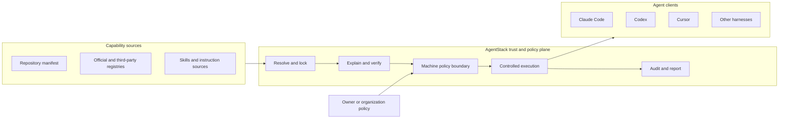
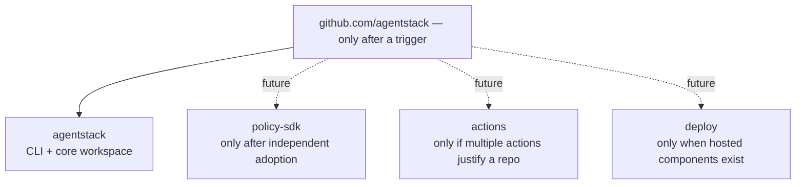
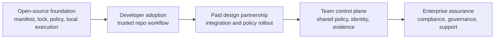
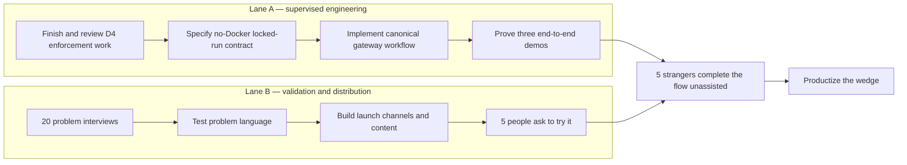

# AgentStack strategy

> **Status:** working strategy and decision framework, not a promise of shipped features<br/>
> **Updated:** 2026-07-14<br/>
> **Audience:** maintainers, contributors, design partners, and future collaborators<br/>
> **Publication:** intentionally public. Open strategy supports trust and contribution; exact pricing, prospect details, and confidential commercial assumptions stay elsewhere.

## Executive decision

AgentStack should become the **vendor-neutral trust and policy layer for agent-enabled repositories**.

The immediate message is:

> **Cloning a repo should not hand your agent to a stranger.**

The defensible product is not another agent, prompt library, or MCP marketplace. It is the layer that makes agent configuration portable, inspectable, reproducible, and unable to weaken the policy of the machine on which it runs.

The operating decisions are:

1. Keep one product and one monorepo while the product wedge is being proven.
2. Preserve modular Rust crate boundaries, but create separate repositories only when a component earns independent adoption.
3. Reserve the `AgentStack` GitHub organization name now; do not transfer the repository until an explicit trigger is met.
4. Make local enforcement and portability open source. Monetize coordination across people, machines, and organizations.
5. Import or federate existing discovery sources instead of building another public MCP directory.
6. Make `agentstack run <harness> --locked` from the current repository the supervised product milestone. The locked modifier is not shipped today; the existing harness positional remains intact.
7. Run product validation and distribution work in parallel with the engineering critical path.

## What exists today

The repository is already a modular Cargo workspace with nine crates:

```text
crates/
├── core
├── trust
├── policy
├── adapters
├── recorder
├── runtime
├── egress
├── executor
└── cli
```

That is a good internal architecture. It does **not** yet mean that AgentStack has nine independently adoptable products.

Important factual baselines:

- `agentstack run` exists. It launches a supported harness as a tracked run and can use profile, sandbox, lockdown, and plan options.
- The proposed `agentstack run <harness> --locked` contract does not exist yet. Trust, lock verification, policy compilation, guarded host execution, and reporting are not yet one completed public workflow.
- `--sandbox` and `--lockdown` require a build compiled with the optional `sandbox` feature and a running Docker daemon. That feature is off by default, so these modes cannot be the first-run activation wedge for the standard released binary.
- A composite GitHub Action already exists in [`action.yml`](action.yml). It runs `agentstack install --locked` and `agentstack doctor --ci`. The next job is to document, demonstrate, and distribute it—not rebuild it.
- The manifest is the source of truth. Generated client files are compiled output.
- Machine policy is the upper bound. A repository may request less capability, never more.

## The product thesis

AgentStack sits between untrusted or partially trusted agent configuration and the tools that execute it.



The promise has four parts:

- **Portable:** one manifest can describe the intended setup across supported clients.
- **Reproducible:** a lockfile pins what was selected and allows CI to detect drift.
- **Inspectable:** the user can understand sources, secrets, writes, and capabilities before activation.
- **Bounded:** repository configuration cannot loosen machine or organization policy.

Portability creates adoption. Trust and policy create differentiation. Coordination creates revenue.

## What AgentStack is—and is not

### AgentStack should own

- The portable manifest and lock contract.
- Capability resolution and provenance.
- Client adapters and lifecycle management.
- Trust decisions and policy compilation.
- Enforced execution paths, egress decisions, and audit evidence.
- Organization-level distribution and policy coordination later.

### AgentStack should integrate with

- Official MCP registries and vendor catalogs.
- Existing runtimes and sandbox technologies where they improve enforcement.
- Secret stores and identity providers.
- CI providers, source hosts, and security information systems.
- Agent clients rather than attempting to replace them.

### AgentStack should not build now

- Another general-purpose agent.
- A proprietary prompt or skill marketplace.
- A public MCP directory that competes with existing discovery networks.
- A hosted control plane before local activation is proven.
- Separate repositories merely to make the project look like a larger ecosystem.

## Ecosystem and GitHub organization plan

The TanStack analogy is useful for brand architecture, but not as a reason to copy its current repository count. TanStack projects can be adopted independently. AgentStack components should earn that status through usage.

### Decision now

- Reserve the `AgentStack` organization handle, if available.
- Keep `Tarekkharsa/agentstack` as the active home for now.
- Keep the nine crates in the existing workspace.
- Present the crates as product layers in the documentation, not as nine separately marketed products.

### Transfer trigger

Transfer the main repository to the organization when **any one** of these is true:

- A second public repository is genuinely needed, such as a reusable SDK, policy library, or deployment package.
- A design partner needs organization ownership or organization-scoped access.
- An external maintainer needs durable permissions that should not depend on a personal account.
- The project has enough adoption that neutral ownership materially improves trust.

### Repository split test

A component becomes a separate repository only when all five statements are true:

1. It is useful without installing the full AgentStack CLI.
2. It has its own users, documentation, versioning needs, and release cadence.
3. Its API boundary is stable enough to support independent consumers.
4. The maintenance and CI overhead is lower than the coordination benefit.
5. At least one real adopter has asked to use or contribute to it independently.

The possible future shape is:



The brand can still be an ecosystem before the code is split:

- **AgentStack Core:** manifest, locking, resolution, and shared models.
- **AgentStack Trust:** trust decisions, signatures, provenance, and explanations.
- **AgentStack Policy:** policy definition and compilation.
- **AgentStack Runtime:** controlled execution and lifecycle.
- **AgentStack Recorder:** evidence, audit events, and reports.
- **AgentStack CLI:** the primary user interface across those capabilities.

## Product and revenue ladder

The business model should follow the boundary between local enforcement and organizational coordination.



### Free and open source

- Manifest, lockfile, profiles, adapters, and local workflows.
- Local trust, signatures, policy evaluation, sandboxing, and reports.
- CI verification through the existing GitHub Action.
- Registry import and ecosystem interoperability.

Keeping enforcement open makes the security claim inspectable and allows AgentStack to become a common format.

### Paid design partnerships

The first revenue should be high-touch and evidence-producing:

- Integrate AgentStack with a team's real repositories and clients.
- Convert existing configurations into governed manifests.
- Define machine and organization policy baselines.
- Produce an audit or compliance export required by the customer.
- Turn repeated work into the first control-plane features.

Exact pricing is a private commercial hypothesis and should be validated in sales conversations, not committed to this public repository.

### Team control plane

Charge for coordination that is difficult to reproduce with local files alone:

- Organization policy distribution and inheritance.
- Identity, groups, roles, and approval workflows.
- Fleet inventory and configuration status.
- Shared secret references and provider integrations without storing raw secrets in manifests.
- Central audit search, retention, and export.
- Managed updates, exceptions, and evidence collection.

### Enterprise assurance

- SSO and directory synchronization.
- Data residency and private deployment options.
- Policy-as-code review and delegated administration.
- SIEM and governance integrations.
- Compliance evidence packages and longer retention.
- Support commitments, onboarding, and architecture review.

## Execution strategy: two parallel lanes

The engineering milestone and market learning should proceed together. Interviews do not require a finished product, but activation tests do.



The roadmap uses **exit gates**, not optimistic dates. Calendar estimates can be added after the `run <harness> --locked` contract is designed and sized.

## Phase 0A — prove the canonical no-Docker activation path

### Objective

Turn the repo-safety thesis into one understandable, end-to-end workflow that works with the standard released binary and does not require Docker.

### Assurance-tier decision

AgentStack should present two honest assurance tiers:

| Tier | Requirements | Guarantees and limits | Product role |
|---|---|---|---|
| Protected activation | Standard binary; no Docker | Explicit project trust, locked-input and drift checks, policy compilation under the machine ceiling, and cooperative host-guard hooks where supported by the client. This is meaningful protection, but it is not kernel isolation. | Default quickstart, developer adoption, and the 15-minute activation metric |
| Maximum assurance | Binary built with the `sandbox` feature plus a running Docker daemon | Container sandboxing and, with `--lockdown`, stronger network confinement through the egress path. Platform-specific guarantees must remain documented and tested. | Security-sensitive teams, CI, and environments willing to accept the dependency |

The no-Docker tier is the activation wedge. Sandbox and lockdown remain important differentiation, but are an explicit opt-in maximum-assurance mode rather than a prerequisite for seeing the product's value.

### CLI-surface decision

Preserve the current required harness positional:

```text
agentstack run <harness> --locked
```

For the first release of this workflow, the project is the current working directory. `--locked` is a modifier that fails closed on trust or lock violations; it does not consume a second positional argument. Remote acquisition must not be overloaded into the harness slot. If later evidence justifies URL or bundle acquisition, add an explicit named source option or a separate preparation command after its trust boundary is designed.

### Critical path

1. Finish, review, and test the current D4 lockdown and gateway work.
2. Write the behavioral contract for `agentstack run <harness> --locked` before expanding the CLI surface.
3. Resolve the current repository's AgentStack state without executing repository-controlled hooks or tools.
4. Detect the AgentStack manifest and require an explicit trust decision.
5. Resolve only locked inputs and fail closed on drift or missing references.
6. Compile repository policy under the machine-policy ceiling.
7. Launch the selected harness through the canonical gateway and enforced execution path.
8. Record material decisions and produce a human-readable report.
9. Clean up generated state according to the selected artifact mode.

### Contract questions that must be settled

- What minimum state must exist in the current working directory, and what named interface could safely support remote sources later?
- How does the new `--locked` modifier compose with the existing required `harness` positional, `--profile`, `--plan`, and trailing harness arguments?
- Where is the trust boundary before any repository-controlled code or hook can run?
- What exactly does `--locked` guarantee for skills, servers, binaries, images, and remote sources?
- Which execution claims are kernel-enforced on each operating system, and which are advisory?
- How are secrets requested without resolving them before trust is established?
- What is recorded, where is it stored, and how can sensitive values be excluded?
- What happens when a client cannot support a capability safely?
- How does cleanup behave for static, clean-at-rest, and zero-files modes?

### Required demos

1. **Safe repository, no Docker:** using the standard binary, inspect, trust, lock-check, compile policy, launch with supported host guards, report, and clean up.
2. **Policy violation, no Docker:** repository requests a capability forbidden by machine policy and is blocked with an understandable explanation.
3. **Tamper or drift, no Docker:** a dependency or lock input changes and execution fails before activation.
4. **Maximum assurance:** with the feature-enabled binary and Docker already available, demonstrate sandbox and lockdown behavior separately from the first-run quickstart.

### Exit gate

- The three no-Docker demos pass using the standard released binary; the separate maximum-assurance demo passes in its documented Docker environment.
- Claims in the landing page and README match what the enforcement path actually guarantees.
- Five people with no maintainer help can complete the no-Docker safe-repository flow.
- Median time to first successful protected run is under 15 minutes.

## Phase 0B — validate the problem and build distribution

This lane runs concurrently with Phase 0A.

### Interview target

Conduct 20 problem interviews with developers or security owners who use at least two agent clients, manage agent configuration in repositories, or review third-party agent-enabled repositories.

The interviews should investigate current behavior, not pitch the roadmap:

- What happens after they clone a repo containing agent configuration?
- Which files or instructions do they inspect before opening an agent?
- Have they experienced configuration drift across developers or clients?
- Who is allowed to approve MCP servers, skills, hooks, or secrets?
- What evidence would security need before approving broad agent adoption?
- Which part is painful enough that they already maintain scripts, templates, or policy documents?

Success is **five interviews ending with “can I try it?”** This measures pull without pretending those people are already design partners.

### Distribution channels

| Audience | Problem message | Primary channels | Asset |
|---|---|---|---|
| Agent-heavy developers | “Cloning a repo should not hand your agent to a stranger.” | Show HN, GitHub, agent-client communities, Rust communities | 90-second demo and reproducible example repo |
| Platform and DevEx teams | “One governed setup across agent clients.” | Direct outreach, engineering blogs, platform communities | portability matrix and migration guide |
| AppSec and DevSecOps | “Repo policy can narrow machine policy, never widen it.” | Security communities, conference proposals, practitioner newsletters | [published security review](https://tarekkharsa.github.io/agentstack/security-review-2026-07-11.html), threat model, policy-violation demo, and CI example |
| Open-source maintainers | “Ship an agent setup users can inspect and reproduce.” | GitHub Discussions, maintainer communities, targeted outreach | contributor quickstart and trust badge concept |

### Launch sequence

1. Publish a short technical article describing the clone-as-consent problem without leading with product features.
2. Release the three demo repositories and short terminal recordings.
3. Rewrite the homepage and README lead around “Cloning a repo should not hand your agent to a stranger,” with portability as supporting proof rather than the headline.
4. Document the existing GitHub Action with a copyable workflow and visible failure examples.
5. Use the published security review in AppSec outreach and link it from the trust story.
6. Invite a small beta group through GitHub Discussions or a lightweight mailing list.
7. Conduct direct outreach to 20 teams already using multiple agent clients.
8. Publish a Show HN only after the quickstart succeeds without maintainer intervention.
9. Turn the first successful external adoption into a case study focused on time saved or risk removed.

### Weekly operating rhythm

- Five problem conversations or targeted outreach messages.
- One concrete technical artifact: demo, article, migration note, or policy example.
- One unassisted activation observation once the workflow is usable.
- One review of objections, failed activations, and message performance.

## Phase 1 — productize the wedge

Begin only after the Phase 0 activation gate is met.

### Product work

- Make the canonical run path predictable, documented, and fast.
- Promote the existing GitHub Action as the CI trust gate.
- Add importers or resolvers for relevant official registries rather than owning a directory.
- Improve signature and provenance UX.
- Provide clear policy examples for individuals, teams, and CI.
- Make audit reports easy to export and attach to reviews.
- Harden install, upgrade, restore, and cross-platform behavior.

### Adoption work

- Publish a compatibility matrix based on tested behavior.
- Provide migration guides from common native configurations.
- Maintain small examples for the top supported clients.
- Write one case study from a real external user.
- Track quickstart failures as product bugs, not documentation anecdotes.

### Exit gate

- Ten independent activated repositories.
- At least five weekly active external users for four consecutive weeks.
- At least three repositories use the GitHub Action.
- One external maintainer or team relies on AgentStack for a real workflow.

## Phase 2 — paid design partnerships

### Objective

Learn which coordination problem organizations will pay to remove.

### Offer

- A limited-scope implementation using the open-source product.
- A documented policy baseline and client rollout.
- A defined success measure such as setup time, drift reduction, blocked violations, or audit preparation time.
- Weekly access to the maintainer and an explicit path for product feedback.

### Rules

- Sell an outcome, not an unlimited custom engineering retainer.
- Require permission to anonymize learnings, even if the customer cannot be named.
- Prefer features useful to multiple customers.
- Do not build hosted infrastructure for a single customer's procurement checklist.
- Record every repeated manual task as a control-plane candidate.

### Exit gate

- Two paying design partners with the same core coordination problem.
- One repeated workflow clearly belongs in a team product.
- Evidence that the buyer, user, and security stakeholder can agree on value.

## Phase 3 — team control plane

Build the smallest hosted or self-hosted coordination product supported by pilot evidence.

### Initial scope

- Organization and project inventory.
- Signed policy distribution and inheritance.
- Identity, roles, and approval records.
- Fleet health and lock-drift status.
- Searchable audit events and basic retention.
- Integrations with existing secret and identity providers.

### Architecture principle

Local enforcement must continue working without the cloud. The control plane distributes policy and collects evidence; it must not become the only place where safety decisions can be evaluated.

### Exit gate

- Three organizations use shared policy or audit coordination weekly.
- At least one organization expands beyond the original pilot team.
- Support load and infrastructure cost fit a repeatable commercial model.

## Phase 4 — enterprise assurance

Build only against proven procurement and governance needs:

- SSO, directory synchronization, and delegated administration.
- Private networking, regional storage, and deployment choices.
- Longer evidence retention and SIEM export.
- Formal policy change control and exception workflows.
- Compliance mappings and audit-ready evidence packages.
- Support and reliability commitments.

The exit gate is repeatable enterprise sales driven by the same product, not a collection of unrelated consulting engagements.

## Feature priority

| Priority | Work | Why now |
|---|---|---|
| P0 | Finish and validate D4 enforcement work | Security claims depend on the actual path |
| P0 | Specify and implement the no-Docker `run <harness> --locked` contract | This is the user-facing activation wedge and preserves the current CLI shape |
| P0 | Three end-to-end demos and unassisted activation tests | Proves the promise is understandable and real |
| P0 parallel | Interviews, message testing, and distribution assets | Prevents building without a channel |
| P1 | Document and promote the existing GitHub Action | Converts current capability into adoption |
| P1 | Provenance UX, registry imports, migration guides | Reduces adoption friction without creating a marketplace |
| P1 | Reports and policy examples | Makes trust decisions useful to developers and reviewers |
| P2 | Paid rollout playbook and evidence export | Supports design partnerships |
| P3 | Shared policy, identity, inventory, approvals, audit search | Monetizable coordination layer |
| Deferred | Public marketplace, broad fleet platform, compliance suite, repo split | Requires real usage or paid demand |

## Metrics and decision gates

### Activation

- Percentage of quickstart users who complete a protected run.
- Median time from standard-binary install to first no-Docker protected run.
- Failure stage: install, trust, lock, policy, client launch, or report.
- Number of external repositories with a committed manifest and lockfile.

### Retention

- Weekly active external users and repositories.
- Repeat protected runs per repository.
- Lockfile refreshes, CI checks, and policy decisions over time.
- Percentage of users supporting more than one agent client.

### Trust value

- Violations blocked before activation.
- Drift or tampering detected in CI.
- Time required to explain why a capability was allowed or denied.
- Evidence exported for code review, security review, or audit.

### Commercial pull

- Interviews that ask to try the product.
- Teams willing to provide a real repository and policy baseline.
- Qualified pilot conversations and paid pilots.
- Repeated requests for shared policy, identity, inventory, or evidence.

### Kill or change signals

Reconsider the wedge if, after adequate distribution:

- Developers do not perceive repository agent configuration as a meaningful trust problem.
- The protected workflow adds too much friction to become routine.
- Native client standards fully solve portability and machine-policy ceilings across clients.
- Most interest is only in generic MCP discovery rather than trust and enforcement.

If the trust wedge is weak but portability is strong, narrow the product to reproducible cross-client configuration. If security buyers show pull but individual developers do not, lead with CI and platform governance while keeping the local developer experience free.

## Competitive posture

The market already contains runtime, registry, gateway, and managed-MCP products. AgentStack should use them to sharpen its boundary:

| Category | Examples | AgentStack posture |
|---|---|---|
| Vendor catalogs and local runtimes | Docker MCP Catalog and Toolkit | Integrate where useful; differentiate on repository trust, cross-client policy, and reproducibility |
| Secure MCP runtimes and gateways | ToolHive | Consider runtime adapters or complementary use; avoid claiming uniqueness for sandboxing alone |
| Managed enterprise MCP | MintMCP and similar products | Compete only where organization policy and evidence overlap; keep the local foundation vendor-neutral |
| Public discovery | Official MCP Registry, GitHub MCP Registry | Import and federate; do not rebuild the directory |
| Native agent-client configuration | Claude Code, Codex, Cursor, others | Compile to or broker for them; remain above any single vendor |

The moat is the combination of:

- A widely adopted, versioned manifest and lock contract.
- High-quality adapters across otherwise incompatible clients.
- A machine-policy ceiling users can reason about.
- Provenance and evidence that follow the configuration lifecycle.
- A trusted open-source implementation with a paid coordination layer.

## Risks and mitigations

| Risk | Consequence | Mitigation |
|---|---|---|
| The hero workflow is larger than estimated | Roadmap slips while messaging gets ahead of reality | Specify the behavioral contract first; use exit gates; keep claims tied to tested enforcement |
| First value requires an optional build and Docker | Laptop users bounce before experiencing the trust value | Make the no-Docker protected tier the quickstart; measure sandbox and lockdown as a separate maximum-assurance journey |
| Security language overclaims OS guarantees | Loss of trust | Publish platform-specific guarantees and distinguish enforced from advisory controls |
| Too many features dilute the wedge | No clear reason to adopt | Freeze hosted, marketplace, and fleet work until activation gates are met |
| No repeatable acquisition channel | Product receives friendly feedback but no strangers | Operate distribution weekly and measure unassisted activation |
| One large vendor absorbs the category | Cross-client value weakens | Stay standards-based, vendor-neutral, and useful with multiple runtimes and registries |
| Premature repository or organization restructuring | Maintenance work without user value | Reserve the organization; transfer and split only on explicit triggers |
| Consulting becomes bespoke work | Revenue without a scalable product | Time-box pilots and only productize repeated coordination needs |

## Next ten actions, in order

1. Reserve the `AgentStack` GitHub organization handle without transferring the repository.
2. Keep this strategy intentionally public as maintainable Markdown outside the Pages deployment, while keeping exact pricing and prospect details private.
3. Finish, review, and test the current D4 lockdown and gateway changes.
4. Write and review the no-Docker behavioral specification for `agentstack run <harness> --locked`, using the current working directory as the project.
5. Begin 20 problem interviews immediately; aim for five people asking to try the workflow.
6. Build the three no-Docker activation demos and a separate maximum-assurance Docker demo.
7. Add a copyable workflow and failure demo for the existing GitHub Action.
8. Rewrite the homepage and README lead around the repository-consent message.
9. Publish the clone-as-consent article, use the existing security review in AppSec outreach, and begin targeted outreach before a broad launch.
10. Observe five strangers completing the no-Docker workflow, fix every activation blocker, and then revisit later gates.

## Decision log

| Decision | Rationale | Revisit when |
|---|---|---|
| One monorepo | Crates are coherent internal modules, not yet independent products | A component passes the five-part split test |
| Reserve org, defer transfer | Protects the name without creating migration work | A transfer trigger occurs |
| Local enforcement remains OSS | Inspectability and adoption are prerequisites for trust | Only if sustainability proves impossible without weakening the standard |
| Monetize coordination | Shared policy, evidence, and governance have organizational value | Pilot evidence identifies a different repeatable buyer problem |
| Federate registries | Discovery already has credible providers | Users prove a missing trust-metadata layer cannot be supplied through federation |
| No-Docker `run <harness> --locked` is supervised critical-path work | It joins multiple trust boundaries, preserves the existing positional CLI, and must not be treated as polish | The end-to-end contract and activation demos are complete |
| Strategy is public; commercial details are private | Transparency supports trust, but pricing and prospect data create no equivalent public benefit | Publication causes measurable strategic harm or the audience changes |

## External reference points

- [TanStack GitHub organization](https://github.com/TanStack)
- [Docker MCP Catalog and Toolkit](https://docs.docker.com/ai/mcp-catalog-and-toolkit/)
- [ToolHive](https://github.com/stacklok/toolhive)
- [Official MCP Registry](https://registry.modelcontextprotocol.io/)
- [GitHub MCP Registry announcement](https://github.blog/ai-and-ml/github-copilot/meet-the-github-mcp-registry-the-fastest-way-to-discover-mcp-servers/)
- [MintMCP](https://www.mintmcp.com/)

These references are positioning inputs, not implementation dependencies or endorsements.
