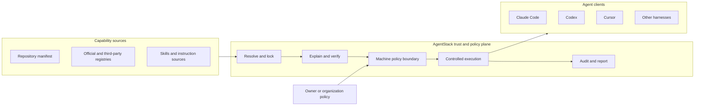
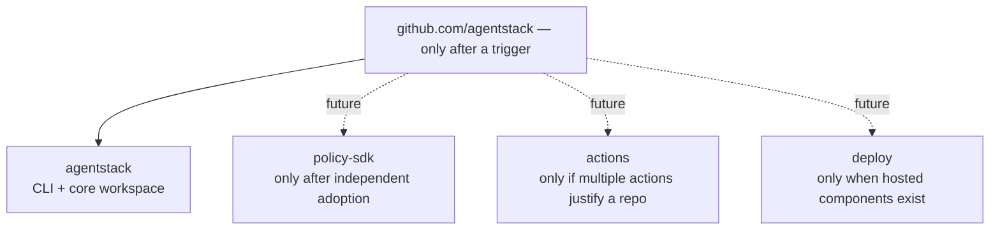
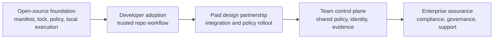
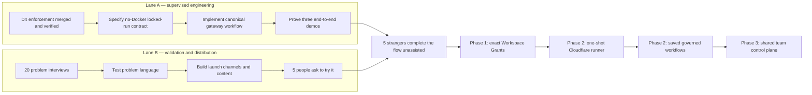

# AgentStack strategy

> **Status:** working strategy and decision framework, not a promise of shipped features<br/>
> **Updated:** 2026-07-16<br/>
> **Audience:** maintainers, contributors, design partners, and future collaborators<br/>
> **Publication:** intentionally public. Open strategy supports trust and contribution; exact pricing, prospect details, and confidential commercial assumptions stay elsewhere.

## Executive decision

AgentStack should become the **vendor-neutral trust and policy layer for agent-enabled repositories**.

The immediate message is:

> **Cloning a repo should not hand your agent to a stranger.**

The defensible product is not another agent, prompt library, or MCP marketplace. It is the layer that makes agent configuration portable, inspectable, reproducible, and unable to weaken the policy of the machine on which it runs.

The operating decisions are:

1. Keep one product and one monorepo while the product wedge is being proven.
2. Preserve modular Rust crate boundaries, but create separate repositories only when a component earns independent adoption.
3. Reserve the `AgentStack` GitHub organization name now; do not transfer the repository until an explicit trigger is met.
4. Make local enforcement and portability open source. Monetize coordination across people, machines, and organizations.
5. Import or federate existing discovery sources instead of building another public MCP directory.
6. Make `agentstack run <harness> --locked` from the current repository the supervised product milestone. The locked modifier is not shipped today; the existing harness positional remains intact.
7. Run product validation and distribution work in parallel with the engineering critical path.
8. After the locked-run activation gate, make **Workspace Grants**—exact, reviewable read/write/deny roots plus tool, secret, egress, and budget limits—the next enforcement product milestone.
9. Use Cloudflare as the first hosted execution backend only after scoped local execution is proven. Cloudflare is an adapter behind AgentStack's portable policy contract, not the product identity.
10. Add saved JavaScript/TypeScript workflows only after a one-shot local/cloud run shares one frozen execution contract. Workflow files request capabilities; they never grant capabilities to themselves.

## What exists today

The repository is already a modular Cargo workspace with nine crates:

```text
crates/
├── core
├── trust
├── policy
├── adapters
├── recorder
├── runtime
├── egress
├── executor
└── cli
```

That is a good internal architecture. It does **not** yet mean that AgentStack has nine independently adoptable products.

Important factual baselines:

- `agentstack run` exists. It launches a supported harness as a tracked run and can use profile, sandbox, lockdown, and plan options.
- The proposed `agentstack run <harness> --locked` contract does not exist yet. Trust, lock verification, policy compilation, guarded host execution, and reporting are not yet one completed public workflow.
- `--sandbox` and `--lockdown` require the sandbox feature plus a running Docker daemon. Official release binaries include that feature; default local source builds omit it. Docker is still too large a prerequisite for the first-run activation wedge.
- A composite GitHub Action already exists in [`action.yml`](action.yml), and the README includes a copyable example. It runs `agentstack install --locked` and `agentstack doctor --ci`. The next job is to add a visible failure demo, publish it on the site, and distribute it—not rebuild it.
- The manifest is the source of truth. Generated client files are compiled output.
- Machine policy is the upper bound. A repository may request less capability, never more.

## The product thesis

AgentStack sits between untrusted or partially trusted agent configuration and the tools that execute it.



The promise has five parts:

- **Portable:** one manifest can describe the intended setup across supported clients.
- **Reproducible:** a lockfile pins what was selected and allows CI to detect drift.
- **Inspectable:** the user can understand sources, secrets, writes, and capabilities before activation.
- **Bounded:** repository configuration cannot loosen machine or organization policy.
- **Repeatable:** a reviewed task can be saved and rerun without widening its approved code, tools, secrets, network, or budget envelope.

Portability creates adoption. Trust and policy create differentiation. Coordination creates revenue.

## What AgentStack is—and is not

### AgentStack should own

- The portable manifest and lock contract.
- Capability resolution and provenance.
- Client adapters and lifecycle management.
- Trust decisions and policy compilation.
- Enforced execution paths, egress decisions, and audit evidence.
- The portable Workspace Grant and workflow execution-plan contracts.
- Organization-level distribution and policy coordination later.

### AgentStack should integrate with

- Official MCP registries and vendor catalogs.
- Existing runtimes and sandbox technologies where they improve enforcement.
- Native workflow formats where they can be imported, wrapped, and governed without weakening the AgentStack policy ceiling.
- Native harness extension and plugin surfaces (pi extensions, OpenCode plugins, Claude Code/Codex plugins) as governed distribution targets — AgentStack pins and delivers the code; only the harness executes it.
- Secret stores and identity providers.
- CI providers, source hosts, and security information systems.
- Agent clients rather than attempting to replace them.

### AgentStack should not build now

- Another general-purpose agent.
- A proprietary prompt or skill marketplace.
- A public MCP directory that competes with existing discovery networks.
- A hosted control plane before local activation is proven.
- Another generic cloud coding agent or general-purpose workflow engine.
- Cloudflare-specific concepts in the portable manifest, grant, or workflow contract.
- Separate repositories merely to make the project look like a larger ecosystem.

## Security decision ledger

These decisions are part of the strategic sequence even when their detailed
implementation proof lives in architecture, enforcement, tests, or history.
Each open boundary is its own supervised implementation and review unit; do not
bundle it with documentation, catalog transport, or unrelated guard changes.

| ID | Status and phase | Decision | Required proof |
|---|---|---|---|
| D1 — resilient machine floor | **Done** | Cache the validated, secret-free machine `Policy` input—not a project ruleset. A corrupt edit uses the exact last-known-good input; first-run corruption or an invalid snapshot blocks protected activation. This is resilience against accidental rot, not protection from a host-compromised user process. | Valid refresh, unchanged-digest, degraded snapshot, blocked first-run, corrupt/future snapshot, and gateway-deny regression tests. |
| D2 — one resolved grant | **Phase 0A** | Extend the existing `ExecutionPlan` / `Gateway::from_plan` seam into native render and profile leases. One frozen grant carries resolved identities, verified pins, trust state, effective policy, secret grant and lifetime, confinement posture, and evidence identity. Do not create a parallel authority abstraction. | Every delivery path consumes the same grant; no path independently reconstructs or widens authority. |
| D3 — local executable integrity | **Phase 0A gate** | Allow manifests to declare integrity inputs for stdio scripts and other local executables; pin them in the lock, show them in trust review, and warn when executable local code is intentionally unpinned. If the first locked-run release excludes this coverage, label that limit explicitly rather than implying it is locked. | A one-byte executable edit fails verification and re-gates review; an unpinned executable is visibly labelled. |
| D4 — one MCP route in lockdown | **Done** | The same frozen, pin-verified server set drives gateway dispatch and the `gateway_only_hosts` egress fence. Declared HTTP MCP hosts are direct-denied on all ports; stdio stays host-side; literal-IP/non-TLS tunnels are refused; unsafe fallback or partial resolution fails closed. | Docker witness: direct declared upstream fails while the same call succeeds and is recorded through the relay; precedence, transport, classification, and ruleset-version tests. |
| D5 — sandbox name matches posture | **Phase 1 decision** | After D4 and compatibility evidence, decide whether ordinary `--sandbox` should mean confined networking by default and expose bridge/proxy-only mode under an explicitly weaker name. | Compatibility evidence plus tests and documentation showing the default name cannot overstate the topology. |
| D6 — extensions are pinned executable content | **Proposed, post-cut lane** ([design](docs/design/extensions-capability.md)) | Govern native harness extensions/plugins (pi, OpenCode first) as a first-class capability kind: strict content pinning via the D3 integrity-root digest, untrusted-means-never-rendered, copy-based render with an ownership ledger, and an honest provenance-only runtime label — the code executes inside the harness process, outside the policy ceiling, and AgentStack never executes it itself. No cross-CLI translation; the portable layer remains declarative hooks. | Witnesses: an untrusted bundle renders no extension bytes; a one-byte source edit fails locked verification and re-gates review; pruning never touches unmanaged files or the guard's artifacts. |

## Ecosystem and GitHub organization plan

The TanStack analogy is useful for brand architecture, but not as a reason to copy its current repository count. TanStack projects can be adopted independently. AgentStack components should earn that status through usage.

### Decision now

- Reserve the `AgentStack` organization handle, if available.
- Keep `Tarekkharsa/agentstack` as the active home for now.
- Keep the nine crates in the existing workspace.
- Present the crates as product layers in the documentation, not as nine separately marketed products.

### Transfer trigger

Transfer the main repository to the organization when **any one** of these is true:

- A second public repository is genuinely needed, such as a reusable SDK, policy library, or deployment package.
- A design partner needs organization ownership or organization-scoped access.
- An external maintainer needs durable permissions that should not depend on a personal account.
- The project has enough adoption that neutral ownership materially improves trust.

### Repository split test

A component becomes a separate repository only when all five statements are true:

1. It is useful without installing the full AgentStack CLI.
2. It has its own users, documentation, versioning needs, and release cadence.
3. Its API boundary is stable enough to support independent consumers.
4. The maintenance and CI overhead is lower than the coordination benefit.
5. At least one real adopter has asked to use or contribute to it independently.

The possible future shape is:



The brand can still be an ecosystem before the code is split:

- **AgentStack Core:** manifest, locking, resolution, and shared models.
- **AgentStack Trust:** trust decisions, signatures, provenance, and explanations.
- **AgentStack Policy:** policy definition and compilation.
- **AgentStack Runtime:** controlled execution and lifecycle.
- **AgentStack Workflow:** saved, digest-pinned task plans with role-specific grants; only after the execution contract is proven.
- **AgentStack Recorder:** evidence, audit events, and reports.
- **AgentStack Cloud:** hosted runtime adapters, beginning with Cloudflare; only after scoped local execution is proven.
- **AgentStack CLI:** the primary user interface across those capabilities.

## Product and revenue ladder

The business model should follow the boundary between local enforcement and organizational coordination.



### Free and open source

- Manifest, lockfile, profiles, adapters, and local activation flows.
- Local trust, signatures, policy evaluation, sandboxing, and reports.
- CI verification through the existing GitHub Action.
- Registry import and ecosystem interoperability.

Keeping enforcement open makes the security claim inspectable and allows AgentStack to become a common format.

### Paid design partnerships

The first revenue should be high-touch and evidence-producing:

- Integrate AgentStack with a team's real repositories and clients.
- Convert existing configurations into governed manifests.
- Define machine and organization policy baselines.
- Produce an audit or compliance export required by the customer.
- Turn repeated work into the first control-plane features.

Exact pricing is a private commercial hypothesis and should be validated in sales conversations, not committed to this public repository.

### Team control plane

Charge for coordination that is difficult to reproduce with local files alone:

- Organization policy distribution and inheritance.
- Identity, groups, roles, and approval workflows.
- Fleet inventory and configuration status.
- Shared secret references and provider integrations without storing raw secrets in manifests.
- Central audit search, retention, and export.
- Managed updates, exceptions, and evidence collection.

### Enterprise assurance

- SSO and directory synchronization.
- Data residency and private deployment options.
- Policy-as-code review and delegated administration.
- SIEM and governance integrations.
- Compliance evidence packages and longer retention.
- Support commitments, onboarding, and architecture review.

## Execution strategy: two parallel lanes

The engineering milestone and market learning should proceed together. Interviews do not require a finished product, but activation tests do.

> **Scope decision (2026-07-16) — minimum version first.** The maintainer has
> scoped current work to a minimum version: finish the locked-run keystone and
> close the gaps in already-implemented machinery, then stop. Lane B
> (validation and distribution) and everything past the minimum-version cut
> are deferred — explicitly, not silently — until the cut ships and there is
> time or a reason to seek external users. The success criterion for the cut
> is "trustworthy for the maintainer's own daily repositories." The exact cut
> line lives in [`TODO.md`](TODO.md); the phase gates below remain the bar for
> calling any phase complete.



The roadmap uses **exit gates**, not optimistic dates. Calendar estimates can be added after the `run <harness> --locked` contract is designed and sized.

## Phase 0A — prove the canonical no-Docker activation path

### Objective

Turn the repo-safety thesis into one understandable, end-to-end workflow that works with the standard released binary and does not require Docker.

### Assurance-tier decision

AgentStack should present two honest assurance tiers:

| Tier | Requirements | Guarantees and limits | Product role |
|---|---|---|---|
| Protected activation | Standard binary; no Docker | Explicit project trust, locked-input and drift checks, policy compilation under the machine ceiling, and cooperative host-guard hooks where supported by the client. This is meaningful protection, but it is not kernel isolation. | **Opt-in** Protected quickstart for Phase 0A (a candidate default at the Phase 0A exit gate); developer adoption and the 15-minute activation metric |
| Maximum assurance | Official release binary, or a source build with the `sandbox` feature, plus a running Docker daemon | Container sandboxing and, with `--lockdown`, stronger network confinement through the egress path. Platform-specific guarantees must remain documented and tested. | Security-sensitive teams, CI, and environments willing to accept the dependency |

The no-Docker tier is the activation wedge. Sandbox and lockdown remain important differentiation, but are an explicit opt-in maximum-assurance mode rather than a prerequisite for seeing the product's value.

### CLI-surface decision

Preserve the current required harness positional:

```text
agentstack run <harness> --locked
```

For the first release of this workflow, the project is the current working directory. `--locked` is a modifier that fails closed on trust or lock violations; it does not consume a second positional argument. Remote acquisition must not be overloaded into the harness slot. If later evidence justifies URL or bundle acquisition, add an explicit named source option or a separate preparation command after its trust boundary is designed.

### Critical path

1. **[done]** Finish, review, and test the D4 lockdown and gateway work.
2. Write the behavioral contract for `agentstack run <harness> --locked` before expanding the CLI surface.
3. Complete D2 by extending the existing resolved-grant seam across the locked host run, native render, gateway, and profile leases; do not introduce a second authority path.
4. Settle D3 local executable integrity as part of the locked contract: implement pinned integrity inputs or explicitly exclude and label that surface in the first release.
5. Resolve the current repository's AgentStack state without executing repository-controlled hooks or tools.
6. Detect the AgentStack manifest and require an explicit trust decision.
7. Resolve only locked inputs and fail closed on drift or missing references.
8. Compile repository policy under the machine-policy ceiling.
9. Launch the selected harness through the canonical gateway and enforced execution path.
10. Record material decisions and produce a human-readable report.
11. Clean up generated state according to the selected artifact mode.

### Contract questions that must be settled

- What minimum state must exist in the current working directory, and what named interface could safely support remote sources later?
- How does the new `--locked` modifier compose with the existing required `harness` positional, `--profile`, `--plan`, and trailing harness arguments?
- Where is the trust boundary before any repository-controlled code or hook can run?
- What exactly does `--locked` guarantee for skills, servers, binaries, images, and remote sources?
- Which local scripts and executable assets become declared integrity inputs,
  and how is intentionally unpinned local code labelled without implying coverage?
- Which execution claims are kernel-enforced on each operating system, and which are advisory?
- How are secrets requested without resolving them before trust is established?
- What is recorded, where is it stored, and how can sensitive values be excluded?
- What happens when a client cannot support a capability safely?
- How does cleanup behave for static, clean-at-rest, and zero-files modes?
- Which fields must be frozen into a backend-neutral execution plan so the same reviewed grant can later run locally or through a hosted adapter without semantic drift?

### Required demos

1. **Safe repository, no Docker:** using the standard binary, inspect, trust, lock-check, compile policy, launch with supported host guards, report, and clean up.
2. **Policy violation, no Docker:** repository requests a capability forbidden by machine policy and is blocked with an understandable explanation.
3. **Tamper or drift, no Docker:** a dependency or lock input changes and execution fails before activation.
4. **Maximum assurance:** with an official release binary (or a feature-enabled source build) and Docker available, demonstrate sandbox and lockdown behavior separately from the first-run quickstart.

### Exit gate

- The three no-Docker demos pass using the standard released binary; the separate maximum-assurance demo passes in its documented Docker environment.
- Claims in the landing page and README match what the enforcement path actually guarantees.
- Five people with no maintainer help can complete the no-Docker safe-repository flow.
- Median time to first successful protected run is under 15 minutes.

## Phase 0B — validate the problem and build distribution

This lane runs concurrently with Phase 0A.

### Interview target

Conduct 20 problem interviews with developers or security owners who use at least two agent clients, manage agent configuration in repositories, or review third-party agent-enabled repositories.

The interviews should investigate current behavior, not pitch the roadmap:

- What happens after they clone a repo containing agent configuration?
- Which files or instructions do they inspect before opening an agent?
- Have they experienced configuration drift across developers or clients?
- Who is allowed to approve MCP servers, skills, hooks, or secrets?
- What evidence would security need before approving broad agent adoption?
- Which part is painful enough that they already maintain scripts, templates, or policy documents?
- Which repository directories should an agent be able to read, edit, or never see for a real task?
- Which agent task is repeated often enough that they would save and rerun it?
- Would they run that task remotely if the sandbox received no long-lived repository or model credential and returned only a reviewable patch and receipt?

Success is **five interviews ending with “can I try it?”** This measures pull without pretending those people are already design partners.

### Distribution channels

| Audience | Problem message | Primary channels | Asset |
|---|---|---|---|
| Agent-heavy developers | “Cloning a repo should not hand your agent to a stranger.” | Show HN, GitHub, agent-client communities, Rust communities | 90-second demo and reproducible example repo |
| Platform and DevEx teams | “One governed setup across agent clients.” | Direct outreach, engineering blogs, platform communities | portability matrix and migration guide |
| AppSec and DevSecOps | “Repo policy can narrow machine policy, never widen it.” | Security communities, conference proposals, practitioner newsletters | [published security review](https://tarekkharsa.github.io/agentstack/security-review-2026-07-11.html), threat model, policy-violation demo, and CI example |
| Open-source maintainers | “Ship an agent setup users can inspect and reproduce.” | GitHub Discussions, maintainer communities, targeted outreach | contributor quickstart and trust badge concept |

### Launch sequence

1. Publish a short technical article describing the clone-as-consent problem without leading with product features.
2. Release the three demo repositories and short terminal recordings.
3. Rewrite the homepage and README lead around “Cloning a repo should not hand your agent to a stranger,” with portability as supporting proof rather than the headline.
4. Add a visible failure demo and site copy for the existing documented GitHub Action.
5. Use the published security review in AppSec outreach and link it from the trust story.
6. Invite a small beta group through GitHub Discussions or a lightweight mailing list.
7. Conduct direct outreach to 20 teams already using multiple agent clients.
8. Publish a Show HN only after the quickstart succeeds without maintainer intervention.
9. Turn the first successful external adoption into a case study focused on time saved or risk removed.

### Weekly operating rhythm

- Five problem conversations or targeted outreach messages.
- One concrete technical artifact: demo, article, migration note, or policy example.
- One unassisted activation observation once the workflow is usable.
- One review of objections, failed activations, and message performance.

## Phase 1 — productize the wedge

Begin only after the Phase 0 activation gate is met.

### Product work

Complete this work in order:

1. Make the canonical run path predictable, documented, and fast.
2. Ship **Workspace Grants** in the maximum-assurance local path. Start with safely mountable directory roots (`path/**`), a read-only repository root, nested read-write mounts for approved roots, deny masks, canonical-path checks, and exact grants in the run plan and report. Machine policy remains the ceiling. Host hooks may mirror the intent but must remain labelled cooperative.
3. Bind grants to profiles and future workflow roles so a researcher can be read-only, an implementer can write one subtree, and a reviewer can receive only the diff. A changed persistent grant changes the consent digest and requires renewed trust.
4. Freeze one backend-neutral execution-plan contract covering project and workflow digests, read/write/deny roots, tools, secrets, egress, commands, approval points, time/token/cost limits, and audit identity. A backend may narrow this plan, never reinterpret or widen it.
5. Resolve D5 using compatibility evidence: either make confined networking the ordinary meaning of sandbox or retain the current split with names and labels that cannot imply stronger topology.
6. Add a report-only sequence-anomaly heuristic after recorder completion: flag a `secret_access` followed shortly by egress inconsistent with that secret's constrained server. It must never block and must be described as metadata correlation—not DLP or payload inspection.

Then continue the adoption work:

- Promote the existing GitHub Action as the CI trust gate.
- Add importers or resolvers for relevant official registries rather than owning a directory.
- Improve signature and provenance UX.
- Provide clear policy examples for individuals, teams, and CI.
- Make audit reports easy to export and attach to reviews.
- Harden install, upgrade, restore, and cross-platform behavior.

### Adoption work

- Publish a compatibility matrix based on tested behavior.
- Provide migration guides from common native configurations.
- Maintain small examples for the top supported clients.
- Write one case study from a real external user.
- Track quickstart failures as product bugs, not documentation anecdotes.

### Exit gate

- Ten independent activated repositories.
- At least five weekly active external users for four consecutive weeks.
- At least three repositories use the GitHub Action.
- One external maintainer or team relies on AgentStack for a real workflow.
- At least one external repository uses an enforced directory-scoped write grant, and its run report proves that writes outside the grant fail.
- The same frozen execution plan passes conformance tests against the local runtime seam intended for future hosted adapters.

## Phase 2 — paid design partnerships

### Objective

Learn which coordination problem organizations will pay to remove.

### Offer

- A limited-scope implementation using the open-source product.
- A documented policy baseline and client rollout.
- A defined success measure such as setup time, drift reduction, blocked violations, or audit preparation time.
- Weekly access to the maintainer and an explicit path for product feedback.

### Rules

- Sell an outcome, not an unlimited custom engineering retainer.
- Require permission to anonymize learnings, even if the customer cannot be named.
- Prefer features useful to multiple customers.
- Do not build hosted infrastructure for a single customer's procurement checklist.
- Record every repeated manual task as a control-plane candidate.

### Ordered product experiments

These experiments follow the local Phase 1 grant and execution-plan gates. They are not prerequisites for the initial open-source activation wedge.

1. **Cloudflare one-shot runner.** Use Cloudflare as the first hosted backend: a Worker owns authentication, policy, approvals, and credential brokering; a durable run coordinator owns state; and one isolated Sandbox performs the agent task. Start with one repository, one supported harness, one frozen grant, and one returned patch plus receipt. Keep model and Cloudflare credentials bring-your-own initially. Do not build a multi-tenant dashboard in this phase.
2. **Repository broker boundary.** The sandbox receives only approved read material and short-lived execution credentials—not a long-lived GitHub App token. Trusted service code validates returned paths, traversal, symlinks, and write scope before applying a patch to a new branch or pull request. A sparse checkout alone is not an enforcement claim.
3. **Saved governed workflows.** Add `.agentstack/workflows/*.js` or `*.ts` only after the one-shot local and Cloudflare paths consume the same frozen plan. Import and wrap a native workflow format before inventing broad orchestration syntax where practical. AgentStack's portable format must be a restricted, versioned API that normalizes to an inspectable plan; arbitrary workflow code never executes on the host.
4. **Role-specific authority.** Each workflow role receives its own profile, folders, tools, secrets, egress, commands, budget, and audit identity. Workflow source and normalized-plan digests are locked; any change re-gates trust. Retries require idempotent steps, and commit, pull-request, deployment, or other irreversible effects require explicit policy or approval.
5. **Durability only when needed.** Use Cloudflare Workflows for retries, waits, recovery, schedules, and human approval only after a real repeated task needs those properties. AgentStack owns the portable contract; Cloudflare implements the first durable adapter.

### Exit gate

- Two paying design partners with the same core coordination problem.
- One repeated workflow clearly belongs in a team product.
- Evidence that the buyer, user, and security stakeholder can agree on value.
- At least one design partner completes a Cloudflare-hosted run whose effective grant and receipt match the local contract.
- At least one saved workflow is run repeatedly with role-specific grants and without permission widening after a source or policy change.

## Phase 3 — team control plane

Build the smallest hosted or self-hosted coordination product supported by pilot evidence.

### Initial scope

- Organization and project inventory.
- Signed policy distribution and inheritance.
- Identity, roles, and approval records.
- Shared, signed Workspace Grants and workflow distribution.
- Optional managed Cloudflare execution with usage metering; local and bring-your-own-cloud execution remain supported.
- Fleet health and lock-drift status.
- Searchable audit events and basic retention.
- Integrations with existing secret and identity providers.

### Architecture principle

Local enforcement must continue working without the cloud. The control plane distributes policy and collects evidence; it must not become the only place where safety decisions can be evaluated.

### Exit gate

- Three organizations use shared policy or audit coordination weekly.
- At least one organization expands beyond the original pilot team.
- Support load and infrastructure cost fit a repeatable commercial model.

## Phase 4 — enterprise assurance

Build only against proven procurement and governance needs:

- SSO, directory synchronization, and delegated administration.
- Private networking, regional storage, and deployment choices.
- Longer evidence retention and SIEM export.
- Formal policy change control and exception workflows.
- Compliance mappings and audit-ready evidence packages.
- Support and reliability commitments.

The exit gate is repeatable enterprise sales driven by the same product, not a collection of unrelated consulting engagements.

## Feature priority

| Priority | Work | Why now |
|---|---|---|
| Done | D4 enforcement and machine-policy hardening | Security foundation merged and verified on `main` |
| P0 | Specify and implement the no-Docker `run <harness> --locked` contract | This is the user-facing activation wedge and preserves the current CLI shape |
| P0 | D2 one resolved grant across delivery paths | The locked run cannot be canonical if render or leases reconstruct authority independently |
| P0 | D3 declared local executable integrity or an explicit exclusion | `--locked` must not imply that unpinned scripts are content-bound |
| P0 | Three end-to-end demos and unassisted activation tests | Proves the promise is understandable and real |
| P0 parallel | Interviews, message testing, and distribution assets | Prevents building without a channel |
| P1 | Document and promote the existing GitHub Action | Converts current capability into adoption |
| P1 | Exact Workspace Grants in the local maximum-assurance path | Establishes the permission contract before any remote execution or orchestration |
| P1 | Backend-neutral frozen execution plan | Prevents local and hosted backends from drifting semantically |
| P1 | D5 sandbox-default posture decision | Makes the user-facing mode name match the proven network topology |
| P1 | Sequence-anomaly report flag | Adds useful metadata evidence without claiming DLP |
| P1 | Provenance UX, registry imports, migration guides | Reduces adoption friction without creating a marketplace |
| P1 | Reports and policy examples | Makes trust decisions useful to developers and reviewers |
| P1 post-cut | D6 governed native extensions kind (pi, OpenCode first) | Closes the last unmanaged capability surface; the D3 digest machinery and the guard's write path already cover the hard parts |
| P2 | Paid rollout playbook, evidence export, and one-shot Cloudflare runner | Tests remote execution without prematurely building a control plane |
| P2 after runner evidence | Saved governed workflows with role-specific grants | Makes proven tasks reusable without widening authority |
| P3 | Shared policy, workflows, identity, inventory, approvals, audit search | Monetizable coordination layer |
| Deferred | Public marketplace, broad fleet platform, compliance suite, repo split | Requires real usage or paid demand |

## Metrics and decision gates

### Activation

- Percentage of quickstart users who complete a protected run.
- Median time from standard-binary install to first no-Docker protected run.
- Failure stage: install, trust, lock, policy, client launch, or report.
- Number of external repositories with a committed manifest and lockfile.

### Retention

- Weekly active external users and repositories.
- Repeat protected runs per repository.
- Runs using enforced directory-scoped write grants.
- Saved workflow reruns, completion rate, and permission-change re-gates.
- Local versus hosted runs consuming the same execution-plan version.
- Lockfile refreshes, CI checks, and policy decisions over time.
- Percentage of users supporting more than one agent client.

### Trust value

- Violations blocked before activation.
- Drift or tampering detected in CI.
- Time required to explain why a capability was allowed or denied.
- Evidence exported for code review, security review, or audit.

### Commercial pull

- Interviews that ask to try the product.
- Teams willing to provide a real repository and policy baseline.
- Qualified pilot conversations and paid pilots.
- Repeated requests for shared policy, identity, inventory, or evidence.

### Kill or change signals

Reconsider the wedge if, after adequate distribution:

- Developers do not perceive repository agent configuration as a meaningful trust problem.
- The protected workflow adds too much friction to become routine.
- Native client standards fully solve portability and machine-policy ceilings across clients.
- Most interest is only in generic MCP discovery rather than trust and enforcement.

If the trust wedge is weak but portability is strong, narrow the product to reproducible cross-client configuration. If security buyers show pull but individual developers do not, lead with CI and platform governance while keeping the local developer experience free.

## Competitive posture

The market already contains runtime, registry, gateway, and managed-MCP products. AgentStack should use them to sharpen its boundary:

| Category | Examples | AgentStack posture |
|---|---|---|
| Vendor catalogs and local runtimes | Docker MCP Catalog and Toolkit | Integrate where useful; differentiate on repository trust, cross-client policy, and reproducibility |
| Secure MCP runtimes and gateways | ToolHive | Consider runtime adapters or complementary use; avoid claiming uniqueness for sandboxing alone |
| Managed enterprise MCP | MintMCP and similar products | Compete only where organization policy and evidence overlap; keep the local foundation vendor-neutral |
| Public discovery | Official MCP Registry, GitHub MCP Registry | Import and federate; do not rebuild the directory |
| Native agent-client configuration | Claude Code, Codex, Cursor, others | Compile to or broker for them; remain above any single vendor |

The moat is the combination of:

- A widely adopted, versioned manifest and lock contract.
- High-quality adapters across otherwise incompatible clients.
- A machine-policy ceiling users can reason about.
- Provenance and evidence that follow the configuration lifecycle.
- A trusted open-source implementation with a paid coordination layer.

## Risks and mitigations

| Risk | Consequence | Mitigation |
|---|---|---|
| The hero workflow is larger than estimated | Roadmap slips while messaging gets ahead of reality | Specify the behavioral contract first; use exit gates; keep claims tied to tested enforcement |
| First value requires an optional build and Docker | Laptop users bounce before experiencing the trust value | Make the no-Docker protected tier the quickstart; measure sandbox and lockdown as a separate maximum-assurance journey |
| Security language overclaims OS guarantees | Loss of trust | Publish platform-specific guarantees and distinguish enforced from advisory controls |
| Too many features dilute the wedge | No clear reason to adopt | Freeze hosted, marketplace, and fleet work until activation gates are met |
| No repeatable acquisition channel | Product receives friendly feedback but no strangers | Operate distribution weekly and measure unassisted activation |
| One large vendor absorbs the category | Cross-client value weakens | Stay standards-based, vendor-neutral, and useful with multiple runtimes and registries |
| Native clients make folder rules and workflows table stakes | Individual features stop differentiating AgentStack | Sell the portable combination of role-specific grants, machine ceilings, provenance, and evidence across clients |
| Cloudflare becomes part of the public contract | Vendor lock-in prevents other runtimes and private deployments | Keep a backend-neutral frozen plan and treat Cloudflare as the first adapter only |
| Saved workflow code widens its own authority | A reusable automation becomes a privilege-escalation path | Workflow files only request grants; machine and organization policy cap them; digest changes re-gate trust |
| Remote agent runs create weak margins or runaway spend | Hosted usage grows without a viable business | Begin with bring-your-own Cloudflare and model credentials; enforce time/token/cost budgets before managed resale |
| Premature repository or organization restructuring | Maintenance work without user value | Reserve the organization; transfer and split only on explicit triggers |
| Consulting becomes bespoke work | Revenue without a scalable product | Time-box pilots and only productize repeated coordination needs |

## Active execution checklist

[`TODO.md`](TODO.md) is the only ordered day-to-day work list. It starts with
the first incomplete Phase 0A and Phase 0B gates, links back to the detailed
phase contracts here, and stops later-phase work from entering the current
critical path. Update this strategy only when a decision, phase, or exit gate
changes; update `TODO.md` as work starts and finishes.

## Decision log

| Decision | Rationale | Revisit when |
|---|---|---|
| One monorepo | Crates are coherent internal modules, not yet independent products | A component passes the five-part split test |
| Reserve org, defer transfer | Protects the name without creating migration work | A transfer trigger occurs |
| Local enforcement remains OSS | Inspectability and adoption are prerequisites for trust | Only if sustainability proves impossible without weakening the standard |
| Monetize coordination | Shared policy, evidence, and governance have organizational value | Pilot evidence identifies a different repeatable buyer problem |
| Federate registries | Discovery already has credible providers | Users prove a missing trust-metadata layer cannot be supplied through federation |
| No-Docker `run <harness> --locked` is supervised critical-path work | It joins multiple trust boundaries, preserves the existing positional CLI, and must not be treated as polish | The end-to-end contract and activation demos are complete |
| Extend the existing resolved-grant seam | A parallel D2 abstraction would recreate trust, policy, secret, and evidence decisions inconsistently | Every delivery path consumes the same frozen grant |
| Pin or label local executable code | A locked manifest that launches a changed unpinned script is not fully content-bound | D3 witness proves a byte change re-gates, or the product claim explicitly excludes it |
| Revisit the sandbox default after compatibility evidence | `--sandbox` currently leaves a direct route open while `--lockdown` is topologically confined | D5 evidence supports a final, honestly named interface |
| Workspace Grants precede cloud execution | The hosted path must inherit a proven read/write/deny and authority contract rather than invent one remotely | Exact local grants and execution-plan conformance are proven |
| Cloudflare is the first hosted backend, not the product identity | Its Worker, durable coordination, Sandbox, and Workflow primitives fit the first vertical slice, while AgentStack must remain portable | A second backend or private-deployment requirement earns an adapter |
| Saved workflows follow one-shot local/cloud parity | Persistence and orchestration multiply security and cost risk; they should wrap a stable frozen plan | A repeated user task proves the need and both backends consume the same plan |
| Strategy is public; commercial details are private | Transparency supports trust, but pricing and prospect data create no equivalent public benefit | Publication causes measurable strategic harm or the audience changes |
| Native extensions ride the existing executable-integrity machinery, post-cut (2026-07-16) | pi-style harness extensions are the last unmanaged capability surface and the highest-risk one; D3's strict digests, trust re-gating, and the guard's proven write path into pi/OpenCode make a new manifest kind cheaper and safer than a parallel mechanism. Provenance-only at runtime, labelled honestly | E1/E2 witnesses land, a second CLI pair shares an extension format (revisits singular `target`), or evidence earns the E4 unification |
| Minimum version first; Phase 0B and post-cut work deferred (2026-07-16) | Solo-maintainer time and token budget are the binding constraints; the configuration problem is solved and the staged trust machinery must become an enforced claim before anything new is worth building. Deferral is explicit so resuming is a decision, not drift | The minimum version ships, or a concrete external pull (user, design partner, deadline) justifies reopening a deferred lane |

## External reference points

- [TanStack GitHub organization](https://github.com/TanStack)
- [Docker MCP Catalog and Toolkit](https://docs.docker.com/ai/mcp-catalog-and-toolkit/)
- [ToolHive](https://github.com/stacklok/toolhive)
- [Official MCP Registry](https://registry.modelcontextprotocol.io/)
- [GitHub MCP Registry announcement](https://github.blog/ai-and-ml/github-copilot/meet-the-github-mcp-registry-the-fastest-way-to-discover-mcp-servers/)
- [MintMCP](https://www.mintmcp.com/)
- [Claude Code workflows](https://code.claude.com/docs/en/workflows)
- [Cloudflare Agents](https://developers.cloudflare.com/agents/)
- [Cloudflare Sandbox](https://developers.cloudflare.com/sandbox/)
- [Cloudflare Workflows](https://developers.cloudflare.com/workflows/)

These references are positioning inputs, not implementation dependencies or endorsements.
