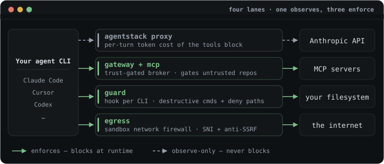

<!-- INTERNAL SOURCE: this file is the build input for its page on
     https://tarekkharsa.github.io/agentstack/ — readers go to the site.
     Edit here, then run: python3 tools/make-docs-pages.py -->

# AgentStack — Enforcement matrix

This is the authoritative, code-grounded answer to one question: **for each
execution mode, what does AgentStack actually enforce, and by what mechanism?**
When any other document and this one disagree, this one is right — it is checked
against the source, not against intent.

Audience: anyone deciding what a mode actually guarantees.

**Contents**

- [Claim discipline](#claim-discipline)
- [What "trusted" does and does not mean](#what-trusted-does-and-does-not-mean)
- [Policy is authority, not isolation](#policy-is-authority-not-isolation)
- [The matrix](#the-matrix)
- [Per-cell notes](#per-cell-notes)
- [Experimental `tools_execute`](#experimental-tools_execute)
- [See also](#see-also)

AgentStack intercepts an agent CLI on four independent lanes — one observes, three enforce:

## Claim discipline

AgentStack **restricts destinations and records decisions; it cannot guarantee
that sensitive content never leaves through an allowed destination.** An enforced
egress allowlist blocks connections to hosts you did not approve — it does not
inspect payloads, and it permits traffic to every host you *did* approve,
including the model API itself. A prompt-injected agent can still exfiltrate
through any allowed channel. The honest claim is: *untrusted project
declarations are not auto-activated, and unapproved egress is blocked on the
enforced paths* — never "exfiltration is impossible."

Read every cell below with that ceiling in mind. "Enforced" means the disallowed
action is *prevented at runtime* (by the kernel, the container boundary, or the
proxy); it never means the allowed action is *safe*.

## What "trusted" does and does not mean

Trusting a project asserts exactly one thing: **the current manifest, local
overlay, and lockfile consent digest was approved for automatic loading on this
machine.** The lockfile separately pins resolved server definitions, skills,
and instructions; drift in those inputs fails verification. Detached
signatures attest to lockfile bytes but do not silently create local trust.

Trusted does **not** mean:

- **Safe to run unsandboxed.** Trust gates *whether* a bundle's servers spawn,
  its skills enter context, and its secrets resolve. It does not confine what a
  running agent then does — that is the job of policy and the sandbox, per the
  matrix below.
- **Vetted for correctness or intent.** `agentstack trust` summarizes the
  runtime surface—commands, HTTP contacts, secret refs, and skill pin status—so
  *you* can judge it. AgentStack verifies the consent digest and lock pins; it
  does not vouch for what the referenced code does.
- **Tamper-proof against a compromised host agent.** In host mode the agent CLI
  runs as you, so it can in principle reach the user-writable trust store under
  `~/.agentstack/` and self-trust a bundle. Only the sandbox removes this. The
  interactive consent probe is part of the same honest limit: `agentstack
  trust` treats a terminal on stdin as attended consent, and a same-user
  process that allocates a pseudo-terminal (`script`, `expect`, a `pty`
  wrapper) reads as interactive — no stronger than the store-file boundary
  above, and not claimed to be. What the gate does enforce is that headless
  callers (pipes, RPC servers) cannot grant without `--yes` plus the reviewed
  `--consented-digest`. Every store mutation now leaves an identity-only
  event behind (see [Trust-store mutation
  logging](#trust-store-mutation-logging)), which makes silent self-trust
  harder to miss — but the log lives in the same user-writable directory, so
  it is evidence, not a defence.

Conversely, **untrusted project declarations are inert on automatic and
experimental execution paths**: the auto-project gateway does not spawn or
contact their MCP servers or resolve their secrets, and `tools_execute` refuses
to begin. This does not sandbox arbitrary repository code, prevent a user from
running it manually, or block an explicit static `agentstack apply`; those are
separate authorization and execution paths.

## Policy is authority, not isolation

Policy decides *which* tools, hosts, secrets, and paths are permitted; it does
not decide *where* the process runs. **Policy is not a sandbox** — an allowed
tool can still have side effects, and an allowed host can still receive
sensitive data. Confinement is the job of `--sandbox` and `--lockdown`, per the
matrix below; the two compose but are never substitutes.

The shipped presets (`examples/policies/`) map to intent, not to a single
universal mode: use **developer** for daily work, **compatible** as a migration
step from an unmanaged setup, **locked-down** when a run needs confinement, and
**ci** as a runner-only floor. In every case the effective ruleset is the
machine ∩ project intersection, so a preset can only narrow what the machine
ceiling already allows.

## The matrix

Modes are columns; policy dimensions are rows. Legend:

- **enforced** — a runtime mechanism prevents the disallowed action; bypass means
  defeating the kernel, the container, or the proxy.
- **coarse** — a real check runs, but at coarser granularity than the policy can
  express (whole-workspace mount vs. per-path; host-only at write time vs. exact
  host:port at runtime; once-at-construction vs. per-call).
- **unsupported** — no code path on this mode consults the policy for this
  dimension; the dimension has **no effect** here. (Stated bluntly rather than
  softened to "advisory": for these cells no check happens at all, so there is
  nothing to bypass.)
- **cooperative** — a real per-call check runs, but only because the harness
  chooses to consult it (a pre-tool-use hook). Protects against an agent's
  *accidents*; a harness that ignores its own hook protocol, or a process the
  harness never routes through hooks, bypasses it entirely. Strictly weaker
  than **enforced** and never to be described as enforcement.

| Dimension | `host` | `gateway` | `--sandbox` | `--lockdown` |
|---|---|---|---|---|
| **Tools** | unsupported | **enforced** | **enforced**† | **enforced** |
| **Egress** | coarse | coarse | **enforced**\* | **enforced** |
| **Secrets** | **enforced** | **enforced** | **enforced**‡ | **enforced** |
| **Filesystem — write** | cooperative¶ | cooperative¶ | coarse | coarse |
| **Filesystem — read** | cooperative¶ | cooperative¶ | coarse | coarse |
| **Audit / recording** | unsupported | **enforced** | **enforced**§ | **enforced** |
| **Native extensions** | unsupported‖ | unsupported‖ | unsupported‖ | unsupported‖ |
| **Hooks** | unsupported# | unsupported# | unsupported# | unsupported# |

\* **for proxied traffic only.** Plain `--sandbox` points `HTTPS_PROXY` at the
proxy but the container keeps an ordinary bridge network — a process that
ignores the proxy env can still dial out directly. The run is labelled
`SANDBOX / PROXIED · DIRECT ROUTE OPEN` for exactly this reason; only
`--lockdown` (no direct route, topological confinement) earns `ENFORCED`.
See the egress section below.

† **plain sandbox, for MCP traffic routed through the gateway.** A trusted run
renders one host-gateway entry into the harness config, so calls hit
`Gateway::try_call`. Plain `--sandbox` still has an open direct route: an agent
that independently reaches an egress-allowed upstream can bypass that gateway.
An untrusted bundle, a bundle with no proxied servers, or an incompatible
adapter can also be unrouted; those cases are surfaced at runtime. Under
`--lockdown`, D4 closes this qualification: the same frozen, pin-verified server
set drives gateway dispatch and the `gateway_only_hosts` egress fence; direct
connections to every declared HTTP MCP host are denied even when ordinary
egress policy allows them. If the gateway entry and native-config shadows
cannot be installed, lockdown refuses to start. Undeclared service aliases are
outside this exact declared-endpoint claim.

‡ **plain sandbox, for gateway-routed runs.** The host-side gateway resolves `${REF}` secrets
in its own memory and hands the container only the endpoint URL + a per-run
bearer token — resolved secret *values* never enter the container. A prior
`agentstack apply` that baked secrets into a project config is shadowed out.
(A run that isn't gateway-routed falls back to the coarse rendered-config path.)

§ **plain sandbox, for gateway-routed runs.** A gateway-routed run's own
`events.jsonl` gains a `ToolCall` per call (digest-only args) and a
`SecretAccess` per resolved ref (name only), alongside the lifecycle + egress
events it already held. Trust-store mutations and cost/tokens remain unrecorded.
See the Audit / recording section.

‖ **runtime is unsupported in every mode — this is a pre-delivery capability, not
a runtime one.** A native extension's code runs *inside the harness process at
full user permission*; no policy ceiling, gateway, egress fence, container, or
guard hook observes or constrains it once the harness loads it, so there is no
runtime cell to earn a stronger label. What agentstack governs happens entirely
*before* delivery: the source is content-pinned in `agentstack.lock`, an
untrusted or drifted project renders zero bytes, `apply` copies (never symlinks)
the pinned bytes into the harness's extension directory, and `run --locked`
re-verifies each delivered copy against its pin before launch. That pipeline is
provenance and content binding — which bytes, from where, reviewed by whom — not
runtime enforcement, and it is deliberately labelled as such. See the Native
extensions section.

# **runtime is unsupported in every mode — a hook is a command the harness
itself runs at full user permission.** A `[hooks.*]` entry compiles into each
hook-capable harness's native hooks config; when the harness fires the event,
it executes the hook's command in its own process context — no policy ceiling,
gateway, egress fence, container, or guard observes or constrains that
execution, so there is no runtime cell to earn a stronger label. (The host
guard's own pre-tool-use hook is this same mechanism pointed at agentstack's
guard binary — that is why the filesystem rows above top out at
**cooperative**.) What agentstack governs happens before delivery, and it is a
*narrower* surface than the extensions pipeline: the hook's declaration — its
event, matcher, command line, and targets — is part of the manifest bytes, so
declaring or editing a hook re-gates trust review; rendering is fail-closed
for untrusted projects; and `doctor` reports declared-vs-installed drift. But
when a hook's command names a local script, the *script file's bytes are not
content-pinned* — no lock entry digests them, so editing the script after
consent changes what runs without re-gating anything. That gap is documented
here deliberately rather than papered over. Strategy classification: hooks are
an executable capability kind alongside extensions — the full consent ceremony
always applies, and no compressed-consent path may ever cover them. See the
Hooks section.

Two of the four columns are execution modes for a *rendered* config: **host** is
`agentstack apply` + `agentstack run` (adapters write native config, the harness
runs on the bare machine and talks to upstream MCP servers directly).
**gateway** is the in-process broker (`agentstack mcp`, `connect`, code mode) —
every MCP call routes through `Gateway::try_call`. **--sandbox** and
**--lockdown** are `agentstack run --sandbox [--lockdown]`: the harness runs in a
Docker container behind the egress proxy.

## Per-cell notes

### Tools

- **host — unsupported.** `render_server()` and `plan_target_with_servers()`
  write the manifest's servers straight into the harness's native MCP config with
  the real command/URL; the harness then talks to upstream servers directly.
  `CompiledRuleset::tool_decision` is never called on this path.
  (`crates/adapters/src/render.rs`, `crates/cli/src/render/apply.rs`)
- **gateway — enforced.** Every call checks `tool_decision(server, tool)` before
  dispatch, and `namespaced_tools()` filters denied tools out of discovery too, so
  a denied tool is invisible *and* refused if called anyway. This is the single
  enforcement point. (`Gateway::try_call`, `crates/cli/src/gateway.rs`)
- **sandbox — enforced for gateway-routed traffic.** A trusted run
  builds a host-side gateway (`Gateway::from_frozen` — hard trust gate: untrusted
  → empty → unrouted) and a token-gated HTTP MCP endpoint, then renders one
  gateway entry into the harness's user-scope config and shadows any direct
  project config. The container's MCP calls therefore reach `Gateway::try_call`,
  where `[policy.tools]` is enforced exactly as in gateway mode (denied at
  discovery *and* at call), and each call is recorded in the run's own
  `events.jsonl`. The container reaches the gateway directly through
  `host.docker.internal`. **Ceiling:** the ordinary bridge remains open; an
  agent that opens its own connection to an upstream host the egress policy
  allows bypasses the gateway. (`Gateway::from_frozen`,
  `crates/cli/src/gateway_http.rs`, `crates/cli/src/commands/sandbox.rs`
  `wire_sandbox_gateway`)
- **lockdown — enforced.** The container reaches the host gateway only through
  the egress sidecar's fixed-destination relay. The same frozen, pin-verified
  server set is handed to `Gateway::from_frozen` for dispatch and compiled into
  `gateway_only_hosts` for egress classification. That rule wins over an
  ordinary allow, so a direct connection to every normalized declared HTTP MCP
  host (all ports) is blocked while the relay remains the sole MCP route. stdio
  upstreams stay host-side. Literal-IP and non-TLS CONNECT targets are refused;
  partial, drifted, or unclassifiable server resolution fails the run; and an
  adapter whose gateway entry or native shadows cannot be installed is refused
  rather than given a rendered-config fallback. The relay is a fixed byte pipe;
  tool policy remains at the gateway. Precise ceiling: AgentStack fences the
  declared normalized endpoints, not every undeclared DNS alias the same service
  might operate. (`crates/cli/src/commands/sandbox.rs`,
  `crates/runtime/src/lockdown.rs`, `crates/egress/src/decide.rs`)

### Egress

- **host — coarse.** Write/spawn-time check only: for HTTP servers the declared
  URL host is extracted and `egress_decision(name, host, None)` is called with
  **port `None`** when the config is written. A host hidden behind an unresolved
  `${REF}` fails closed only if the server is egress-constrained. There is no
  runtime traffic filtering once the harness is running natively.
  (`crates/cli/src/render/apply.rs`)
- **gateway — coarse.** For HTTP upstreams the resolved host is checked once at
  construction (`egress_decision(name, host, None)`, port `None`); a constrained
  server whose host can't be determined is skipped. There is no per-call egress
  re-check, and stdio (child-process) upstreams get no egress check at all — their
  network access is unconstrained by AgentStack. (`crates/cli/src/gateway.rs`)
- **sandbox — enforced.** Every CONNECT is checked against `EgressGuard::decide`
  with the **real port** from the CONNECT line; resolved addresses must be global
  unicast (anti-SSRF, `netguard`); the TLS ClientHello SNI must equal the CONNECT
  host (anti-domain-fronting); a per-run token gates who may use the proxy at all.
  **Topology caveat:** `--sandbox` gives the container an ordinary bridge network
  with `HTTPS_PROXY` pointed at a host proxy — a container that *ignored*
  `HTTPS_PROXY` could still reach the open internet directly. Egress is enforced
  for traffic that goes through the proxy, not guaranteed the way `--lockdown` is.
  (`crates/egress/src/proxy.rs`, `crates/cli/src/commands/sandbox.rs`)
- **lockdown — enforced (topological).** The container is attached ONLY to an
  internal Docker network whose sole reachable peer is the egress-proxy sidecar;
  there is no host route, no internet, no DNS beyond it. Ignoring the proxy env
  reaches *nothing*. The sidecar runs the identical `ServerProxy` enforcement as
  `--sandbox`. This is strictly stronger: confinement is topological, not
  convention. (`crates/runtime/src/lockdown.rs`, `crates/egress/src/proxy.rs`)

### Secrets

- **host — enforced, fail-closed.** `ScopedResolver::resolve` calls
  `secret_decision(server, name)` before returning any value; a denied or
  unresolvable `${REF}` blocks the write rather than emitting a literal
  placeholder. Once allowed, the concrete value is written into the native config
  file on disk — that on-disk exposure is a separate, accepted fact (ARCHITECTURE
  Layer 1), not a policy gap. (`crates/cli/src/secret/mod.rs`)
- **gateway — enforced, fail-closed.** A per-server `ScopedResolver` substitutes
  every `${REF}` through `secret_decision`; a ref outside `[policy.secrets]` fails
  to resolve, and the call is refused outright if any refs remain unresolved for
  that server. Same mechanism as host mode. (`crates/cli/src/gateway.rs`)
- **sandbox — enforced, for a gateway-routed run.** A trusted run
  routes MCP through the host-side gateway (`Gateway::from_frozen`), which resolves
  `${REF}`s fail-closed in its own memory via the same per-server `ScopedResolver`
  as gateway mode. Resolved secret *values* stay on the host — the container
  receives only the gateway's endpoint URL and a per-run bearer token. A prior
  `agentstack apply` that baked literal secrets into the project config is
  actively neutralized: `wire_sandbox_gateway` mounts an empty config over that
  path (shadowing it), so those bytes never reach the container either.
  **Fallback:** a run that is *not* gateway-routed — an untrusted bundle, a
  harness with no servers, or one that can't host an HTTP MCP entry — has no
  host-side resolution and, if a stale rendered config sits in the workspace, the
  container sees whatever was baked there. That path is coarse, as before.
  (`crates/cli/src/gateway.rs`, `crates/cli/src/commands/sandbox.rs`)
- **lockdown — enforced.** Secret resolution stays host-side as above, while
  D4 removes the fallback: a trusted run must install the token-bearing gateway
  entry and shadows, and an empty/untrusted run must install empty shadows. If
  either cannot be done, lockdown refuses to start. Resolved values therefore
  do not enter the container through AgentStack's MCP configuration path.
  (`crates/cli/src/gateway.rs`, `crates/cli/src/commands/sandbox.rs`)

### Filesystem — write

- **host / gateway — cooperative (¶), when the guard is installed.** No
  sandbox, no mount, no kernel path-scoping touches either path — `runs.rs`
  spawns the harness against the real filesystem, and stdio MCP children run
  with the ambient user's full permissions. What DOES run is the host guard:
  `agentstack guard install` wires `agentstack guard check` into each
  detected CLI's own pre-tool-use hook (Claude Code, Codex, Gemini, Cursor,
  Windsurf, Copilot CLI, Antigravity, OpenCode, Pi; VS Code agent mode reads
  the Claude-format user hooks). (VS Code's hook support is in Preview and
  may be disabled by an organization — coverage there is best-effort.) Per
  tool call it blocks: destructive
  commands (`rm -rf` outside the workspace, `git reset --hard`, `git clean
  -f`, disk writes, …), any access to `[policy.filesystem] deny` globs
  (machine ∪ project — a repo can only add), and file-tool writes outside
  the workspace + `[guard] allow_roots` + temp. `[guard.project_roots]`
  scopes an extra root to one workspace ("sessions under `~/x` may also
  write `~/y`") — the grant lives in the MACHINE manifest, so a project can
  never widen its own write scope, and the guard denies shell writes to that
  manifest's directory precisely so this table can't be edited into
  allowlisting itself. Denials are recorded to the
  audit log (`host-guard` entries in `calls.jsonl`). The ceiling is the
  legend's: the harness must honor its own hook protocol — this catches
  accidents, not malice, and Claude Desktop / Junie expose no hook surface
  at all (their cells are effectively *unsupported*). Config unreadable →
  the hook fails CLOSED; unrecognized payload shapes fail open (a guard
  that wedges the harness gets uninstalled, not fixed).
  (`crates/cli/src/guard.rs`, `crates/cli/src/commands/guard.rs`)
- **sandbox / lockdown — coarse.** The whole workspace is one bind mount, mounted
  `:ro` unless the effective write scope covers the workspace root
  (deny-by-default — the one dimension where absence means deny). A partial scope
  like `src/**` rounds *down* to read-only, since it's one all-or-nothing mount.
  The kernel enforces the `:ro` bind, not the harness. Coarse by definition:
  whole-workspace, not per-path. (`crates/cli/src/commands/sandbox.rs`,
  `CompiledRuleset::workspace_write_decision` in `crates/policy/src/ruleset.rs`)

### Filesystem — read

- **host / gateway — cooperative (¶), deny globs only.** The same hook guard
  checks every file-tool read and shell token against `[policy.filesystem]
  deny` (`.env`, key files, …) — so `cat .env`, `Read(.env)`, and `cp .env
  /tmp` are blocked in everyday host use. Reads are otherwise NOT confined
  to the workspace (confine-all-reads would break the harness itself; that
  is what the sandbox's mount boundary is for), and `FsRules.read` scopes
  are still never consulted on these paths.
  (`crates/cli/src/guard.rs`, `crates/cli/src/commands/guard.rs`)
- **sandbox / lockdown — coarse.** The whole workspace is visible inside the
  container and nothing outside the mounted workspace directory is — so the
  workspace boundary itself is a real, kernel-level read scope. But no finer mount
  is created from `[policy.filesystem] read`, so read globs narrower than the whole
  workspace are informational only. (`crates/cli/src/commands/sandbox.rs`,
  `crates/runtime/src/spec.rs`)

### Audit / recording

**Recorded is not prevented.** This whole section describes what is *written
down*, which is a different claim from what is *stopped*. An event proves a
check ran and what it decided; it never upgrades the cell that decided it. The
matrix rows above are the enforcement claim, and a family whose row says
`cooperative` or `coarse` keeps saying that no matter how completely its
decisions are logged. The two are set side by side deliberately, because
"we have a log of it" is the most tempting way to sound stronger than you are.

Which is which, per denial family:

| Denial family | Enforcement claim | Recorded? | Where |
|---|---|---|---|
| Gateway tool block | **enforced** (gateway/sandbox/lockdown) | yes | `calls.jsonl` + run `events.jsonl` (`ToolCall`, `outcome: denied`) |
| Egress refusal — sandbox proxy | **enforced** under `--lockdown`, `coarse`/proxied under plain `--sandbox` | yes | run `events.jsonl` (`Egress`, `allowed: false`) |
| Egress refusal — host path | **coarse** — a write-time check on the declared host, not a wire-level fence | yes, **new in Phase 3** | `calls.jsonl` (`tool: egress`) + run `events.jsonl` (`Egress`) when inside a run |
| Secret-scope refusal | **enforced** — the ref reaches no backing store | yes, **new in Phase 3** | `calls.jsonl` (`tool: secret`) + run `events.jsonl` (`SecretDenied`) |
| Filesystem guard | **cooperative** — the harness chose to ask | yes | `calls.jsonl` (`server: host-guard`, `run: None`) |
| Content-pin refusal | **enforced** — the server is dropped before it is spawned or dialled | yes, **new in Phase 4** | `calls.jsonl` (`tool: pin`) + run `events.jsonl` (`PinRejected`) |

The content-pin row is the fifth family, added in Phase 4. It differs from the
other four in what refused: nothing the user *authored* denied anything here,
the delivered bytes simply are not the bytes they reviewed — which is why it
has its own family and its own next step (review what changed, or re-pin
deliberately), rather than borrowing the tool block's. It only ever fires for
a project that is already trusted: an unreviewed bundle is refused whole,
earlier, and never reaches per-server verification.

One honesty note specific to it: its refusal text is composed from lockfile and
manifest fragments, which are repository content and therefore hostile input
(invariant 7). It is control-character-stripped and length-bounded before it is
printed or recorded, so the reason in the log is deliberately lossy — a denial
the reader can trust to be a denial is worth more than a complete one.

The two rows marked *new in Phase 3* were previously refusals that happened,
printed once, and left nothing behind. Adding their events changed **only**
what is written: both were already fail-closed refusals, both still are, and
neither row's enforcement claim moved as a result. The same is true of the
Phase 4 row: `Gateway::build` drops exactly the servers it dropped before, and
`refuse` still returns `()`. The host-path egress row in
particular stays `coarse` — recording a write-time decision does not make it a
runtime fence, and reading this table as though it did is the exact error the
paragraph above exists to prevent.

- **host — unsupported for MCP tool calls.** Native host-mode runs never call
  `calllog::record` for tool traffic because the harness talks to upstream MCP
  servers directly, bypassing AgentStack entirely. Audit of *calls* happens only
  if the harness is separately configured to route via the gateway (`agentstack
  mcp`). Since Phase 3 the host path does record its own **refusals** — the
  host-path egress check and secret-scope denials above — which is why this cell
  is `unsupported` for the dimension (what the agent did) while denials are
  nonetheless retrievable (what agentstack refused). (`crates/cli/src/runs.rs`,
  `crates/cli/src/seatbelt.rs`)
- **gateway — enforced.** `Gateway::try_call` logs every outcome (denied / ok /
  error) via `calllog::record` to `~/.agentstack/audit/calls.jsonl`. Only an
  argument *digest* is stored, never raw values or resolved secrets, and upstream
  error text is reduced to a fixed class so a malicious upstream can't write
  arbitrary bytes into the log. This is the most complete audit dimension.
  (`crates/cli/src/gateway.rs`, `crates/recorder/src/lib.rs`)
- **sandbox — enforced (for a gateway-routed run).** `RunLog::create`
  is mandatory and fails closed ("nothing trusted runs unobserved"). The run log
  captures container lifecycle (`SandboxStarted` / `SandboxExited`) and every
  egress decision — and, now that a trusted run's MCP traffic routes through the
  host-side gateway, every **tool call** (`ToolCall`: server, tool, outcome,
  argument *digest* only — never values) and every **secret reference** resolved
  (`SecretAccess`: ref *name* only). The gateway mirrors these into the run's own
  `events.jsonl` because it inherits the run id (`Gateway::from_frozen`), so
  `agentstack report run <id>` reads a self-contained record without the
  cross-project audit log. Trust-store mutations are recorded, but in their own
  machine-global stream rather than any run's log (see [Trust-store mutation
  logging](#trust-store-mutation-logging)); cost/tokens remain unrecorded.
  A run that isn't gateway-routed (untrusted bundle, or
  no servers) records only lifecycle + egress. (`crates/cli/src/gateway.rs`
  `log_call`, `crates/cli/src/commands/sandbox.rs`)
- **lockdown — enforced.** Run-log creation remains mandatory, and D4 makes the
  gateway the only route to declared MCP endpoints. Every possible declared
  MCP call therefore produces the same tool/secret evidence described above;
  an untrusted or serverless run has no MCP calls and records lifecycle plus
  egress. Cost/tokens remain the documented recorder gap; trust-store mutations
  are recorded outside the run log, as above.
  (`crates/cli/src/gateway.rs`, `crates/cli/src/commands/sandbox.rs`)

### Servers

- **pre-delivery — content-pinned by definition, trust-gated.** A
  `[servers.*]` entry *is* its definition: transport, command, args, env, url.
  `agentstack.lock` pins that resolved definition's checksum
  (`LockedServer`), the manifest bytes are bound into the trust digest, and
  `doctor`'s `check_server_reproducibility` reports pin-vs-manifest drift.
  Editing a server's command line therefore re-gates trust review, and an
  untrusted or drifted project renders no server config and spawns nothing.
  A stdio server's *executable* is a separate pin: repo-local commands and
  interpreter-script args are pinned as D3 `LockedExecutable` entries, which
  `run --locked` re-verifies before launch.
- **runtime — this is the tools row, not a separate one.** Once a server is
  spawned, what it may do is governed as tool calls: see [Tools](#tools) for
  what each mode enforces, and [Egress](#egress) for where it may talk. The
  honest limit is that pinning binds *what gets launched*, never what the
  launched process then does. A server fetched from a registry at a floating
  version is pinned at the definition agentstack resolved — the upstream
  package it names can still change beneath that definition unless the
  definition itself pins a version. (`crates/core/src/lock.rs` `LockedServer`,
  `crates/cli/src/commands/doctor.rs` `check_server_reproducibility`)

### Skills

- **pre-delivery — content-pinned, trust-gated, materialized on activation.**
  A skill is instructional text an agent reads, not code agentstack executes.
  `agentstack.lock` pins each skill's bytes (`LockedSkill`, carrying its
  source — path, git, or library), the manifest bytes are trust-bound, and an
  untrusted or drifted project materializes no skill files: nothing enters an
  agent's context before the gate passes. Skills land on disk through
  `agentstack use <toolset> --write`, not `apply`, and pruning is scoped by
  the ownership ledger to what agentstack placed.
- **runtime — unsupported, and the honest reason matters.** A skill's content
  is prose the model reads. No mode inspects, filters, or contains it, because
  there is nothing to intercept: it is context, not a call. A reviewed skill
  can still contain text that steers a model badly — content pinning binds
  *which words you consented to*, never what the model does with them. That is
  why skill review is a human reading step, not a check.
  (`crates/core/src/lock.rs` `LockedSkill`)

### Instructions

- **pre-delivery — content-pinned per fragment, trust-gated, compiled into
  managed regions.** Each `[instructions.*]` fragment is a local file pinned
  by the SHA-256 of its raw bytes (`LockedInstruction`), and
  `doctor`'s `check_instruction_reproducibility` reports drift between pin and
  file. Compilation writes only into agentstack's managed region of
  `CLAUDE.md` / `AGENTS.md`, leaving hand-written content outside that region
  untouched and restorable.
- **Layer scope — machine fragments are not repo content.** User/global-layer
  fragments are deliberately *not* pinned: they are yours, not the project's,
  and binding them into a project's consent digest would make your own
  machine's notes re-gate every repo. Project fragments are pinned; machine
  fragments are trusted by ownership.
- **runtime — unsupported, same reason as skills.** Instructions are text in
  an agent's context. Nothing intercepts them at run time, and a trusted
  fragment that says something unwise is still executed by the model's
  judgement, not agentstack's. (`crates/core/src/lock.rs` `LockedInstruction`,
  `crates/cli/src/commands/doctor.rs` `check_instruction_reproducibility`)

### Settings

- **Not pinned, not probed, not witnessed — the one capability kind with no
  binding of its own.** `[settings.*]` values are merged into native CLI
  configuration as raw JSON. There is no `LockedSetting`, so settings content
  never reaches `agentstack.lock`; no `doctor` probe reports settings drift in
  either direction; and no test witnesses the behavior. Every other kind on
  this page can answer "are the delivered bytes the reviewed bytes?" — settings
  cannot.
- **Why this is stated rather than fixed here.** The gap was surfaced by the
  P0.3 structural lint and is recorded as **F20** in `TODO.md`. Closing it is
  a behavior change — pinning settings values, re-gating on change, adding a
  probe and a witness — which is scheduled as its own supervised item. Until
  then, treat a settings value the way you would treat any un-pinned config:
  read it at review time, and expect no machinery to tell you if it moves.
- **What still applies, precisely.** Settings live in the manifest, and
  manifest bytes are bound into the trust digest — so editing a
  `[settings.*]` value *in the manifest* does re-gate consent, exactly like
  any other manifest edit. What is missing is everything downstream of that:
  no pin means a rendered value that is changed, or a lock that is
  regenerated, is checked against nothing, and no probe will tell you.
  (`crates/core/src/manifest/model.rs`)

### Hooks

- **host / gateway / sandbox / lockdown — unsupported (runtime).** A
  `[hooks.*]` entry is a command the harness runs *in its own process context
  at full user permission* whenever the declared lifecycle event fires
  (`PreToolUse`, `SessionStart`, …). No runtime mode consults policy for it:
  it is not a tool call, so the gateway never sees it; the egress fence and
  the sandbox container never single it out from the harness that spawned it;
  and the host guard cannot referee it — the guard *is itself* a hook riding
  this exact mechanism. Every runtime cell is `unsupported`, and honestly so.
  (`crates/cli/src/render/hooks.rs`)
- **pre-delivery — declaration-bound and trust-gated, but NOT content-pinned.**
  The governed surface is the declaration: a hook's event, matcher, command
  line, args, timeout, and targets live in the manifest, whose bytes are
  bound into the trust digest — adding a hook or editing its command line
  re-gates trust review, and rendering into a harness's native hooks config is
  fail-closed for untrusted or drifted projects. `doctor`'s Hooks section
  reports declared-vs-installed render drift. **The honest limit:** unlike a
  native extension, whose source tree is digest-pinned in `agentstack.lock`, a
  hook's command typically *names* a script whose file bytes have no lock
  entry — editing that script after consent changes what the harness executes
  without re-gating anything. What is bound is *which command line runs*, not
  *what the named file contains*. Consent policy follows from this: hooks are
  an executable capability kind alongside extensions and always get the full
  consent ceremony — never a compressed path. (`crates/cli/src/render/hooks.rs`,
  `crates/core/src/manifest/model.rs` `Hook`)

### Native extensions

- **host / gateway / sandbox / lockdown — unsupported (runtime).** A native
  extension (pi `.ts`, OpenCode `.js`) is executable code the harness loads and
  runs *in its own process at full user permission*. No runtime mode consults
  policy for it: the gateway never sees it, the egress fence and the sandbox
  container never contain it, and the host guard's pre-tool-use hook never
  intercepts it — it is not a tool call. Every runtime cell is `unsupported`,
  and honestly so. (`crates/cli/src/render/extensions.rs`)
- **pre-delivery — content-pinned, trust-gated, copy-rendered, then re-verified
  under `--locked`.** This is the entire governed surface, and it runs before
  the harness ever loads a byte. The source is pinned in `agentstack.lock` with
  the strict integrity-root digest (symlinks rejected, `.git` included), so any
  change re-gates trust review. `apply` renders fail-closed: an untrusted or
  drifted project writes zero extension bytes, and only lock-matching sources
  are **copied** (never symlinked) into the harness's extension directory, so
  the delivered bytes are the reviewed bytes. An ownership ledger scopes pruning
  to what agentstack placed and hard-excludes the guard's `agentstack-guard*`
  artifacts. Under `run --locked`, the `rendered-verify` gate re-digests each
  delivered copy against its pin before launch, refusing on drift and naming the
  extension. All of this is provenance and content binding — not runtime
  enforcement. (`crates/cli/src/render/extensions.rs` `render` / `verify_rendered`,
  `crates/cli/src/commands/locked.rs`, `agentstack_core::digest::integrity_root_digest`)

### Workflows

- **pre-delivery — pinned, probed, and witnessed.** A `[workflows.*]` entry is
  orchestration script bytes plus a declared role set. `agentstack.lock` pins
  both (`LockedWorkflow`: script checksum and `roles`, stored sorted and
  de-duplicated so a role-set change is drift even when the bytes are
  identical), which means widening a workflow's roles re-gates trust exactly
  like editing its code. `doctor` probes it from two sides —
  `check_workflow_reproducibility` for pin-vs-disk drift and
  `check_workflow_ceilings` for a declaration that exceeds machine policy —
  and the invariant has a named witness
  (`workflow_drift_and_roles_widening_block_trust_until_relocked`).
- **admission — the grant is frozen before anything runs.** A workflow's own
  grant is constructed once, re-asserting `meta.roles ⊆ admitted roles` and
  re-clamping ceilings, and every child step is spawned under a grant derived
  from it. No step can widen what the workflow was admitted with, and machine
  policy remains the ceiling over the whole tree.
- **runtime — NOT enforced by the workflow; each step gets its own posture's
  enforcement.** This is the sentence that matters. "Governed workflow" does
  not mean uniform containment: a step that runs in host mode is
  cooperative-guard-only, and only a sandbox or lockdown step gets kernel and
  egress fences. The report labels each step with its posture slug rather than
  letting the workflow's name imply the strongest one.
- **Step outputs are model output — untrusted data.** Results flow into later
  steps' prompts by design, so a prompt-injected step can mislead its
  successors. It cannot escalate: roles are a closed, pre-reviewed set and the
  ceiling is frozen at admission. Can mislead, cannot widen — that is the
  honest boundary.
- **Not enforced: token and cost accounting.** `budget` meters agent count and
  wall clock, which the engine observes; tokens it cannot observe uniformly
  across harnesses, and the recorder's cost dimension is still unwired.
  (`crates/core/src/lock.rs` `LockedWorkflow`, `crates/workflow/src/lib.rs`,
  `crates/cli/src/commands/doctor.rs` `check_workflow_reproducibility` /
  `check_workflow_ceilings`)

### The locked run's frozen grant (`run --locked`)

- **What is enforced.** The launch is gated fail-closed *before* the harness
  starts: enforced trust, strict lock verification (including the D3
  executable pins — pin derivation and verification share one classifier and
  both anchor at the project root, so record and verify can never disagree),
  `rendered-verify`, and policy admission against the machine ceiling. The
  run's MCP surface is then **frozen**: the compiled machine ∩ project
  ruleset and the `${REF}`-only server set are sealed (HMAC, machine-local
  key) into a private run artifact, and the launch-scoped bridge
  (`agentstack mcp --grant`) serves exactly that — refusing on a failed MAC,
  consent drift, lost trust, version skew, or a machine ceiling that changed
  since freeze, and refusing every mutating/secret-resolving control-plane
  tool (lease transitions, `session_start`, manifest editors) for the run's
  duration. It never falls back to disk re-derivation.
  (`crates/cli/src/commands/locked.rs`, `crates/cli/src/grant.rs`,
  `crates/cli/src/mcp_server.rs`; asserted end-to-end in
  `examples/projects/locked-run/`.)
- **What is NOT claimed.** No kernel isolation — the harness runs as you on
  the host; `--lockdown` is the fence. The sealing key is readable by the
  same user, so the artifact MAC stops cross-machine replay, on-disk
  tampering, and forgery by anything that cannot read the key file — not a
  same-user unconfined process (which already runs at full permission here;
  the manifest cross-check hardening is staged for the confined tiers).
  Ambient **user/global-scope** MCP entries are named in an honest
  content-derived warning, not neutralized (parking a shared global config
  that harness apps rewrite mid-run would risk clobbering user state). A
  machine-policy tightening mid-run takes effect at the next run, matching
  the in-process gateway's snapshot-at-start semantics.

### Trust-store mutation logging

**What ships:** every mutation of the machine trust store appends one
identity-only line to `~/.agentstack/audit/trust.jsonl` — timestamp, action
(`grant`, `regrant`, `repin`, `revoke`), the store's own project key, and the
consent digest pinned or removed. Never the manifest bytes, never the reviewed
surface. The append happens inside the store lock and only after the store
write succeeded, so log order is store order and every event describes a
mutation that actually happened. `repin` is recorded distinctly from
`regrant` because no human consented to it. The file is created `0600` and is
never rotated: consent metrics count over the full history.

**What it is not:** the append is best-effort — if it fails, the grant still
succeeds and the event is simply lost, because recording must never gate
consent. The log is append-only by convention, **not tamper-evident**, and it
sits under the same user-writable `~/.agentstack/` as the trust store itself.
A compromised host-mode agent that can self-trust can also delete or rewrite
this log. It raises the cost of unnoticed self-trust; it does not prevent it.
Only sandbox mode removes the underlying risk.

### Intake detection (dropped files)

**What ships:** files sitting in a project's own `skills/` and `instructions/`
directories that no manifest entry declares are noticed at command time by
`status`, `doctor`, `use`, `lock`, and `adopt`, and offered for adoption with a
preview. Undeclared content is **inert**, and that is a property of the
existing design rather than a new check: nothing enumerates those directories,
so undeclared content is never resolved, pinned, materialized, or placed in an
agent's context. Detection reads it and reports names, paths, and a one-line
summary; adoption writes a manifest entry and nothing else — the lock still has
to pin the bytes and the trust gate still has to pass before anything is
delivered. Every byte read is treated as hostile input (invariant 7): bounded
reads, bounded entry counts, symlinks refused rather than followed (the
directory entry *and* the file whose bytes would be read), names validated
before they can become manifest keys, and all displayed text passed through the
shared terminal sanitizer. A dropped file whose name a manifest entry already
uses is reported and **not** adopted: replacing a pinned declaration is a
different act from bringing in something new, and it never happens behind a
preview that presents it as an addition.

Each item is classified by provenance. Inside a git work tree, tracking alone
decides — untracked is the user's own work, tracked came with the project.
Outside one, the clock is this project's last recorded grant in `trust.jsonl`
(above): content modified since then is local work. The classification is shown
to the user and gates only *compression* of the first-time adoption path; it
never gates adoption itself, and a project with no recorded grant history
always takes the full staged review.

**What it is not:** provenance is a heuristic about origin, **not an integrity
claim**. Untracked-in-git means git has not seen the file, which anything with
write access to the working tree can arrange; the grant timestamp is read from
the same user-writable log named above. Modification time is deliberately *not*
consulted for tracked files, because git rewrites it on every checkout — but
outside a work tree it is the only signal there is, and it is as forgeable as
any other filesystem timestamp. Neither signal survives an attacker who already
has local write access, and neither is a substitute for reading what you are
adopting. Detection is also not a monitor: it runs when you run a command, so
content dropped and removed between commands is never seen.

### Single-action activation (`agentstack yes`)

**What ships:** for locally-authored dropped files with no name collision, one
command performs declare → lock → trust → render behind one review and one
confirmation. **The collapse is presentation, not semantics.** It calls the
same functions the explicit sequence calls, and the grant goes through the one
`grant_gated` path `agentstack trust` uses — same surface, same digest, same
recorded `trust.jsonl` events in the same order. That parity is a witness test
(`crates/cli/tests/funnel_activation.rs`), not a claim. The review shows
everything the separate steps show — including the real activation dry run,
which is the actual `use` code path with writing off, so the preview cannot
drift from what follows it — plus, for each item, the provenance line saying
why it qualified. Declining restores the manifest and lockfile to their
previous bytes, so a refusal leaves the project as it was.

The command requires a terminal. It is a review a human reads and answers;
headless callers keep the explicit path, where `--consented-digest` binds the
acknowledgement to previewed bytes (§7.2). Content that fails provenance or
collides with an existing declaration is not filtered out downstream — it is
never in the set the compressed path acts on, and the user is told which
command reviews it properly.

**What it is not:** this is **first-time adoption only**. Re-consent to
*changed* content is not compressed and stays on the explicit path until the
review card can render a real diff of what changed — compressing a re-gate
before the change is visible would be worse than the friction it removes. It
does not widen what a yes grants: the same bytes are consented to, in the same
gate, with the same effect. It is also not a review the tool performs on your
behalf — nothing here inspects what a skill's text tells a model to do, for the
reason stated under **Skills** above.

### Review-card state on disk (snapshots, recognition, decisions)

**What ships:** the review card keeps three pieces of state so a re-gate can
show *what changed* rather than only *that something changed*, and so repeated
review of identical content gets shorter.

- **The content snapshot store**, `~/.agentstack/store/content/<sha256>/`. The
  bytes a pin covers, deposited at pin time as part of producing the pin
  itself: a lockfile entry cannot be built without a checksum, and the only way
  to obtain one is through the depositing function
  (`Store::pin` for skills, `Store::pin_instruction` for instruction
  fragments). Write-once, keyed by exactly the checksum the lockfile records,
  never evicted — which is what lets both sides of a re-lock coexist so a diff
  has something to compare. Copies, never links, so a delivered or compared
  artifact cannot track later edits to the project file. Every read re-hashes
  the directory against its own name before trusting it.
- **The recognition index**, `~/.agentstack/recognition.json`. A map from
  content digest to the project keys that have approved it, written after a
  grant. It holds digests and project keys — **never content**. Revoking a
  project's trust removes it from the index.
- **Standing re-gate decisions**, stored on the project's entry in
  `~/.agentstack/trust.json`. What the human answered when content changed
  under a pin they had already approved: `keep-pinned` (with the pin to keep)
  or `blocked`. Discarded with the rest of consent when trust is revoked.

**What they are not:**

- **Not tamper-evident.** All three live under the user's own `~/.agentstack`
  at ordinary user permissions. A same-user process that can write there can
  write the trust store too; the real boundary is the OS user account, as
  stated at the top of this document. The card must never be read as attesting
  that the snapshot it diffs against is authentic — it attests that this is
  what *was recorded* when consent was given.
- **Not consulted by trust verification.** `check`/`check_digest` read the
  trust store and the pinned files, exactly as before. Snapshots and the
  recognition index are read at card-render time only. Deleting all three
  changes what the review can *show*, never what it *decides*: a missing
  snapshot degrades to the honest "the bytes you approved were not recorded"
  message, and a missing index simply produces no recognition line.
- **Not synced, and not portable.** None of the three is rendered into a
  project, committed, or shared. Recognition in particular never crosses
  machines — that is a consequence of where it lives, not a policy promise.
- **Not a backup.** The snapshot store is not a recovery mechanism and is not
  what `agentstack restore` reads; it holds approved bytes for comparison, not
  project history.
- **Not a widening of consent.** Recognition shortens what the card *says*; it
  never shortens the gate. The per-project yes still happens in full, and a
  machine-level "always allow this content anywhere" is deliberately not built.

## Sharing, intake, and what a signature is worth

Phase 4 added three surfaces that all handle content from outside this machine.
Each is written down here because each is a place where a reader could
reasonably assume more protection than exists.

### Bundle signatures — `share` / `receive`

A `.astack` bundle carries an ed25519 signature over its own contents
(everything except the signature and the key that made it). What the signature
proves, exactly: **these bytes came from the holder of this key, unchanged
since they signed.**

What it does not prove, and must never be read as proving:

- **Nothing about whether the content is safe.** A publisher can sign malware
  perfectly well. Verification is an authenticity check, not a review.
- **Nothing about who the key belongs to.** There is no certificate authority
  and no web of trust here. A key is a stranger's until the user runs
  `agentstack publisher trust` and says whose it is — a purely local claim,
  based on whatever out-of-band check they did or did not perform.
- **It is not a second way to say yes.** A valid signature from a recognized
  publisher changes the card's wording — the question of *whose* key it is is
  settled — and changes nothing else. The review body is identical, and a
  witness compares both runs byte for byte to keep that true.

An unsigned bundle and an invalid signature are both stated on the card and
neither aborts: the full review stands in both cases. An invalid signature is
the loudest of the three, because it means the bytes changed after signing.

### Quarantine — where intake waits

Fetched content is staged under `.agentstack/quarantine/` before the card is
shown, so what the card describes is what is on disk rather than what was in
memory. Inertness there is structural rather than enforced: the path is not an
intake directory, is named by no manifest entry, is on no search path, and is
reachable by no server. **There is no sandbox around it** — it is a directory
of files nothing is arranged to read. That is the whole mechanism, and it is
honest precisely because there is nothing to bypass.

Declining removes the directory. The property is the Phase 1 one: fetched then
declined leaves the project byte-identical with nothing to clean up later.

Path traversal is refused at one choke point (`quarantine::check_relative`),
allow-list shaped, called both by the caller and inside staging so the
guarantee belongs to the module rather than to call-site diligence.

### Attribution — `license` and `origin` in the lock

Recorded per pinned skill, and carried forward by `Lock::upsert` so an ordinary
re-lock cannot erase it. NOTICE/LICENSE text travels with the content rather
than being summarized into a tag.

The honest limit: **this records what a source declared, and verifies none of
it.** A registry claiming `Apache-2.0` gets `Apache-2.0` written down. AgentStack
does not check that the claim is true, that the publisher had the right to make
it, or that the NOTICE text is complete. It makes the obligation *visible and
durable*, which is strictly more than a promise and strictly less than a legal
review.

## Experimental `tools_execute`

This is a separate, machine-opt-in mode with a narrower runtime surface than a
whole harness sandbox. It is available only in builds with the `sandbox`
feature and has no host fallback.

| Property | Status | Mechanism and honest limit |
|---|---|---|
| Project identity | **enforced** | Current project digest must be in the trust store before files, Docker, relay, or upstream dispatch. Trust covers AgentStack manifest layers/lockfile, not every arbitrary repository file. |
| Enablement | **enforced** | Only `[experimental] tools_execute = true` in the machine manifest is consulted. The same table in a repo cannot enable it. |
| Tool authority | **enforced** | Immutable, exact namespaced grant; per-run authenticated relay checks membership and count; the existing gateway re-applies compiled machine ∩ project tool policy. Allowed tools can still have side effects. |
| Secrets | **enforced** | No resolved secret, gateway environment, or relay credential appears in guest env/result/events. Upstream processes still receive secrets that their declared server configuration authorizes. |
| Filesystem read | **enforced** | Guest sees only a private read-only `/app` mount containing source, JSON input, bootstrap, generated bindings, and relay token. The policy ruleset is mounted only into the sidecar. The guest does not receive workspace, AgentStack home, Docker socket, or host home mounts. Container/kernel escape is outside this claim. |
| Filesystem write | **enforced** | Read-only root and `/app`; only a 16 MiB `noexec,nosuid,nodev` `/tmp` tmpfs and one pre-created, 1 MiB-capped result-file bind are writable. |
| Direct egress | **enforced** | Internal Docker network has only the egress sidecar as peer. Its ordinary proxy requires an undisclosed separate token; the fixed raw relay reaches only the host execution relay. The host relay binds the narrowest interface the sidecar can still reach via `host.docker.internal`: the private, non-routable docker0 bridge gateway on a native Linux daemon, or the host loopback on Docker Desktop — never a LAN-facing interface. It stays reachable from Docker containers on the host (not from other LAN hosts); the residual `0.0.0.0` wildcard bind applies only as a fallback when a Linux host cannot bind that gateway (Docker-Desktop-on-Linux, whose gateway lives in the VM). Its random token, exact grant, bounded protocol, and execution-scoped lifetime are the control. No payload/content inspection occurs on allowed tool results. |
| Process isolation | **enforced** | Non-root uid/gid 65532, capabilities dropped, `no-new-privileges`, 128 MiB memory, one CPU, 32 PIDs. Docker's configured/default seccomp policy, Docker itself, and the host kernel remain trusted computing base; AgentStack does not yet ship a custom executor seccomp policy. |
| Limits | **enforced** | Machine-owned timeout, output, and call defaults are configurable only below compiled hard ceilings; requests may only narrow them. Aggregate stdout/stderr and separate result/source/input bytes, granted-tool count, and relay call count are bounded. A tool call already dispatched upstream cannot be revoked atomically. |
| Recording | **enforced** | Run log creation is required. Events store digests and metadata, never source/input/result/secret values; tool calls carry execution IDs and render beneath the execution in `agentstack report run`. Recording is evidence, not tamper-proof remote attestation. |
| Runtime supply chain | **partial** | Node image is pinned by repository digest. AgentStack does not yet publish an executor-specific SBOM, attestation, or independent scan, so the feature remains experimental. |

## See also

- [`ARCHITECTURE.md`](ARCHITECTURE.md) — the layer model this matrix concretizes,
  especially Layer 3 (policy dimensions) and Layer 4 (runtime modes).
- [`../TODO.md`](../TODO.md) — the ordered current work and evidence gates.
- [`../STRATEGY.md`](../STRATEGY.md) — the product direction and outcome gates.
- [`../CHANGELOG.md`](../CHANGELOG.md) — release history.
