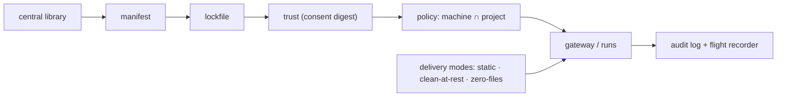

# Concepts and glossary

For every reader. This page defines each term AgentStack uses, in two or three
plain sentences. Every other page links here on first use instead of
re-explaining — so keep it open the first time through.

Read it left to right: you write a **manifest**, the **lockfile** pins its
contents, you **trust** the result, **policy** narrows what may run, the
**gateway** or a **run** carries it to your tools, and every call lands in the
**audit** log. The **central library** feeds shared capabilities into the
manifest, and the **delivery mode** decides how it all reaches the agent.

## The manifest and the lockfile

**Manifest** — one file (`.agentstack/agentstack.toml`) that lists everything
your tools are allowed to run: MCP servers, skills, instructions, settings,
hooks, and extensions. You edit this; AgentStack renders it into each tool's own
config. It only ever holds `${REF}` secret placeholders, never real secret
values.

**Lockfile** — `agentstack.lock` pins the exact resolved contents of the
manifest (server definitions, skill bytes, instruction bytes) to SHA-256
digests, so the same inputs reproduce and any change is visible. It is part of
what you consent to when you trust a project.

**Why the architecture docs say "bundle"** — `ARCHITECTURE.md` calls this same
declared unit a *bundle*, its strategic term for the thing the registry will one
day distribute. In all user-facing prose the word is **manifest**; they are the
same thing. More: [reference.md — the manifest](reference.md#the-manifest),
[ARCHITECTURE.md — the bundle](ARCHITECTURE.md#layer-1--the-bundle-cratescore).

## Profile

**Profile** — a named subset of the manifest ("backend", "design") that you
activate together. A manifest with no profiles activates its whole inline set as
the default, so you only name a profile when you have more than one.

**Preset (unrelated)** — the policy *presets* in
[`examples/policies/`](../examples/policies/) (`compatible`, `developer`,
`locked-down`, `ci`) are unrelated starter machine-policy files you copy and
edit; they are not profiles. More:
[reference.md — selective skills via profiles](reference.md#selective-skills-via-profiles).

## CLI, adapter, target

**CLI (≡ harness)** — the agent tool you run: Claude Code, Codex, Cursor, and so
on. Some flags and older output call it a *harness*; they mean the same thing,
and this page uses **CLI**.

**Adapter** — AgentStack's per-CLI compiler that turns one manifest into that
CLI's own config format. `agentstack adapters list` shows their ids; there are
13 today.

**Target** — an adapter id you name in `[targets]` (or a `--target` flag) to say
which CLIs a command should act on. More:
[reference.md — data-driven adapters](reference.md#data-driven-adapters).

## MCP, gateway, brokered call

**MCP (Model Context Protocol)** — the plugin standard agent CLIs use to expose
tools; an "MCP server" is one such plugin. AgentStack spells it out here because
the rest of the docs assume it.

**Gateway** — AgentStack's in-process broker. Instead of each CLI talking to MCP
servers directly, calls route through the gateway, where policy is checked and
every call is logged. It is *not* the `agentstack proxy` command, which is an
unrelated, observe-only relay that watches Anthropic-API token usage and
enforces nothing — different tool, similar-sounding name.

**Brokered call** — any tool call the gateway routes and records. Only brokered
calls are policy-checked and audited; a server rendered straight into a CLI's
native config is called directly and is not brokered. More:
[reference.md — agent-operable `mcp`](reference.md#agent-operable-agentstack-mcp),
[reference.md — the wire proxy](reference.md#wire-proxy-proxy),
[reference.md — call log](reference.md#call-log).

## Trust and the consent digest

**Trust** — your local approval that a project may auto-load on this machine.
Until you run `agentstack trust .`, a cloned repo is inert: no server spawns, no
skill enters context, no secret resolves. Trust says the surface was approved
for loading — it does not vouch that the code is safe or that a trusted project
is safe to run unsandboxed.

**Consent digest** — the SHA-256 fingerprint of your manifest, local overlay,
and lockfile that trust is pinned to. Change any of those bytes — a `git pull`, a
re-lock — and the project drops back to untrusted until you re-trust it. More:
[ENFORCEMENT.md — what trusted does and does not mean](ENFORCEMENT.md#what-trusted-does-and-does-not-mean).

## Drift

**Drift** — a mismatch between the manifest and what is actually on disk, in
either direction: a config hand-edited since the last render, or manifest entries
that would be removed on the next render. `doctor` flags it and tells you which
fix to run — `adopt` to keep a hand-edit, `apply --write` when the manifest is
right. More:
[reference.md — drift: adopt or apply?](reference.md#drift-adopt-or-apply).

## Guard

**Guard** — a *cooperative* check that AgentStack wires into each CLI's own
pre-tool-use hook to block obvious destructive commands (`rm -rf` outside the
workspace, writes to `.env` and key files). It catches an agent's accidents, not
a determined attacker: a CLI that ignores its own hooks, or a process the CLI
never routes through a hook, bypasses it entirely. It is never enforcement.
More: [ENFORCEMENT.md — filesystem write](ENFORCEMENT.md#filesystem--write).

## Sandbox, lockdown, and `run --locked`

Three ways to raise how strongly a run is confined, from lightest to strongest:

**`run --locked`** — no container. AgentStack runs the fail-closed pre-launch
gates (trust, lock verification, policy admission) and freezes the run's tool
surface, then launches the CLI on your host. Protection before launch, not
kernel isolation.

**`run --sandbox`** — a Docker container with a host-side egress proxy. Proxied
HTTPS traffic is checked against policy, but the container keeps a direct network
route a proxy-ignoring process could still use.

**`run --lockdown`** — the container's only route out is the egress proxy, so
there is no direct route at all. Strongest confinement AgentStack ships. More:
[ENFORCEMENT.md — the matrix](ENFORCEMENT.md#the-matrix).

## Posture and the machine-policy summary

**Posture** — the per-run label saying how strongly the effective policy is
actually enforced for that run, printed on the run banner. The four labels are
`HOST / ADVISORY`, `HOST / PROTECTED`, `SANDBOX / PROXIED`, and
`LOCKDOWN / ENFORCED`. "Posture" always means this label.

**Machine-policy summary** — a separate, one-word line `doctor` prints —
`open`, `restrictive`, or `mixed` — describing your machine policy's shape, not a
run. `restrictive` means a rename-proof `"*"` rule binds every server, not that
the policy is tight. More:
[reference.md — execution posture](reference.md#execution-posture).

## Delivery modes

The **delivery mode** decides where a project's rendered files live. You always
commit the intent (manifest plus lockfile); the rendered artifacts are the
choice:

- **static** (the default) — rendered files sit on disk, kept out of git.
- **clean-at-rest** — nothing generated persists; profiles are injected per
  session and reverted on exit.
- **zero-files** — no per-project files at all; every trusted repo serves its own
  stack live over the gateway.

Not sure which you need? See [which mode do I need?](choose.md). More:
[reference.md — where rendered files live](reference.md#where-rendered-files-live-three-modes).

## Secrets

**Placeholder (`${REF}`)** — the only form a secret takes in the manifest: a
named reference like `${GH_TOKEN}`, never the value. Placeholders resolve in
memory at run time; if one can't resolve, the write or run fails closed rather
than leaking a placeholder into live config.

**Keychain and varlock** — the two backing stores a `${REF}` can resolve from.
The OS **keychain** (service `agentstack`) holds values locally; **varlock** is
an optional resolver that fronts 1Password, cloud secret managers, and more when
a project opts in. The full chain is process env → varlock → keychain → project
`.env`. More: [reference.md — secret resolution](reference.md#secret-resolution).

## Library, catalog, registry, trust store

Four things that skim alike but do different jobs:

- **Central library** — your own managed home (`~/.agentstack/lib/`) of skills
  and server definitions that projects reference by name instead of copying.
- **Bundled catalog** — ready-made skills shipped inside the AgentStack binary
  that `search` can find and add.
- **Official MCP Registry** — the public `registry.modelcontextprotocol.io`
  index of MCP servers; `search` queries it and `add from <id>` installs one.
Skills also come straight from any skills repo — `add skill owner/repo`
(or a git URL, or a local dir) discovers, scans, and pins them; see
[add a skill](howto/add-a-skill.md).
- **Trust store** — the machine-local record (under `~/.agentstack/`) of which
  projects you have trusted, keyed by path and consent digest. It stores no
  capabilities — only your approvals. More:
  [reference.md — the central library](reference.md#the-central-library),
  [reference.md — search across providers](reference.md#search-across-providers).

## Egress

**Egress** — outbound network traffic from a run, governed by `[policy.egress]`
host rules. Under `--sandbox` and `--lockdown` the egress proxy enforces those
rules on proxied traffic: unapproved egress is blocked on the enforced paths.
That is the honest limit — it never makes exfiltration impossible, because
traffic to a host you *did* approve (including the model API) is still allowed.
More: [ENFORCEMENT.md — egress](ENFORCEMENT.md#egress).

## Flight recorder and the call audit log

Two separate records, easy to confuse:

**Flight recorder** — a per-run, append-only log of one run's lifecycle, limits,
egress decisions, brokered tool calls, and secret-reference names. Read it with
`agentstack report run <id>`.

**Call audit log** — the single global log
(`~/.agentstack/audit/calls.jsonl`) of every brokered tool call across all runs,
storing argument *digests* only, never values. It is best-effort local
diagnostics, not tamper-evident forensic evidence. More:
[ARCHITECTURE.md — flight recorder](ARCHITECTURE.md#layer-5--flight-recorder-cratesrecorder),
[reference.md — call log](reference.md#call-log).
