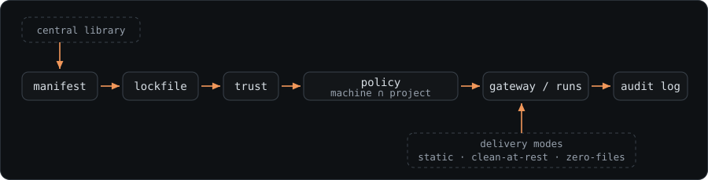

<!-- INTERNAL SOURCE: this file is the build input for its page on
     https://tarekkharsa.github.io/agentstack/ — readers go to the site.
     Edit here, then run: python3 tools/make-docs-pages.py -->

# Concepts and glossary

For every reader. This page defines each term AgentStack uses, in two or three
plain sentences. Every other page links here on first use instead of
re-explaining — so keep it open the first time through.

## Start with the files

Before any of the terms below, this is what AgentStack actually puts in a
project. Two groups: the ones you write and commit, and the ones written for you.

```text
your-project/
├── .agentstack/
│   ├── agentstack.toml   # what your tools may run — you edit this      ← manifest
│   ├── agentstack.lock   # the exact bytes that resolved to             ← lockfile
│   ├── skills/           # skill files this project carries (when used)
│   ├── instructions/     # instruction fragments (when used)
│   └── .env              # local secret values — gitignored, never committed
│
├── .mcp.json             # ─┐
├── .claude/skills/       #  │ rendered for each CLI: generated output, not
└── AGENTS.md             # ─┘ hand-edited — regenerate or remove it any time
```

Commit the first group; it is the portable part. The second group is written by
`agentstack apply` in one shape per CLI, and how much of it exists at rest is
decided by [delivery routing](#delivery-modes) — skills and MCP servers reach an
MCP-capable CLI live, so nothing generated lands here for them, while house
rules, settings, hooks and extensions are real files. Machine-wide counterparts
of the same idea live in
`~/.agentstack/`; everything above is what one repository carries.

The rest of this page names each piece, in the order the pieces are used.

## How the pieces fit together

<!-- Diagram source (regenerate concepts-flow.svg by hand from this):
flowchart LR
  library["central library"] --> manifest["manifest"]
  manifest --> lockfile["lockfile"]
  lockfile --> trust["trust (consent digest)"]
  trust --> policy["policy: machine ∩ project"]
  policy --> run["gateway / runs"]
  modes["delivery: routed per kind + CLI · render-locally override"] --> run
  run --> audit["audit log + flight recorder"]
-->



Read it left to right: you write a **manifest**, the **lockfile** pins it, you
**trust** the result, **policy** narrows what may run, and the **gateway** (or a
**run**) carries it to your tools — every call landing in the **audit** log. The
**central library** feeds shared capabilities into the manifest; **delivery
routing** decides how each capability reaches the agent.

## The manifest and the lockfile

**Manifest** — one file (`.agentstack/agentstack.toml`) listing everything your
tools may run: MCP servers, skills, instructions, settings, hooks, and
extensions. You edit it; AgentStack renders it into each tool's own config. It
holds only `${REF}` secret placeholders, never real values.

**Lockfile** — `agentstack.lock` pins the manifest's resolved contents (server
definitions, skill bytes, instruction bytes) to SHA-256 digests, so the same
inputs reproduce and any change is visible. It is part of what you consent to
when you trust a project.

## Toolset

**Toolset** — a named subset of the manifest ("backend", "design") you activate
together. A manifest with no toolsets activates its whole inline set as the
default, so you only name one when you have more than one. In the manifest file
a toolset is a `[profiles.<name>]` table — the key kept its original spelling so
existing manifests keep working.

(The policy *presets* in `examples/policies/` are unrelated — starter
machine-policy files you copy and edit, not toolsets.)

## CLI, adapter, target

**CLI (≡ harness)** — the agent tool you run: Claude Code, Codex, Cursor, and so
on. Some flags and older output call it a *harness*; same thing, and this page
uses **CLI**.

**Adapter** — AgentStack's per-CLI compiler that turns one manifest into that
CLI's own config format. `agentstack adapters list` shows their ids; there are
13 today, at three different levels of verification —
[adapters.md](adapters.md) says what each one is tested against and what it
manages.

**Target** — an adapter id you name in `[targets]` (or a `--target` flag) to say
which CLIs a command acts on. More:
[reference.md — data-driven adapters](reference.md#data-driven-adapters).

## MCP, gateway, brokered call

**MCP (Model Context Protocol)** — the plugin standard agent CLIs use to expose
tools; an "MCP server" is one such plugin. Spelled out here because the rest of
the docs assume it.

**Gateway** — AgentStack's in-process broker. Instead of each CLI talking to MCP
servers directly, calls route through the gateway, where policy is checked and
every call is logged. It is *not* the `agentstack proxy` command — an unrelated,
observe-only relay that watches Anthropic-API token usage and enforces nothing.

**Brokered call** — any tool call the gateway routes and records. Only brokered
calls are policy-checked and audited; a server rendered straight into a CLI's
native config is called directly and is not brokered. More:
[reference.md — agent-operable `mcp`](reference.md#agent-operable-agentstack-mcp),
[reference.md — code mode](reference.md#compact-proxied-surface--code-mode),
[reference.md — the wire proxy](reference.md#wire-proxy-proxy),
[reference.md — call log](reference.md#call-log).

## Trust and the consent digest

**Trust** — your local approval that a project may auto-load on this machine.
Until you run `agentstack trust .`, a cloned repo is inert: no server spawns, no
skill enters context, no secret resolves. Trust says the surface was approved
for loading — not that the code is safe, or that a trusted project is safe to run
unsandboxed.

**Consent digest** — the SHA-256 fingerprint of your manifest, local overlay,
and lockfile that trust is pinned to. Change any of those bytes — a `git pull`, a
re-lock — and the project drops back to untrusted until you re-trust it. More:
[ENFORCEMENT.md — what trusted does and does not mean](ENFORCEMENT.md#what-trusted-does-and-does-not-mean).

**The yes** — the consent moment itself, and the one thing never automated. For
files you drop into `.agentstack/skills/` or `.agentstack/instructions/`,
`agentstack yes` (v0.18.0+) is the whole ceremony in one step: notice, pin,
review, render.

**Review card** — what a yes shows you before it means anything: what the
content adds, what it would run, contact, or read, and — on a re-gate — what
changed since you last approved it, as a real diff rather than a digest.

**Provenance** — the check that decides which review you get. Content you
demonstrably wrote here (untracked in git, or newer than the last review) may
take the one-step path; anything that arrived with a clone always takes the
full staged review. Selection is by evidence, never by politeness.

**Undo timeline** — `agentstack undo` (v0.18.0+): every recorded write, newest
first; pick a point and revert to it. The revert is itself recorded, so it can
be undone too. `restore` is the same record as a script-friendly, one-write
primitive, and works in every release. More:
[undo anything](howto/undo.md).

## Drift

**Drift** — a mismatch between the manifest and what is actually on disk, either
way: a config hand-edited since the last render, or manifest entries that would
be removed on the next one. `doctor` flags it and names the fix — `adopt` to keep
a hand-edit, `apply --write` when the manifest is right. More:
[reference.md — drift: adopt or apply?](reference.md#drift-adopt-or-apply).

## Guard

**Guard** — a *cooperative* check AgentStack wires into each CLI's own
pre-tool-use hook to block obvious destructive commands (`rm -rf` outside the
workspace, writes to `.env` and key files). It catches an agent's accidents, not
a determined attacker: any CLI that ignores its own hooks, or a process it never
routes through a hook, bypasses it entirely. It is never enforcement. More:
[ENFORCEMENT.md — filesystem write](ENFORCEMENT.md#filesystem--write).

## Sandbox, lockdown, and `run --locked`

Three ways to raise how strongly a run is confined, lightest to strongest:

**`run --locked`** — no container. AgentStack runs the fail-closed pre-launch
gates (trust, lock verification, policy admission) and freezes the run's tool
surface, then launches the CLI on your host. Protection before launch, not
kernel isolation.

**`run --sandbox`** — a Docker container with a host-side egress proxy. Proxied
HTTPS is checked against policy, but the container keeps a direct network route a
proxy-ignoring process could still use.

**`run --lockdown`** — the container's only route out is the egress proxy, so
there is no direct route at all. Strongest confinement AgentStack ships. More:
[ENFORCEMENT.md — the matrix](ENFORCEMENT.md#the-matrix).

## Posture and the machine-policy summary

**Posture** — the per-run label for how strongly the effective policy is actually
enforced, printed on the run banner. The four labels are `HOST / ADVISORY`,
`HOST / PROTECTED`, `SANDBOX / PROXIED · DIRECT ROUTE OPEN`, and
`LOCKDOWN / ENFORCED · NO DIRECT ROUTE` — the sandbox and lockdown labels are
emitted with those suffixes, and the suffix is the honest half: plain
`--sandbox` proxies egress but leaves a direct route a proxy-ignoring process
can take. The labels are enumerated in
[reference.md — execution posture](reference.md#execution-posture); what each
one actually guarantees is
[ENFORCEMENT.md — the matrix](ENFORCEMENT.md#the-matrix), which is keyed by mode
rather than by label. "Posture" always means this label.

**Machine-policy summary** — a separate one-word line `doctor` prints,
describing your machine policy's shape rather than a run. A fresh machine
reports `unconfigured` — no ceiling at all, and the state to fix first. Two of
the six states, `degraded` and `blocked`, mean the file you think is enforcing
is not the file being enforced. All six:
[reference.md — execution posture](reference.md#execution-posture).

## Machine manifest and machine policy

**Machine manifest** — the personal layer at `~/.agentstack/agentstack.toml`,
seeded by `agentstack init --global`. It holds your standing, cross-project
rules: machine policy, personal instruction fragments, and the guard and
filesystem-deny defaults. Only its `[instructions]` merge into a project load
(beneath the project's own); servers, skills, and settings never inherit, so
personal capabilities never auto-inject into a team repo and its trust digest is
untouched.

**Machine policy** — the `[policy.*]` rules the machine manifest carries: your
standing tool, egress, secret, and filesystem limits, checked **before** any
project's on every brokered call. The effective policy is the intersection
(machine ∩ project), so a repo can only narrow a machine rule, never loosen it;
a machine refusal names its layer in the error and the audit log.

<a id="delivery-modes"></a>
## Delivery: routed, not chosen

Since 2026-08-03 delivery is a **routing decision AgentStack makes**, from two
facts: what kind a capability is, and which CLI it is going to. You always
commit the intent (manifest plus lockfile); where the bytes then go is the
routing:

| Capability kind | Lane |
|---|---|
| Skills · MCP servers, on a CLI with MCP | **dynamic** — served live, on demand, digest-verified per load |
| House rules (`CLAUDE.md` / `AGENTS.md` region) · settings | **rendered** — MCP cannot inject these |
| Hooks · extensions | **rendered**, with the full consent ceremony every time (they run code) |
| Any kind, on a CLI without MCP | **rendered** — that CLI has no live channel |

A project is normally in both lanes at once. `agentstack delivery` shows the
routing per CLI; `agentstack delivery --json` is the same reading for a UI
(`delivery-routing-v1`).

**The one override — render locally.** `[delivery] render_locally = true` in the
manifest, per project or per harness (`[delivery.harness.<id>]`), set with
`agentstack delivery render-locally [--harness <id>] --write`. It writes files
even where the live channel would have worked — for offline work, deterministic
native files, inspection with ordinary filesystem tools, a rule against a
persistent background process, debugging without another runtime dependency, or
compatibility testing against a CLI's own behaviour. It only ever moves a
capability *towards* files; nothing moves an instruction or a hook the other
way, because no channel would carry it.

A gateway-served project keeps **0 project artifacts for the capabilities served
live** — never "0 files": the manifest, the lockfile, and any managed
house-rules region are still there.

### The older delivery modes

The three per-project modes below predate the routing and are still switchable
with `agentstack set-mode`, but they are no longer how delivery is decided:

- **static** — rendered files sit on disk, kept out of git by a
  managed `.gitignore` block. Works however you launch your tools, since the
  capabilities are real files the CLI reads directly.
- **clean-at-rest** — nothing generated persists between sessions. A toolset is
  injected when a session or run starts and reverted on exit; `agentstack lock`
  pins the manifest's name refs *without rendering anything*, so `git status`
  stays silent.
- **zero-files** — no *generated* per-project files. The gateway is registered
  once per CLI, and every trusted repo serves its own stack live over it; a
  [lease](#lease-session-or-locked-run-fence) can fence one connection to a
  toolset without rendering native files. The repo still carries its manifest,
  its lockfile, and any managed house-rules region.

Not sure which you need? See [how capabilities reach your CLIs](choose.md). More:
[reference.md — where rendered files live](reference.md#where-rendered-files-live-three-modes).

## Lease, session, or locked-run fence

Three ways to give a run only *part* of a manifest for a while. A **session**
renders a toolset to disk and reverts it on `session end`; a **lease** does the
same for one live MCP connection without rendering anything; a **locked-run
fence** narrows one run's frozen surface and ends when the process does. A
lease and a session are mutually exclusive, and `freeze` on either promotes
what was actually used into a new toolset — a proposal you review, then
`agentstack lock`. Full comparison:
[reference.md — MCP toolset leases](reference.md#mcp-toolset-leases-one-connection-one-capability-fence).

## Secrets

**Placeholder (`${REF}`)** — the only form a secret takes in the manifest: a
named reference like `${GH_TOKEN}`, never the value. A ref is a strict
`${IDENTIFIER}`; shell fallback (`${VAR:-default}`) and prompt-style placeholders
(`${input:key}`) pass through verbatim and are **not** treated as secrets.
Placeholders resolve in memory at run time; if one can't resolve, the write or
run fails closed, reporting the unresolved ref rather than blanking or leaking it
into live config. Where a resolved value lands depends on delivery mode: a
static render writes it into a native config whose format requires it (behind a
managed gitignore); gateway-backed and clean-at-rest delivery resolve host-side
and keep values out of files at rest. The manifest and lockfile never hold
values in any mode.

**Keychain and varlock** — the two backing stores a `${REF}` resolves from. The
OS **keychain** (service `agentstack`) holds values locally; **varlock** is an
optional resolver fronting 1Password, cloud secret managers, and more, active
only when a project opts in and the `varlock` binary is present — otherwise the
chain skips it. The full chain is process env → varlock → keychain → project
`.env`. More: [reference.md — secret resolution](reference.md#secret-resolution).

## Library, catalog, registry, trust store

Four things that skim alike but do different jobs:

- **Central library** — your own managed home (`~/.agentstack/lib/`) of skills
  and server definitions that projects reference by name instead of copying.
- **Bundled catalog** — ready-made skills shipped inside the AgentStack binary
  that `search` can find and add.
- **Official MCP Registry** — the public `registry.modelcontextprotocol.io`
  index of MCP servers; `search` queries it and `add from <id>` installs one.
- **Trust store** — the machine-local record (under `~/.agentstack/`) of which
  projects you have trusted, keyed by path and consent digest. It stores no
  capabilities — only your approvals. More:
  [reference.md — the central library](reference.md#the-central-library),
  [reference.md — search across providers](reference.md#search-across-providers).

Skills also come straight from any skills repo — `add skill owner/repo`
(or a git URL, or a local dir) discovers, scans, and pins them; see
[add a skill](howto/add-a-skill.md).

## Egress

**Egress** — outbound network traffic from a run, governed by `[policy.egress]`
host rules. Under `--sandbox` and `--lockdown` the egress proxy enforces those
rules on proxied traffic: unapproved egress is blocked on the enforced paths.
That is the honest limit — it never makes exfiltration impossible, because
traffic to a host you *did* approve (including the model API) is still allowed.
More: [ENFORCEMENT.md — egress](ENFORCEMENT.md#egress).

## Flight recorder and the call audit log

Two separate records, easy to confuse:

**Flight recorder** — a per-run, append-only log of one run's lifecycle, limits,
egress decisions, brokered tool calls, and secret-reference names. Read it with
`agentstack report run <id>`.

**Call audit log** — the single global log
(`~/.agentstack/audit/calls.jsonl`) of every brokered tool call across all runs,
storing argument *digests* only, never values. It is best-effort local
diagnostics, not tamper-evident forensic evidence. More:
[ARCHITECTURE.md — flight recorder](ARCHITECTURE.md#layer-5--flight-recorder-cratesrecorder),
[reference.md — call log](reference.md#call-log).

---

Have the words you needed? [Get started](start.html) is the guided path, and
[which mode do I need?](choose.md) picks your two defaults.
