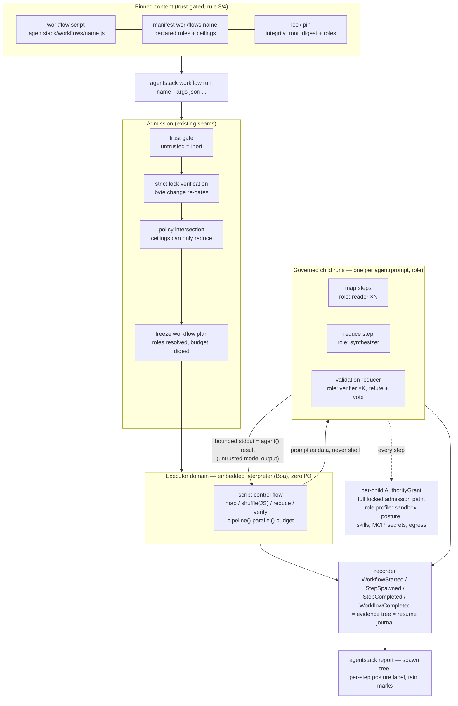

# Governed dynamic workflows as a capability kind

> **Status:** implemented experimental contract. Promotion requirements and
> current work live only in [`../../TODO.md`](../../TODO.md#experimental-workflows).
> This document defines the authoring, authority, and evidence boundaries; it
> is not a roadmap or implementation history.<br/>
> **Approved dependency:** `boa_engine`, isolated to `crates/workflow`.<br/>
> **Origin:** Claude Code's dynamic `Workflow` tool (an orchestration script
> spawning subagents with `agent()`/`pipeline()`/`parallel()`) is per-harness
> only; the maintainer wants the same authoring experience delivered through
> agentstack so every governed CLI can use it.<br/>
> **Product status:** advanced preview, outside the beginner journey.

## 0. Motivation

Claude Code ships a genuinely good orchestration primitive: a plain-JS script
with a declarative `meta` block that fans work out to subagents (`agent()`),
composes them (`pipeline()` / `parallel()`), reports progress (`phase()` /
`log()`), respects a token budget, and resumes from a journal after
interruption. It is also entirely Claude-Code-shaped: the script executes
inside the harness process, subagents are Claude sessions, and no other CLI
gets any of it.

For agentstack the interesting object is not the ergonomics — it is what a
workflow *is* in security terms: **authority, multiplied.** One invocation
spawns N agent runs, each with tool access, filesystem reach, and token
spend, driven by control flow decided at runtime by script code. Today that
either doesn't exist outside Claude Code, or exists as shell scripts looping
`codex exec` with no pinning, no per-step authority, and no evidence.

The thesis: agentstack already owns every hard part — pinned executable
content (D3/D6), a frozen backend-neutral authority projection
(`AuthorityGrant`, locked-run contract §6), a governed code-execution domain
(`crates/executor`), per-CLI adapters, and an append-only recorder. A
workflow engine is the composition of those seams plus exactly one new
capability: *spawn a governed child run*. The authoring API is deliberately
copied from Claude Code, both because it is proven and because that makes
existing Claude Code workflow scripts the "native workflow format" the
strategy says to import and govern before inventing new syntax.

## 1. What already exists (build on it, don't duplicate it)

- **A governed code-execution domain.** `crates/executor` validates execution
  requests, freezes exact tool grants and machine-ceilinged limits into
  immutable plans, and stays policy-agnostic — the CLI supplies an
  already-authorized `ToolAuthority`, and the gateway remains the only
  enforcement point (`crates/executor/src/lib.rs`). A workflow run is this
  same shape with a longer clock: script in, frozen capability set, bounded
  effects out. Its `MachineLimits` "request can only reduce, never increase"
  pattern is exactly the budget model workflows need.
- **The authority projection is already contract-frozen.** `AuthorityGrant`
  (locked-run contract §6.1) is backend-neutral by design and §6.2's
  `RunEnvelope` gives every run an evidence identity. The frozen,
  backend-neutral execution plan is the normalization target every workflow
  step compiles to. Nothing new is
  invented here; workflows are a *consumer* of the grant machinery.
- **The canonical protected run.** `run <harness> --locked` is the child-run
  primitive: trust gate, lock verification, policy
  admission, frozen grant, scoped MCP config, recorded outcome. A workflow
  step is a locked run with a prompt and a role profile.
- **Adapters know how to invoke harnesses.** The 13 data-driven descriptors
  (`crates/adapters/descriptors/`) already carry per-CLI knowledge; most
  target CLIs expose a non-interactive mode (`claude -p`, `codex exec`,
  `opencode run`, …). The descriptor grows an invocation field; no new
  subsystem.
- **Pinning and re-gating executable content is solved.** D6 extensions
  established the pattern for repo-provided code agentstack handles:
  `integrity_root_digest` (strict, symlink-rejecting), a typed lock entry,
  trust preview labelling, untrusted-means-inert
  (see `docs/ARCHITECTURE.md`, native extensions). Workflow source reuses it
  verbatim.
- **Profiles are the role primitive.** Profiles already fence capability
  sets; workflows bind each `agent()` call to one. Current role scopes are
  described honestly in §9.

## 2. Non-goals

- **No workflow code ever executes raw on the host.** The strategy rule is
  explicit ("never execute arbitrary workflow code on the host") and this is
  the load-bearing difference from Claude Code, which runs the script
  in-process and trusts it. AgentStack must not: workflow source arrives
  from repos and is hostile input (rule 7). The script runs only inside the
  governed executor domain. If no acceptable script sandbox is available on
  a machine, workflows are unavailable there — fail closed, no degraded
  "just eval it" mode.
- **Workflow files request authority; they can never grant or widen it.**
  A script names roles and budgets; the manifest declares them; policy
  intersection caps them; a child grant is always ≤ the workflow's own
  grant, which is ≤ machine policy (rule 2, unchanged).
- **No durability engine in v1.** Retries-with-state, waits, schedules, and
  approval events are the Cloudflare Workflows question, gated on proven
  requirements (strategy ledger). v1 workflows are one-shot: they run to
  completion or fail; "resume" means replaying the journal of completed
  steps, not a durable execution substrate.
- **No general-purpose runtime surface.** The script gets the workflow API
  and nothing else: no filesystem, no network, no environment, no process
  spawn. Tool access exists only as governed gateway calls if a role grants
  them.
- **No marketplace.** Sources are the project manifest and the personal
  central library, same as skills, servers, and extensions.
- **Not part of the beginner product path.** Promotion is evidence-gated by
  `TODO.md` and the executor/script-boundary requirements in §9.

## 3. The authoring model — deliberately Claude-Code-compatible

A workflow is one file, `.agentstack/workflows/<name>.js` — plain
JavaScript, no TypeScript in v1 (Claude Code has the same rule, so
compatibility is unhurt and no transpiler dependency exists) — beginning
with a pure-literal `meta` export and using the same core vocabulary:

```ts
export const meta = {
  name: 'nightly-review',
  description: 'Review the day\'s diff across dimensions, verify findings',
  phases: [{ title: 'Review' }, { title: 'Verify' }],
}

const findings = await pipeline(
  DIMENSIONS,
  d => agent(d.prompt, { role: 'reader', label: `review:${d.key}` }),
  r => agent(`Adversarially verify: ${r}`, { role: 'reviewer' }),
)
return findings.filter(Boolean)
```

API surface in v1: `agent(prompt, opts)`, `parallel(thunks)`,
`pipeline(items, ...stages)`, `phase(title)`, `log(msg)`, `args`, `budget`.
Compatibility is a feature with a boundary:

- **Kept:** the control-flow vocabulary, the pure-literal `meta` rule, the
  determinism rule (`Date.now` / `Math.random` / argless `new Date` are
  unavailable — required for journal replay, and digest-relevant for us),
  null-on-failure results, `budget.remaining()` pacing.
- **Changed:** `agent()` takes `role` (a profile name from the workflow's
  declared `roles`) instead of Claude Code's free-form `model`/`agentType`.
  The harness and model are properties of the role's profile, not the
  script — a script that could name arbitrary harness argv would be a
  grant-widening surface. `isolation: 'worktree'` maps to the run layer's
  artifact handling, not a script-controlled mount.
- **Dropped in v1:** `schema` (structured output needs per-harness support;
  steps return text), nested `workflow()`, custom `agentType`.

The near-compatibility means a Claude Code workflow script imports with a
mechanical edit (`model:` → `role:`), satisfying the strategy's
"import and govern a native workflow format before inventing broad syntax."

### 3.1 The canonical shape: map → reduce → verify (added 2026-07-21)

The mental model is MapReduce with governance where Hadoop had cluster
management: YARN's job (ceilings, admission, scheduling) is the engine +
policy intersection; the MapReduce programming model is the script API; and
each mapper is a governed child run instead of a container. The analogy is
deliberately partial — there is no HDFS analog (results are kilobytes of
text; the scarce resource is tokens and judgment, not I/O locality), no
shuffle infrastructure (plain JS over the collected results), and no
speculative re-execution (agents are non-deterministic, so recovery replays
journaled results and never recomputes — the reason for the §3 determinism
rule).

The canonical workflow is three stages, each bound to a different role:

```js
// Map — fan out cheap workers over the split input.
const found = await pipeline(
  args.items,
  it => agent(`Audit ${it}. Return raw findings.`, { role: 'reader', label: `map:${it}` }),
)
// Shuffle — plain JS: group, dedup, filter. No agent spawn, no tokens.
const grouped = groupByFile(found.filter(Boolean))
// Reduce — one synthesis step.
const claims = await agent(`Synthesize and rank:\n${JSON.stringify(grouped)}`,
                           { role: 'synthesizer' })
// Verify — the validation reducer: independent refuters under a
// *narrower* role, majority vote.
const votes = await parallel(parse(claims).map(c => () =>
  agent(`Try to REFUTE against the actual code: ${c.summary}`, { role: 'verifier' })))
return keepUnrefuted(claims, votes)
```

The **validation reducer** is a first-class pattern, not an afterthought,
because it is the mitigation for the §7 data-flow caveat: map outputs are
untrusted model output flowing into later prompts. A prompt-injected mapper
can mislead the reducer but cannot escalate (roles are a closed set,
ceilings frozen); an independent verify stage under a *different profile* —
read-only filesystem, no egress, refute-framed instructions, typically a
stronger model — is what catches the misleading half. The role separation
costs nothing extra: it is exactly what profiles already fence. The
taint labels make the influence path reviewable in the report.

```toml
[workflows.nightly-review]
description = "Review the day's diff, verify findings"
path = "./workflows/nightly-review.ts"   # or: git = "...", rev = "...", subpath = "..."
roles = ["reader", "reviewer"]           # profiles agent() may name — closed set
max_agents = 25                          # ceilings; requests reduce, never increase
max_wall_seconds = 1800
```

- `roles` is the authority-request surface: every profile named must exist,
  and an `agent()` call naming a role outside this list is a validation
  error at normalization time and a refusal at runtime. An empty `roles`
  workflow is valid (pure computation over `args`) and spawns nothing.
- Ceilings follow the `MachineLimits` discipline: machine policy may cap
  `max_agents` / `max_wall_seconds` globally; the manifest requests within
  that; the script's `budget` can only see and subdivide what was granted.
- Source forms and resolution mirror `Skill`/`Extension`: `path` or
  `git`+`rev`(+`subpath`), central library `kind: workflow` later (§8).

## 5. Lock pinning and trust (security-sensitive)

Workflow source is pinned executable content — the D6 rules apply unchanged:

```toml
[[workflow]]
name = "nightly-review"
checksum = "sha256:…"    # integrity_root_digest over the source tree
roles = ["reader", "reviewer"]
```

- **Strict digest** (`integrity_root_digest`): symlink anywhere is a hard
  error; the lenient skill digest is not acceptable for code.
- **The pin records `roles`** the way an extension pin records `target`: the
  review bound this script to these capability sets. Widening `roles`
  without re-locking is drift; verification blocks it even with unchanged
  bytes.
- **Untrusted means inert (rule 3):** an untrusted bundle's workflows never
  parse, never normalize, never execute — the name is not even invocable.
- Byte change → lock change → `TrustState::Changed` → re-review, via the
  existing `trust::digest_for` path; no new trust code. The trust preview
  lists workflows under their own heading: *"orchestration code — spawns
  agent runs under the declared roles"* — stronger than skills, different
  in kind from extensions (agentstack executes this, inside its sandbox,
  which is precisely why the gate must be in front of it).

## 6. Execution model

`agentstack workflow run <name> [--args-json …]` composes three existing
layers:

1. **The orchestration script runs in the governed executor domain.** The
   engine freezes an execution plan for the script itself: the workflow's
   grant (roles resolved to profile capability sets, ceilings, budget), the
   script digest, and a capability table containing only the workflow API.
   The executor's existing invariants carry over: request limits can only
   reduce machine ceilings; the plan is immutable after freeze.
2. **Each `agent()` call is a governed child run.** The engine resolves the
   role's profile, builds the child's `AuthorityGrant` through the same
   admission path as `run --locked` — trust, lock verification, policy
   intersection — and invokes the harness non-interactively per its adapter
   descriptor (headless invocation spec: argv shape for prompt-in/text-out,
   e.g. `claude -p`, `codex exec`). The child gets a launch-scoped MCP
   config for its role, the host guard, and its own `RunEnvelope`. Its
   stdout (bounded, `MAX_RESULT_BYTES`-style) is the `agent()` return value.
   The prompt string crosses from the sandboxed script to the engine as
   data — it is never shell-interpolated (rule 7); argv is constructed from
   the descriptor, prompt delivered via a dedicated arg or stdin.
3. **A workflow-level envelope links the tree.** The recorder gains
   `WorkflowStarted { workflow digest, grant digest }`,
   `StepSpawned { role, child grant digest, label }`, `StepCompleted`
   / `StepFailed`, `WorkflowCompleted` — each child's events live in its own
   run log; the workflow log is the join table. `agentstack report <run>`
   renders the tree. This event stream **is** the resume journal: replaying
   completed `StepCompleted` results is what resume means in v1 — one
   mechanism, not a parallel journal file.

Concurrency is engine-owned (a small fixed cap, machine-configurable), never
script-negotiated. A step that fails resolves to `null` in the script, same
as Claude Code — the script decides whether that's fatal.

### 6.1 Flow diagram



Reading the diagram in Hadoop terms: the *Pinned content* + *Admission*
rows are what Hadoop never had (the job itself is hostile input here); the
*Engine* is YARN's resource manager; the *Children* row is the task
containers, except each carries its own narrowed `AuthorityGrant`; the
*recorder* replaces the JobTracker's bookkeeping and doubles as the resume
journal.

## 7. Honest posture (labels, not promises)

What agentstack can honestly claim:

- which orchestration bytes ran (pinned, re-gated on change);
- what authority every step had (per-child grant digest, role, ceiling), and
  that no step exceeded the workflow's own grant or machine policy;
- complete spawn-tree evidence.

What it must not imply:

- **Inside each step, enforcement is the chosen posture's, not the
  workflow's.** A host-mode child is cooperative-guard-only (¶ in the
  enforcement matrix); a lockdown child gets kernel + egress fences. The
  report labels each step with its posture slug rather than letting
  "governed workflow" suggest uniform containment.
- **Step outputs are model output — untrusted data.** `agent()` results flow
  into later prompts by design; a prompt-injected step can steer its
  successors' *prompts*. It cannot widen any grant (roles are a closed,
  pre-reviewed set and the ceiling is frozen), and that distinction — can
  mislead, cannot escalate — is the honest sentence the docs must say.
- **Token/cost accounting is per-harness best-effort** until the recorder's
  deferred cost-evidence dimension lands; `budget` in v1 meters agent count
  and wall clock, which the engine can enforce, not tokens, which it cannot
  observe uniformly.

## 8. Library and catalog

- Central library `kind: workflow`, bodies under
  `~/.agentstack/lib/workflows/<name>/`, resolver / `lib` verbs / search
  mirroring extensions (E3 pattern).
- Workflows are **not** loadable via MCP zero-files mode — they are
  executable artifacts, not context content; `agentstack_list_loadable`
  excludes them. A follow-up MCP verb to *invoke* a workflow
  (`agentstack_workflow_run`) is plausible but deferred — it makes one
  harness able to spend another's authority and deserves its own review.
- t3code's MCP may be evaluated separately as an **optional child-launch and
  supervision backend**. The workflow engine must still admit and freeze the
  child `ExecutionPlan` and `AuthorityGrant` before calling that backend.
  t3code receives only a narrow launch request or opaque plan reference; it
  cannot supply arbitrary argv, paths, policy, secrets, or authority.
- That backend must capability-negotiate, return a stable child identity,
  propagate cancellation and outcome, and attach evidence to the same parent
  workflow report. Absence, version mismatch, malformed identity, or missing
  evidence fails closed. Direct CLI launch remains the reference
  implementation and fallback.
- Doctor: lock drift, roles referencing missing profiles, source resolution,
  ceiling-vs-machine-policy conflicts.

## 9. Current promotion gates

1. **Locked child runs are the only spawn path.** Each child crosses trust,
   strict lock verification, policy admission, frozen authority, launch, and
   recorded outcome. No workflow-only authority constructor is permitted.
2. **Role limits are labelled honestly.** Roles currently differ by profile
   capability surface, instructions, and runtime posture. They must not imply
   folder-, secret-, or egress-level isolation unless those dimensions are
   actually bound and enforced for the child.
3. **The interpreter boundary needs independent review.** Ceiling enforcement,
   panic-fails-closed behavior, module loading, ambient host capabilities,
   heap growth, and hostile string/regex behavior remain promotion gates.
4. **Repeated use must be demonstrated.** At least three real tasks must be run
   on separate occasions and prove easier to repeat than their manual/native
   equivalents before workflows leave preview.
