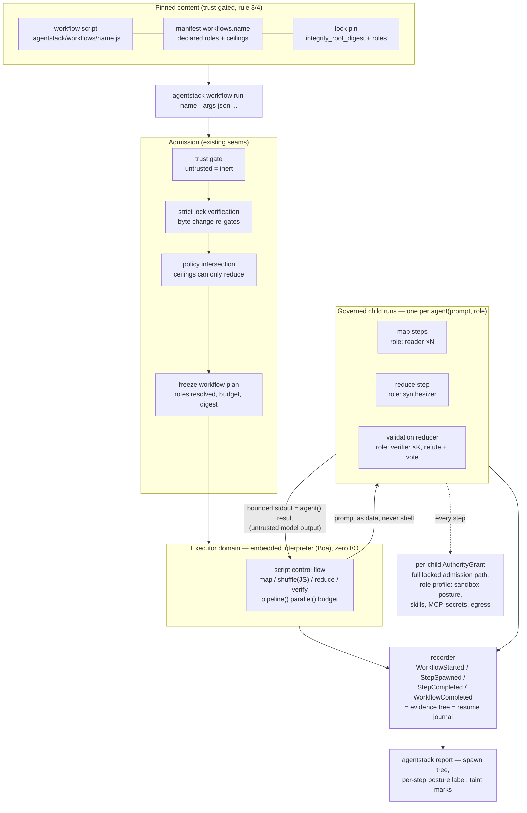

# Governed dynamic workflows as a capability kind

> **Status:** approved — W0 settled 2026-07-21 (maintainer review); the lane
> is opened ahead of Phase 2 as an explicit maintainer scope decision. §11
> records the rulings; §10 carries the re-sequenced stages (W2 before W1);
> the evidence gate is restated, not waived — see §9.4. §12 (2026-07-22)
> is the W3 gate package — F2 + Boa spikes, plan, rule-6 proposal —
> approved 2026-07-22 (maintainer review); rule-6 `boa_engine` granted with
> the conditions recorded in §12.2–§12.3.<br/>
> **Date:** 2026-07-17 · approved 2026-07-21<br/>
> **Origin:** Claude Code's dynamic `Workflow` tool (an orchestration script
> spawning subagents with `agent()`/`pipeline()`/`parallel()`) is per-harness
> only; the maintainer wants the same authoring experience delivered through
> agentstack so every governed CLI can use it.<br/>
> **Queue position:** originally Phase 2 "saved governed workflows"
> ([strategy](../../STRATEGY.md#phase-2--paid-design-partnerships) ·
> [`TODO.md`](../../TODO.md#saved-governed-workflows)). Lane opened early on
> 2026-07-21: the Phase 0A keystone (D7 §9.1's blocker) landed and was
> reviewed 2026-07-17, and the maintainer's own recurring multi-agent tasks
> are the claimed repeated-task evidence — to be confirmed through the
> interim path in §9.4 before W3 (the engine) starts. Supervised work only;
> it does not displace the Phase 0A minimum-version cut, which stays first
> in the queue.

## 0. Motivation

Claude Code ships a genuinely good orchestration primitive: a plain-JS script
with a declarative `meta` block that fans work out to subagents (`agent()`),
composes them (`pipeline()` / `parallel()`), reports progress (`phase()` /
`log()`), respects a token budget, and resumes from a journal after
interruption. It is also entirely Claude-Code-shaped: the script executes
inside the harness process, subagents are Claude sessions, and no other CLI
gets any of it.

For agentstack the interesting object is not the ergonomics — it is what a
workflow *is* in security terms: **authority, multiplied.** One invocation
spawns N agent runs, each with tool access, filesystem reach, and token
spend, driven by control flow decided at runtime by script code. Today that
either doesn't exist outside Claude Code, or exists as shell scripts looping
`codex exec` with no pinning, no per-step authority, and no evidence.

The thesis: agentstack already owns every hard part — pinned executable
content (D3/D6), a frozen backend-neutral authority projection
(`AuthorityGrant`, locked-run contract §6), a governed code-execution domain
(`crates/executor`), per-CLI adapters, and an append-only recorder. A
workflow engine is the composition of those seams plus exactly one new
capability: *spawn a governed child run*. The authoring API is deliberately
copied from Claude Code, both because it is proven and because that makes
existing Claude Code workflow scripts the "native workflow format" the
strategy says to import and govern before inventing new syntax.

## 1. What already exists (build on it, don't duplicate it)

- **A governed code-execution domain.** `crates/executor` validates execution
  requests, freezes exact tool grants and machine-ceilinged limits into
  immutable plans, and stays policy-agnostic — the CLI supplies an
  already-authorized `ToolAuthority`, and the gateway remains the only
  enforcement point (`crates/executor/src/lib.rs`). A workflow run is this
  same shape with a longer clock: script in, frozen capability set, bounded
  effects out. Its `MachineLimits` "request can only reduce, never increase"
  pattern is exactly the budget model workflows need.
- **The authority projection is already contract-frozen.** `AuthorityGrant`
  (locked-run contract §6.1) is backend-neutral by design and §6.2's
  `RunEnvelope` gives every run an evidence identity. The contract's Phase 1
  item "freeze and version the backend-neutral execution plan" is the
  normalization target every workflow step compiles to. Nothing new is
  invented here; workflows are a *consumer* of the grant machinery.
- **The canonical protected run.** `run <harness> --locked` (Phase 0A
  keystone) is the child-run primitive: trust gate, lock verification, policy
  admission, frozen grant, scoped MCP config, recorded outcome. A workflow
  step is a locked run with a prompt and a role profile.
- **Adapters know how to invoke harnesses.** The 13 data-driven descriptors
  (`crates/adapters/descriptors/`) already carry per-CLI knowledge; most
  target CLIs expose a non-interactive mode (`claude -p`, `codex exec`,
  `opencode run`, …). The descriptor grows an invocation field; no new
  subsystem.
- **Pinning and re-gating executable content is solved.** D6 extensions
  established the pattern for repo-provided code agentstack handles:
  `integrity_root_digest` (strict, symlink-rejecting), a typed lock entry,
  trust preview labelling, untrusted-means-inert
  (`docs/design/extensions-capability.md` §4–5). Workflow source reuses it
  verbatim.
- **Profiles are the role primitive.** "Give every role its own profile,
  folders, tools, secrets, egress, commands, budget, and audit identity"
  (Phase 2 TODO) — profiles already fence capability sets; workflows bind
  each `agent()` call to one.

## 2. Non-goals

- **No workflow code ever executes raw on the host.** The strategy rule is
  explicit ("never execute arbitrary workflow code on the host") and this is
  the load-bearing difference from Claude Code, which runs the script
  in-process and trusts it. AgentStack must not: workflow source arrives
  from repos and is hostile input (rule 7). The script runs only inside the
  governed executor domain. If no acceptable script sandbox is available on
  a machine, workflows are unavailable there — fail closed, no degraded
  "just eval it" mode.
- **Workflow files request authority; they can never grant or widen it.**
  A script names roles and budgets; the manifest declares them; policy
  intersection caps them; a child grant is always ≤ the workflow's own
  grant, which is ≤ machine policy (rule 2, unchanged).
- **No durability engine in v1.** Retries-with-state, waits, schedules, and
  approval events are the Cloudflare Workflows question, gated on proven
  requirements (strategy ledger). v1 workflows are one-shot: they run to
  completion or fail; "resume" means replaying the journal of completed
  steps, not a durable execution substrate.
- **No general-purpose runtime surface.** The script gets the workflow API
  and nothing else: no filesystem, no network, no environment, no process
  spawn. Tool access exists only as governed gateway calls if a role grants
  them.
- **No marketplace.** Sources are the project manifest and the personal
  central library, same as skills, servers, and extensions.
- **Not current-phase work.** Behind the Phase 2 evidence gate and, harder,
  behind executor stabilization (§9).

## 3. The authoring model — deliberately Claude-Code-compatible

A workflow is one file, `.agentstack/workflows/<name>.js` — plain
JavaScript, no TypeScript in v1 (Claude Code has the same rule, so
compatibility is unhurt and no transpiler dependency exists) — beginning
with a pure-literal `meta` export and using the same core vocabulary:

```ts
export const meta = {
  name: 'nightly-review',
  description: 'Review the day\'s diff across dimensions, verify findings',
  phases: [{ title: 'Review' }, { title: 'Verify' }],
}

const findings = await pipeline(
  DIMENSIONS,
  d => agent(d.prompt, { role: 'reader', label: `review:${d.key}` }),
  r => agent(`Adversarially verify: ${r}`, { role: 'reviewer' }),
)
return findings.filter(Boolean)
```

API surface in v1: `agent(prompt, opts)`, `parallel(thunks)`,
`pipeline(items, ...stages)`, `phase(title)`, `log(msg)`, `args`, `budget`.
Compatibility is a feature with a boundary:

- **Kept:** the control-flow vocabulary, the pure-literal `meta` rule, the
  determinism rule (`Date.now` / `Math.random` / argless `new Date` are
  unavailable — required for journal replay, and digest-relevant for us),
  null-on-failure results, `budget.remaining()` pacing.
- **Changed:** `agent()` takes `role` (a profile name from the workflow's
  declared `roles`) instead of Claude Code's free-form `model`/`agentType`.
  The harness and model are properties of the role's profile, not the
  script — a script that could name arbitrary harness argv would be a
  grant-widening surface. `isolation: 'worktree'` maps to the run layer's
  artifact handling, not a script-controlled mount.
- **Dropped in v1:** `schema` (structured output needs per-harness support;
  steps return text), nested `workflow()`, custom `agentType`.

The near-compatibility means a Claude Code workflow script imports with a
mechanical edit (`model:` → `role:`), satisfying the strategy's
"import and govern a native workflow format before inventing broad syntax."

### 3.1 The canonical shape: map → reduce → verify (added 2026-07-21)

The mental model is MapReduce with governance where Hadoop had cluster
management: YARN's job (ceilings, admission, scheduling) is the engine +
policy intersection; the MapReduce programming model is the script API; and
each mapper is a governed child run instead of a container. The analogy is
deliberately partial — there is no HDFS analog (results are kilobytes of
text; the scarce resource is tokens and judgment, not I/O locality), no
shuffle infrastructure (plain JS over the collected results), and no
speculative re-execution (agents are non-deterministic, so recovery replays
journaled results and never recomputes — the reason for the §3 determinism
rule).

The canonical workflow is three stages, each bound to a different role:

```js
// Map — fan out cheap workers over the split input.
const found = await pipeline(
  args.items,
  it => agent(`Audit ${it}. Return raw findings.`, { role: 'reader', label: `map:${it}` }),
)
// Shuffle — plain JS: group, dedup, filter. No agent spawn, no tokens.
const grouped = groupByFile(found.filter(Boolean))
// Reduce — one synthesis step.
const claims = await agent(`Synthesize and rank:\n${JSON.stringify(grouped)}`,
                           { role: 'synthesizer' })
// Verify — the validation reducer: independent refuters under a
// *narrower* role, majority vote.
const votes = await parallel(parse(claims).map(c => () =>
  agent(`Try to REFUTE against the actual code: ${c.summary}`, { role: 'verifier' })))
return keepUnrefuted(claims, votes)
```

The **validation reducer** is a first-class pattern, not an afterthought,
because it is the mitigation for the §7 data-flow caveat: map outputs are
untrusted model output flowing into later prompts. A prompt-injected mapper
can mislead the reducer but cannot escalate (roles are a closed set,
ceilings frozen); an independent verify stage under a *different profile* —
read-only filesystem, no egress, refute-framed instructions, typically a
stronger model — is what catches the misleading half. The role separation
costs nothing extra: it is exactly what profiles already fence. The §11.3
taint labels make the influence path reviewable in the report.

```toml
[workflows.nightly-review]
description = "Review the day's diff, verify findings"
path = "./workflows/nightly-review.ts"   # or: git = "...", rev = "...", subpath = "..."
roles = ["reader", "reviewer"]           # profiles agent() may name — closed set
max_agents = 25                          # ceilings; requests reduce, never increase
max_wall_seconds = 1800
```

- `roles` is the authority-request surface: every profile named must exist,
  and an `agent()` call naming a role outside this list is a validation
  error at normalization time and a refusal at runtime. An empty `roles`
  workflow is valid (pure computation over `args`) and spawns nothing.
- Ceilings follow the `MachineLimits` discipline: machine policy may cap
  `max_agents` / `max_wall_seconds` globally; the manifest requests within
  that; the script's `budget` can only see and subdivide what was granted.
- Source forms and resolution mirror `Skill`/`Extension`: `path` or
  `git`+`rev`(+`subpath`), central library `kind: workflow` later (§8).

## 5. Lock pinning and trust (security-sensitive)

Workflow source is pinned executable content — the D6 rules apply unchanged:

```toml
[[workflow]]
name = "nightly-review"
checksum = "sha256:…"    # integrity_root_digest over the source tree
roles = ["reader", "reviewer"]
```

- **Strict digest** (`integrity_root_digest`): symlink anywhere is a hard
  error; the lenient skill digest is not acceptable for code.
- **The pin records `roles`** the way an extension pin records `target`: the
  review bound this script to these capability sets. Widening `roles`
  without re-locking is drift; verification blocks it even with unchanged
  bytes.
- **Untrusted means inert (rule 3):** an untrusted bundle's workflows never
  parse, never normalize, never execute — the name is not even invocable.
- Byte change → lock change → `TrustState::Changed` → re-review, via the
  existing `trust::digest_for` path; no new trust code. The trust preview
  lists workflows under their own heading: *"orchestration code — spawns
  agent runs under the declared roles"* — stronger than skills, different
  in kind from extensions (agentstack executes this, inside its sandbox,
  which is precisely why the gate must be in front of it).

## 6. Execution model

`agentstack workflow run <name> [--args-json …]` composes three existing
layers:

1. **The orchestration script runs in the governed executor domain.** The
   engine freezes an execution plan for the script itself: the workflow's
   grant (roles resolved to profile capability sets, ceilings, budget), the
   script digest, and a capability table containing only the workflow API.
   The executor's existing invariants carry over: request limits can only
   reduce machine ceilings; the plan is immutable after freeze.
2. **Each `agent()` call is a governed child run.** The engine resolves the
   role's profile, builds the child's `AuthorityGrant` through the same
   admission path as `run --locked` — trust, lock verification, policy
   intersection — and invokes the harness non-interactively per its adapter
   descriptor (headless invocation spec: argv shape for prompt-in/text-out,
   e.g. `claude -p`, `codex exec`). The child gets a launch-scoped MCP
   config for its role, the host guard, and its own `RunEnvelope`. Its
   stdout (bounded, `MAX_RESULT_BYTES`-style) is the `agent()` return value.
   The prompt string crosses from the sandboxed script to the engine as
   data — it is never shell-interpolated (rule 7); argv is constructed from
   the descriptor, prompt delivered via a dedicated arg or stdin.
3. **A workflow-level envelope links the tree.** The recorder gains
   `WorkflowStarted { workflow digest, grant digest }`,
   `StepSpawned { role, child grant digest, label }`, `StepCompleted`
   / `StepFailed`, `WorkflowCompleted` — each child's events live in its own
   run log; the workflow log is the join table. `agentstack report <run>`
   renders the tree. This event stream **is** the resume journal: replaying
   completed `StepCompleted` results is what resume means in v1 — one
   mechanism, not a parallel journal file.

Concurrency is engine-owned (a small fixed cap, machine-configurable), never
script-negotiated. A step that fails resolves to `null` in the script, same
as Claude Code — the script decides whether that's fatal.

### 6.1 Flow diagram



Reading the diagram in Hadoop terms: the *Pinned content* + *Admission*
rows are what Hadoop never had (the job itself is hostile input here); the
*Engine* is YARN's resource manager; the *Children* row is the task
containers, except each carries its own narrowed `AuthorityGrant`; the
*recorder* replaces the JobTracker's bookkeeping and doubles as the resume
journal.

## 7. Honest posture (labels, not promises)

What agentstack can honestly claim:

- which orchestration bytes ran (pinned, re-gated on change);
- what authority every step had (per-child grant digest, role, ceiling), and
  that no step exceeded the workflow's own grant or machine policy;
- complete spawn-tree evidence.

What it must not imply:

- **Inside each step, enforcement is the chosen posture's, not the
  workflow's.** A host-mode child is cooperative-guard-only (¶ in the
  enforcement matrix); a lockdown child gets kernel + egress fences. The
  report labels each step with its posture slug rather than letting
  "governed workflow" suggest uniform containment.
- **Step outputs are model output — untrusted data.** `agent()` results flow
  into later prompts by design; a prompt-injected step can steer its
  successors' *prompts*. It cannot widen any grant (roles are a closed,
  pre-reviewed set and the ceiling is frozen), and that distinction — can
  mislead, cannot escalate — is the honest sentence the docs must say.
- **Token/cost accounting is per-harness best-effort** until the recorder's
  deferred cost-evidence dimension lands; `budget` in v1 meters agent count
  and wall clock, which the engine can enforce, not tokens, which it cannot
  observe uniformly.

## 8. Library and catalog

- Central library `kind: workflow`, bodies under
  `~/.agentstack/lib/workflows/<name>/`, resolver / `lib` verbs / search
  mirroring extensions (E3 pattern).
- Workflows are **not** loadable via MCP zero-files mode — they are
  executable artifacts, not context content; `agentstack_list_loadable`
  excludes them. A follow-up MCP verb to *invoke* a workflow
  (`agentstack_workflow_run`) is plausible but deferred — it makes one
  harness able to spend another's authority and deserves its own review.
- Doctor: lock drift, roles referencing missing profiles, source resolution,
  ceiling-vs-machine-policy conflicts.

## 9. Dependency chain (status revised 2026-07-21 — the lane-opening basis)

Ordered; each was a real blocker. Where one is discharged or narrowed, the
basis is recorded here rather than silently dropped:

1. **The Phase 0A keystone — LANDED.** The locked-run grant handoff
   (recorder-open → trust → strict lock verification → policy admission →
   `GrantFrozen` → launch → recorded outcome) shipped and was line-by-line
   reviewed 2026-07-17. This was the load-bearing blocker; its discharge is
   the main reason opening the lane early is defensible.
2. **Phase 1 role grants — narrowed, honestly labelled.** Until Workspace
   Grants land, roles differ in MCP surface, sandbox posture, and
   instructions — not yet folder/secret/egress scope. v1 ships with that
   stated in the trust preview and report ("role = profile capability set as
   of today"), and the roles deepen automatically when Phase 1 grants bind
   to profiles. What v1 must NOT do: imply folder-level role isolation it
   does not have.
3. **Executor-domain maturity — unchanged, still gates W3.** The engine
   reuses the executor's plan-freezing and limit-ceiling model but, per
   §11.1, **not** the Docker-relay backend, so relay-specific stabilization
   (framing fuzz, container soak) does not block it. What does: the
   interpreter seam needs its own witness set (ceiling enforcement,
   panic-fails-closed, no host capability reachable) and an independent look
   at the script-boundary code before workflows leave experimental.
4. **The evidence gate — restated, not waived.** The maintainer's own
   recurring multi-agent tasks (review/audit fan-outs run daily through
   Claude Code's native Workflow tool) are the claimed repeated task. The
   witness that converts claim to evidence: **run at least two real
   recurring tasks through the interim path** — the native orchestrator
   with each `agent()` step couriering into `agentstack run <harness>
   --locked --prompt` (W2) — before W3 begins. If the interim path is not
   actually used repeatedly, the engine is not built; that is the gate
   doing its job.

## 10. Staged implementation (re-sequenced 2026-07-21: W2 before W1)

W2 moved first because it has standalone value today (CI, scripted locked
runs), it is the substrate of the §9.4 interim evidence path, and its only
prerequisite — the locked-run keystone — has landed. W1 needs W2's headless
mode to exist for nothing; they are independent, but W2 pays for itself
immediately and W1 pays off only once W3 exists.

- **W0 — approve this design. DONE 2026-07-21** (maintainer review; rulings
  in §11). D7 ledger entry updated in `STRATEGY.md`; TODO items replaced
  the saved-workflows sketch.
- **W2 — the child-run primitive (supervised, FIRST).** Headless invocation
  spec in adapter descriptors; `run` gains a prompt-in/text-out mode that
  is the full locked admission path with a non-interactive launch; recorder
  step events. Ships standalone as `agentstack run <harness> --locked
  --prompt` — independently useful and testable before any engine exists.
  *Witness:* the child's grant digest is ≤ its profile's capability set; a
  hostile prompt string never reaches a shell.
  *Then:* the §9.4 evidence period — real recurring tasks through the
  interim orchestrator — runs concurrently with W1.
- **W1 — core + trust (supervised).** `[workflows.*]` manifest kind,
  `[[workflow]]` pinning with `roles`, retain/prune, trust-preview heading,
  validation (roles exist, ceilings within machine policy).
  *Witness:* a one-byte script edit re-gates review; a lock-time `roles`
  widening is refused as drift.
- **W3 — the engine (supervised; gated on §9.3 witnesses, §9.4 evidence,
  and rule-6 approval of the Boa dependency).** Script runtime inside the
  executor domain exposing the §3 API; budget/ceiling enforcement;
  journal-replay resume; `workflow run` / `report` tree.
  *Witnesses:* a script calling an undeclared role is refused; a script
  cannot reach fs/net/env from inside the runtime; `max_agents` exhaustion
  stops spawning and records honestly; an infinite-loop script hits the
  wall-clock ceiling and the engine survives; an interpreter panic fails
  the workflow closed with a recorded outcome.
- **W4 — library + import.** `kind: workflow`, the Claude Code import edit
  documented (`model:` → `role:`), docs + enforcement-matrix row.

## 11. Open questions for W0 — RESOLVED 2026-07-21 (maintainer review)

Rulings: **(1)** Boa direction confirmed as already settled — the rule-6
dependency approval itself still happens at W3 with the spike results.
**(2)** Mid-workflow approvals: deferred as recommended; a step needing
human approval fails closed and the report records the refusal honestly.
**(3)** Cross-step taint labels: yes, as recommended — a report-only field
marking prompts that embed prior step output; no blocking semantics. It is
the reviewability half of the §3.1 validation-reducer pattern. **(4)**
`--prompt` pulled forward: **decided yes, reversing the doc's own
"not recommended"** — an explicit maintainer scope decision (2026-07-21)
against the 2026-07-16 cut, on two grounds: the keystone it depends on has
landed, and it is the substrate of the §9.4 evidence path. The original
questions are preserved below for the record.

1. **Which script sandbox? — direction settled (maintainer ruling +
   recommendation, 2026-07-17): no Docker; embedded pure-Rust interpreter.**
   The executor's Docker-relay backend exists for `tools_execute`'s threat
   model — arbitrary code making real tool calls. A workflow script is
   narrower: zero I/O capabilities, every crossing brokered by the Rust
   engine; the sandbox only has to evaluate hostile JS with no ambient
   authority under time/memory ceilings. Plan: **Boa** (pure-Rust JS
   engine) embedded in the executor domain — safe Rust means the worst
   interpreter-bug class degrades to panic/hang (a failed workflow), never
   memory-unsafety on the host; performance is irrelevant for I/O-bound
   orchestration. Fallback if the W3 spike finds Boa's language coverage
   insufficient: QuickJS compiled to WASM under wasmtime (C engine bugs
   confined to WASM linear memory), at the cost of a heavier dependency.
   Ruled out: native C QuickJS bindings (memory-unsafe C parsing
   repo-supplied input — rule 7's nightmare) and a zero-permission `deno`
   subprocess (a security guarantee hanging on an external binary's
   presence and version). Boa is a new dependency and still needs the
   rule-6 approval at W3, confined to the executor/cli side, never
   `trust`/`policy`. W3's witness list gains: an infinite-loop script hits
   the wall-clock ceiling and the engine survives; an interpreter panic
   fails the workflow closed with a recorded outcome.
2. **Mid-workflow approvals.** v1 workflows are non-interactive; a step
   needing human approval fails closed. Is a `pause-for-approval` event
   worth designing now (it is the Cloudflare Workflows durability question
   in miniature), or explicitly deferred? (Recommend: defer; record the
   refusal honestly in the report.)
3. **Cross-step data flow labelling.** Should the report mark prompts that
   embed prior step output (taint-style, metadata only), so a reviewer can
   trace influence? Cheap at the engine layer, and consistent with the
   sequence-anomaly "metadata correlation, not DLP" stance. (Recommend: yes,
   as a report field, no blocking semantics.)
4. **Does `--prompt` (W2) belong in the minimum version?** It is the one
   piece with standalone value today (CI usage, scripted locked runs) and
   no dependency on W1/W3. Pulling it forward is a deliberate scope
   decision against the 2026-07-16 cut — flagged, not recommended.

## 12. W3 engine — spike results, implementation plan, rule-6 proposal

> **Status:** gate package **approved 2026-07-22** (maintainer review). This
> section is the W3 gate package: the F2 design ruling proven on the real
> binaries, the Boa interpreter spike, the rule-6 dependency proposal, and
> the staged implementation plan. The review's sharpenings are incorporated
> in the text (the compile-time-reach honesty in 12.3, the out-of-thread
> watchdog and hostile-string-data residual in 12.2); rule-6 approval for
> `boa_engine` is granted on those terms. Implementation proceeds
> Stage A (W2.5) first; no engine code exists at this commit.
> Full spike evidence: [`spikes/w3-f2-injection-spike.md`](spikes/w3-f2-injection-spike.md)
> (config injection, marker-file evidence, raw timings) and
> [`spikes/w3-boa-spike-report.md`](spikes/w3-boa-spike-report.md)
> (interpreter proofs; the runnable crate itself is scratchpad-only).

### 12.1 F2 resolved — per-child config injection (spike-proven)

The evidence period's design-gate item (evidence doc §4-F2): N locked
children that each park/swap the shared project `.mcp.json` serialize, so
the map fan-out that is the engine's whole point ran one-at-a-time. Ruling:
**headless children get a per-child, launcher-authored MCP config injected
through harness-native flags; the park/swap path is retired for headless
children** (it remains the mechanism for interactive `run --locked`, where
the harness reads project scope and nothing else can reach it).

Proven on the real binaries (claude 2.1.216, codex 0.144.6), with
filesystem evidence — each probe server is `sh -c "touch <marker>; exec
cat"`, so a marker file proves that harness actually spawned that server,
independent of model output:

- **(a) claude honors a launch-scoped config.** In a project whose
  `.mcp.json` server is approved and demonstrably loads by default
  (baseline run spawned it), `claude -p --mcp-config <file>
  --strict-mcp-config` spawned **only** the launch-scoped server; the
  project file was untouched byte-for-byte. A control run without
  `--strict-mcp-config` spawned both — the strict flag is load-bearing.
  Bonus: strict also excludes **user-scope** servers, which the shipped
  park/swap never scoped — injection is strictly stronger isolation than
  what W2 ships today.
- **(b) codex needs `--ignore-user-config` alongside the `-c` override.**
  **CORRECTION (2026-07-22, W2.5 review):** the original spike concluded a
  whole-table `-c 'mcp_servers={…}'` REPLACES the user server table; a live
  decoy-marker test disproved that — the assignment **MERGES** with
  `~/.codex/config.toml` (a decoy server in the user config still spawns
  under `-c` alone). The spike's "zero connections in 12 s" was a
  slow-user-server-startup artifact, not replacement. The correct strict
  scope is `codex exec --ignore-user-config -c 'mcp_servers={probe}'` —
  live-witnessed to exclude the user-config decoy (marker absent) while
  loading only the injected entry; `--ignore-user-config` is codex's
  equivalent of claude's `--strict-mcp-config`. Caveat: the flag also drops
  the user's model/approval config (auth still resolves via `CODEX_HOME`) —
  acceptable for a governed run. `~/.codex/config.toml` hash unchanged
  either way.
- **(b′) codex residual — the connector layer is out of scope (witnessed
  2026-07-22, W2.5 re-run).** A governed codex child forced to enumerate its
  MCP surface listed the injected bridge AND a second server, `codex_apps` —
  codex's account/plugin connector layer (mail/repo/tracker/observability
  connectors from the marketplace-snapshot cache, auth-bound via
  `CODEX_HOME`). That layer is not config-file MCP state: neither the
  injected config nor `--ignore-user-config` scopes it, the bridge, grant
  ruleset, and egress firewall never see it, and codex exposes no per-run
  off-switch (plugin removal mutates global state). So (b) is real
  config-file scoping but NOT complete isolation. Severity is
  posture-dependent (§7): host-tier `--locked` leaves the connectors fully
  live and network-reaching; only `--lockdown`/egress fences their reach.
  The launcher posture banner and `codex.yaml` state the residual. **Open W3
  item (Stage B/C, role wiring):** solve it (spike any connector-disable
  flag/env) or caveat it (codex roles lockdown-only, or carry the documented
  residual) before codex is presented as a first-class role harness.
- **(c) concurrency works.** Two simultaneous children in the same project
  cwd with different injected server sets ran fully overlapped on both
  harnesses (claude: 2×4.6 s in 4.6 s total wall; codex: 16 s/12 s
  overlapped), each saw only its own servers, and no shared config file
  changed. The raw-binary mechanism the engine needs exists; the shipped
  `run --locked` still serializes only because it park/swaps.

**Descriptor extension** — a sibling of `headless.args`, same validation
discipline (`serde` `try_from`, whole-element placeholders only):

```yaml
# claude-code.yaml
headless:
  args: ["-p", "--", "{prompt}"]
  mcp_injection:
    args: ["--mcp-config", "{mcp_config_path}", "--strict-mcp-config"]

# codex.yaml
headless:
  args: ["exec", "--", "{prompt}"]
  mcp_injection:
    args: ["--ignore-user-config", "-c", "{mcp_servers_toml}"]
```

- Two placeholder forms, both substituted as WHOLE argv elements:
  `{mcp_config_path}` — path to a per-run file the launcher renders into
  the run dir (existing adapter render path, containing exactly the bridge
  entry `agentstack mcp --grant <handoff>` that the park/swap path renders
  today); `{mcp_servers_toml}` — the same single entry as an inline TOML
  table value for flag-driven harnesses. The substituted values are
  **launcher-authored trusted data** (never prompt or repo text), but the
  argv still never passes through a shell (rule 7 unchanged).
- Injection args are spliced into the options region (before the `--`
  terminator that precedes `{prompt}`), and they join `Invocation.argv`
  **before `freeze_grant`** — the child's grant digest commits the exact
  per-child config injection the same way it already commits the prompt.
- **Serial-only fallback:** a descriptor with `headless.args` but no
  `mcp_injection` keeps the existing park/swap `ScopedMcpConfig` path with
  its atomic sentinel. The engine schedules such children strictly serially
  per project (queueing on the sentinel instead of failing closed), and the
  report labels each such step `serial (config-swap)` — a harness
  capability stated honestly, not hidden.
- **W2.5 (pre-engine, standalone value):** retrofit `run --locked --prompt`
  itself to injection, so concurrent scripted/CI locked runs work in one
  project before any engine exists. *Witnesses:* two concurrent locked
  children in one project both complete with distinct grant digests and an
  unchanged `.mcp.json`; a strict child sees neither project- nor
  user-scope servers beyond the injected set.

### 12.2 Boa spike — decision: Boa confirmed, with corrected rationale

Scratch crate (outside the workspace), `boa_engine` **0.21.1** from
crates.io, all conclusions from running code plus reading the fetched
source (`jspromise.rs`, `job.rs`, `vm/runtime_limits.rs`, `context/*`) —
not from memory. Every proof prints real evidence via
`cargo run --release`.

| proof | result |
|---|---|
| `agent()` promise bridge | **PASS** — `JsPromise::new_pending` + resolver handles queued to Rust; `Context::run_jobs()` drive loop; `await` resumes on Rust-side resolve; final value JSON round-trips to Rust |
| `parallel` / `pipeline` + language coverage | **PASS** — 3 `agent()` calls inside one `parallel()` all pending in the SAME drain batch (real child concurrency is possible); template literals, destructuring, spread, flatMap, optional chaining, async/await, try/catch: no failures |
| determinism poisoning | **PASS** (tested attacks) — prelude installs non-configurable throwing descriptors over `Date.now`/argless `new Date`/`Math.random`, freezes `Math`; 12 bypass attempts (Function('return this'), Reflect, constructor chains, indirect eval, descriptor extraction) all blocked; no ShadowRealm in default build; `FixedClock(0)` as host-level backstop. No capability-level switch exists to *remove* the APIs — this is descriptor hardening plus a fixed clock, stated as defense-in-depth, not proof against future engine bugs |
| runaway scripts | **PASS at the host boundary** — `RuntimeLimits` (loop iterations, recursion, stack) stop `while(true){}` and deep recursion as Rust-side errors that JS **cannot catch** (`RuntimeLimit` is deliberately non-catchable — the script cannot swallow its own ceiling); engine survives and evaluates again after both |
| wall-clock interruption | **NO true synchronous interrupt exists in 0.21.1.** The production-viable mechanism: `Script::evaluate_async_with_budget` yields cooperatively by approximate opcode cost, so the CLI races it against a deadline and discards the Context on overrun; the instruction counter is fuzz-feature-only. A single expensive builtin call can delay one yield — the hard backstop is at the process layer (below) |
| panic containment | **PASS** — native-function panic caught by `catch_unwind(AssertUnwindSafe(…))`, process continues, fresh Context works; contract: any Context crossed by a panic is discarded |
| footprint | 127 deduped transitive packages (ICU/unicode data, `regress` regexp, futures crates, num-bigint); clean release build **49.9 s**; spike binary **9.6 MiB**; **boa_engine uses internal `unsafe`** (≈137 `unsafe {` sites, no `forbid`) — pure-Rust means "not C bindings", not unsafe-free |

**Decision: Boa, confirmed — with the §11.1 rationale corrected.** The
ruling's "safe Rust means the worst interpreter-bug class degrades to
panic/hang" was partially wrong: Boa contains real `unsafe` code, so
engine memory-safety bugs are not structurally impossible, only far
less likely than in a C engine parsing hostile input, and confined to a
crate the community fuzzes. The decision still holds because the threat
model is narrower than `tools_execute`'s: workflow source is **trust-gated
pinned content** (§5) — the interpreter is defense-in-depth *behind* an
explicit human review gate, not the first line against anonymous input.

One residual the "human-reviewed script" framing must not hide, because it
is the surface v1 actually keeps: Boa's **parser** only ever sees the
trusted pinned script, but Boa's **runtime** processes untrusted string
*data* — `agent()` results are model output and `args` come from the
invoker, and a trusted script may run string/regex builtins over them
(`regress`, the backtracking regex engine, on attacker-influenced input).
That is far narrower than `tools_execute` (which evaluates hostile *code*),
and disabling dynamic compilation (`ensure_can_compile_strings`) means
hostile data can never *become* code — but a runtime/regex bug on hostile
string data is reachable, and it is exactly the class the WASM fallback
would contain. State it in the posture label; it does not block v1.
Functionally the spike leaves nothing open: the API shape, batching,
poisoning, ceilings, and panic path all work.

**Wall-clock enforcement design** (resolves the witness honestly):
graceful ceiling via `evaluate_async_with_budget` + drive-loop deadline
(cooperative, covers everything the spike tested including `while(true)`
via the non-catchable iteration limit). But the cooperative deadline runs
*on the drive thread*, so a **non-yielding synchronous slice** — the
catastrophic-regex ReDoS case above, one `regress` call that ticks no
iteration counter and reaches no yield point — would block the very loop
that is supposed to notice the overrun. The hard backstop must therefore
be **out-of-thread**: a watchdog thread (or `SIGALRM`) that force-exits the
process on wall-clock overrun regardless of what the drive thread is doing;
"the CLI records `WorkflowFailed` and exits" is only true if a thread that
is *not* stuck in Boa does the recording and the exit. So even a stalled
builtin slice cannot outlive the run — via the watchdog, not the
cooperative check. No JS heap cap exists in-process; v1 states that in the
posture label rather than pretending otherwise.

**Fallback trigger, recorded:** QuickJS-in-wasmtime becomes the right
choice if any of these become non-negotiable — hard synchronous deadlines
(wasmtime epochs/fuel), strict memory ceilings (linear-memory cap), or
containment of engine memory-unsafety (WASM boundary) — i.e. if workflow
scripts ever run at less than full trust-gated review. Adopted from the
spike's hardening list regardless of engine: deny dynamic string
compilation (`HostHooks::ensure_can_compile_strings` — no `eval`, no
`Function(string)`; the static prelude is unaffected), install poison
descriptors before any untrusted source evaluates, discard timed-out or
panicked Contexts, keep all real limits host-side.

### 12.3 Rule-6 dependency proposal — `boa_engine` (maintainer approval requested)

- **Dependency:** `boa_engine = "0.21"` (0.21.1 spiked), default features
  (`float16`, `xsum`; `intl` off — no ICU *locale* data, though unicode
  normalization/property crates remain in-graph). Explicitly NOT enabling
  `fuzz`.
- **Where it lives:** a **new crate `crates/workflow`** with
  `#![forbid(unsafe_code)]` from day one (our code; Boa's internal unsafe
  is inside the dependency and flagged above). Internal dependency edges:
  **none** — the same self-contained-domain precedent as `executor`:
  hostile script text in, spawn-requests out, step results in, final value
  out. External deps: `boa_engine`, `serde_json`, `thiserror` only. The
  CLI composes it with the locked-run spawner and the recorder; **nothing
  else may depend on `workflow`, and `workflow` may depend on nothing
  internal** — Boa can never reach `trust`, `policy`, `core`, `adapters`,
  `recorder`, or any enforcement path by construction (a Cargo edge, so a
  violation is a reviewable architecture change, not a slip). Precisely:
  this is a **compile-time reach** boundary (Boa's code cannot *call* those
  APIs), not a **runtime memory** boundary. The `workflow` crate links into
  the `agentstack` process, whose address space also holds the
  `CommitmentKey` and secrets resolved in-flight by the gateway, so a Boa
  memory-safety bug is a whole-process concern, not a contained one — the
  compile edge stops authority reach, only the WASM fallback (§12.2) would
  add runtime isolation. This is the honest reading of "confined."
- **Costs, stated:** +127 transitive packages (the largest single
  dependency addition in the workspace), ≈50 s added to a clean release
  build, roughly 9–10 MiB of binary, and a dependency that internally uses
  `unsafe`. Mitigations: the crate boundary above; `cargo tree`
  drift-checked in CI if desired; the fallback trigger in 12.2.
- **Feature gating:** none proposed for v1 — a single-binary product with
  one user gains nothing from a `workflows` cargo feature except CI matrix
  cost; the crate boundary is the control surface. Revisit if clean-build
  time becomes a complaint.

### 12.4 W3 implementation plan (stages, files, witnesses)

Prerequisite ordering: **W2.5 and W1 land before the engine runs pinned
scripts end-to-end.** Stage B can develop against fixture scripts in
parallel with W1.

- **Stage A — W2.5 per-child injection** (`crates/adapters`,
  `crates/cli`). `McpInjectionSpec` beside `HeadlessSpec` in
  `descriptor.rs` (same try_from validation: known placeholders only,
  whole-element, at most one of each); `claude-code.yaml` + `codex.yaml`
  grow `mcp_injection`; `locked.rs` renders the per-run config into the run
  dir and splices injection args pre-freeze, keeping park/swap for
  descriptors without the block. Tests: spec validation refusals; argv
  composition; the two 12.1 witnesses as integration tests.
- **Stage B — engine domain crate** (`crates/workflow`, new — see 12.3).
  Self-contained like `executor`: hostile script text in, brokered
  spawn-requests out, results back in, final value out; zero I/O, zero
  internal deps. Contents: static `meta` extraction (parse-only via Boa's
  parser — the pure-literal rule checked without executing anything); the
  JS prelude (`parallel`, `pipeline`, determinism poisoning); the
  `agent()` promise bridge and job-queue drive loop; `RuntimeLimits`
  ceilings; panic containment (`catch_unwind`, context discarded). Public
  API sketch: `WorkflowRun::new(script, meta_limits) →
  step(results: Vec<StepResult>) → StepBatch | Done(value) | Failed(err)`
  — the CLI drives it as a state machine, so the crate never owns a thread
  or a clock it can't be denied.
- **Stage C — CLI composition** (`crates/cli`). `agentstack workflow run
  <name> --args-json …`: workflow-level admission (trust gate, strict lock
  verification, roles resolved to profiles, ceilings intersected), then the
  drive loop: each spawn-request becomes a locked child run through the
  existing `run --locked` seams with per-child injection; a small fixed
  concurrency cap (machine-configurable), engine-owned. **F5 is a
  first-class requirement here:** the child's bounded stdout
  (`HeadlessOutput`) resolves the `agent()` promise directly — no courier,
  no JSON hand-copy, no Read-tool formatting corruption possible. A failed
  child resolves to `null` (script decides severity), and per-child
  exit/refusal is consumed from the recorded outcome, not the process exit
  (the F3 class of bug can't recur).
- **Stage D — ceilings, budget, refusals** (`crates/workflow` +
  `crates/cli`). `max_agents` / `max_wall_seconds` under the
  `MachineLimits` discipline (machine caps ≥ manifest request ≥ script
  view); `budget` object exposing what was granted; an `agent()` call
  naming an undeclared role is refused at the bridge (validation already
  rejected it at normalization; the runtime refusal is defense in depth);
  wall-clock enforcement at the drive loop plus interpreter-level limits
  inside a slice.
- **Stage E — evidence tree (F6 as a first-class requirement)**
  (`crates/recorder`, `crates/cli`). New events via `append_checked`:
  `WorkflowStarted { workflow_digest, grant_digest }`, `StepSpawned {
  role, child_run_id, child_grant_digest, label, taint }`, `StepCompleted`
  / `StepFailed`, `WorkflowCompleted` — the workflow log is the join
  table over per-child run logs, exactly the §6.3 shape. `agentstack
  workflow report <run>` renders the spawn tree with per-step posture
  labels and §11.3 taint marks (a step whose prompt embeds prior step
  output is marked; metadata only, no blocking). This event stream doubles
  as the resume journal.
- **Stage F — resume.** Replay: completed `StepCompleted` results feed the
  drive loop as pre-resolved promises for a byte-identical script + args;
  any divergence (digest, roles, args) refuses resume. One mechanism, no
  parallel journal file.

**Witness list (the §10 W3 witnesses, restated + extended):**

1. a script calling an undeclared role is refused (normalization AND
   runtime bridge);
2. the script cannot reach fs / net / env / process from inside the
   runtime (no such intrinsic exists in the context; probe script proves
   absence);
3. `max_agents` exhaustion stops spawning, fails the pending `agent()`
   call closed, and the report records the exhaustion honestly;
4. an infinite-loop script (`while(true){}`) hits the interpreter iteration
   ceiling and the engine survives to record `WorkflowFailed`;
5. a **non-yielding synchronous slice** — a catastrophic-regex ReDoS over
   hostile `agent()`-result data, which ticks no iteration counter and
   never reaches a cooperative yield — is killed by the out-of-thread
   watchdog (not the drive-loop deadline), the process exits, and the
   outcome is recorded; this is the witness that the §12.2 hard backstop is
   real and not merely cooperative;
6. an interpreter panic fails the workflow closed with a recorded outcome
   (process survives; context discarded);
7. `Date.now` / argless `new Date` / `Math.random` are unavailable to
   scripts and cannot be restored from inside one;
8. two concurrent children in one project leave `.mcp.json` untouched and
   see only their injected server sets (Stage A witnesses, re-run under
   the engine);
9. a child's grant digest is ≤ its role profile's capability set (the W2
   witness, per-role).

### 12.5 Non-goals, reaffirmed

Unchanged from §2: no raw host execution, no durability engine, no
`schema` / nested `workflow()` / `agentType` in v1, no marketplace. The
serial-only fallback (12.1) is the only place the engine deliberately
degrades, and it is labelled in the report when it happens.
